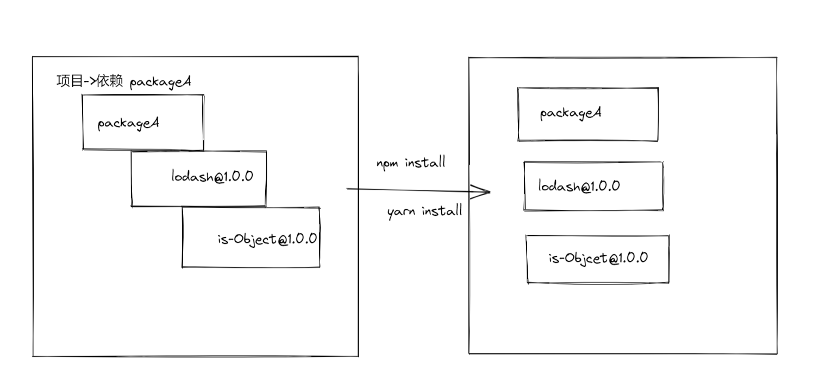
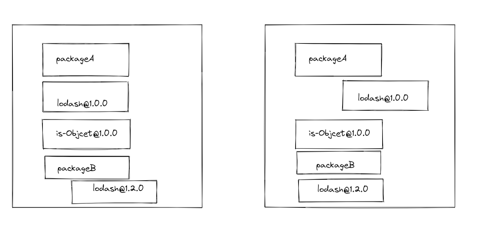
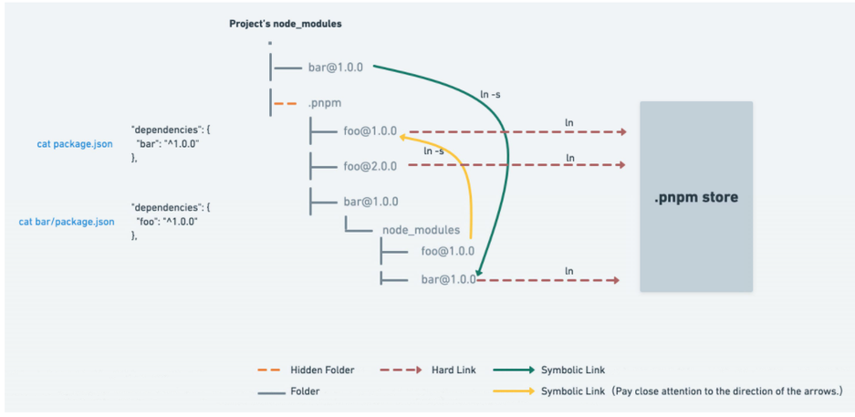
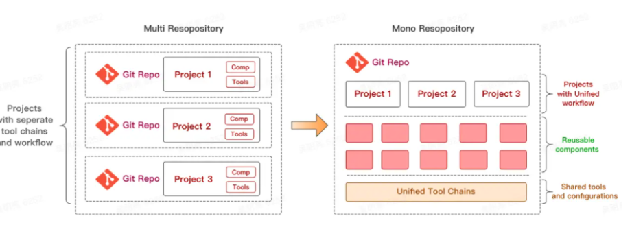
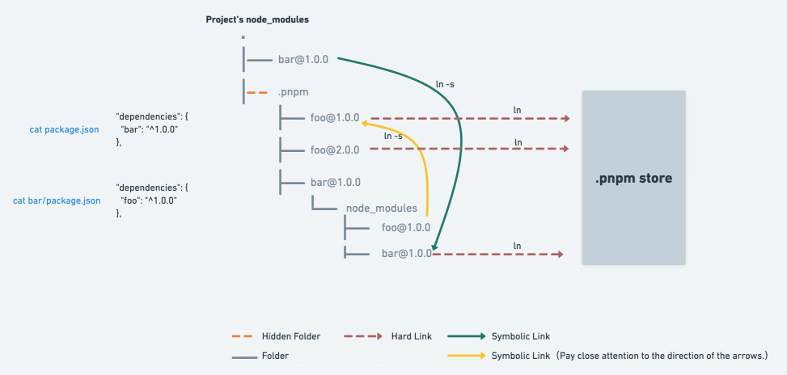
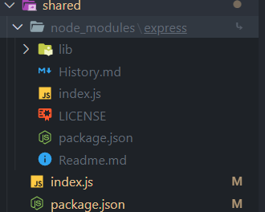
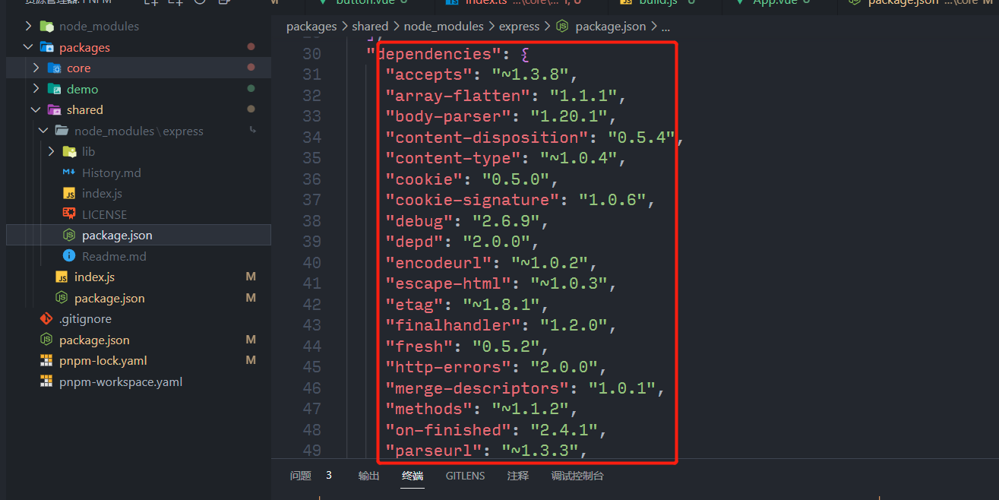
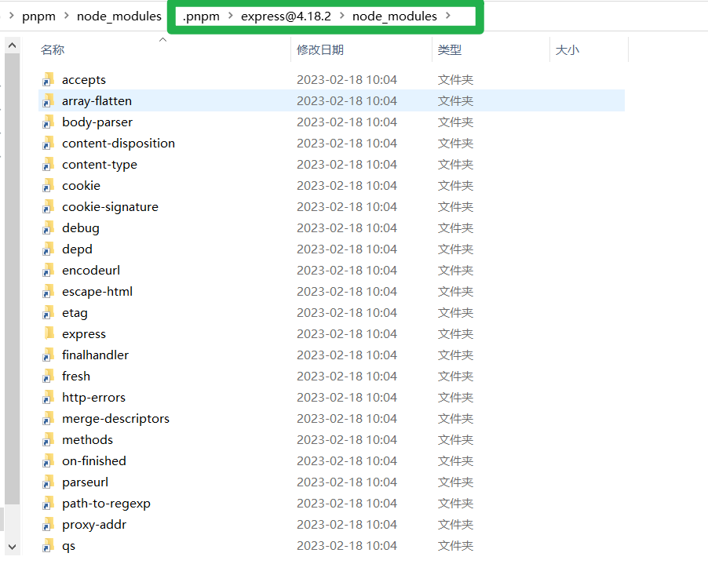

## 一、什么是 pnpm

---

`pnpm`是`performant npm`的简写，直译过来就是**高性能的 npm。**在其[官网](https://pnpm.io/zh/motivation)中有一张图，是跟`yarn/npm`这两个常用包管理工具的对比。根据其提供的数据在一些综合场景下**pnpm 比 npm/yarn 快了大约是两倍。**还有值得注意的一点就是在前不久，尤大大也宣布 Vue3 相关的仓库也采取用 pnpm。

## 二、对比 Yarn/npm 它的优势

---

### 1. 高效利用磁盘空间

当使用 npm 或 Yarn 时，如果你有 100 个项目使用了某个依赖（dependency），就会有 100 份该依赖的副本保存在硬盘上。 而在使用 pnpm 时，**依赖会被存储在内容可寻址的存储中**，所以：

1. 如果你用到了某依赖项的不同版本，那么只会将有差异的文件添加到仓库。 例如，如果某个包有 100 个文件，而它的新版本只改变了其中 1 个文件。那么 pnpm update 时只会向存储中心额外添加 1 个新文件，而不会因为仅仅一个文件的改变复制整新版本包的内容。
2. 所有文件都会存储在硬盘上的某一位置。 当软件包被被安装时，包里的文件会硬链接到这一位置，而不会占用额外的磁盘空间。 这允许你跨项目地共享同一版本的依赖。

因此，在磁盘上节省了大量空间，这与项目和依赖项的数量成正比，并且安装速度要快得多！

#### 1.1 Store 目录

在 pnpm 安装依赖时为了做到共享依赖这一关键优化，它会安装在你项目路径的根目录上比如项目路径为`F:\KMS\text`，pnpm 会在`F盘`中新建`.pnpm-store`文件夹里面存放所有依赖。因为这样一个机制，导致每次安装依赖的时候，如果是个相同的依赖，有好多项目都用到这个依赖，那么这个依赖实际上最优情况(即版本相同)只用安装一次。而在项目中会采用一种叫`hard link`的方式硬链接到项目中。 

#### 1.2 hard Link 机制

`[Hard link](https://link.zhihu.com/?target=https%3A//en.wikipedia.org/wiki/Hard_link)`是计算机里面内置的一种机制，hard link 使得用户可以通过不同的路径引用方式去找到某个文件。pnpm 会在全局的 store 目录里存储项目 node_modules 文件的 hard links 。 举个例子，例如项目里面有个 1MB 的依赖 a，在 pnpm 中，看上去这个 a 依赖同时占用了 1MB 的 node_modules 目录以及全局 store 目录 1MB 的空间(加起来是 2MB)，但因为 hard link 的机制使得两个目录下相同的 1MB 空间能从两个不同位置进行寻址，因此实际上这个 a 依赖只用占用 1MB 的空间，而不是 2MB。 

### 2. 支持 monorepo

随着前端工程的日益复杂，越来越多的项目开始使用 monorepo。之前对于多个项目的管理，我们一般都是使用多个 git 仓库，但 monorepo 的宗旨就是用一个 git 仓库来管理多个子项目，所有的子项目都存放在根目录的 packages 目录下，那么一个子项目就代表一个 package。关于 monorepo 的概念可细看看[这篇文章](https://link.juejin.cn?target=https%3A%2F%2Fwww.perforce.com%2Fblog%2Fvcs%2Fwhat-monorepo)以及开源的 monorepo 管理工具[lerna](https://link.juejin.cn?target=https%3A%2F%2Fgithub.com%2Flerna%2Flerna%23readme)，项目目录结构可以参考一下 [babel 仓库](https://link.juejin.cn?target=https%3A%2F%2Fgithub.com%2Fbabel%2Fbabel)。

pnpm 与 npm/yarn 另外一个很大的不同就是支持了 monorepo，体现在各个子命令的功能上，比如在根目录下 `pnpm add A -r`, 那么所有的 package 中都会被添加 A 这个依赖，当然也支持 `--filter`字段来对 package 进行过滤。

### 3. 依赖管理

在 pnpm 官网中就有对这一特性做了详细的介绍，[详情查看](https://www.pnpm.cn/motivation)

#### 3.1 npm/yarn install

在目前的 npm/yarn 在安装依赖时，都会将项目上的依赖进行扁平化处理 (避免依赖层级太深出现路径太长导致奇奇怪怪的 bug) 。就比如我一个项目中依赖 packageA 它又依赖 lodash 假设 lodash 中又依赖 is-object 这一个包，当我们 安装 packageA 的时候 项目中的 nodemodules 的目录就会安装成下图这样 

可能你会问假如我又依赖 packageB,它依赖的是 lodash@1.2.0 这一个版本，并且同样依赖 is-object@1.0.0这样子。那它也会将lodash@1.2.0这个包也一起拍平吗？

答案是否定的，假如 两个包名字一样只是版本不一样，npm/yarn 是不会管你版本一不一样的，加如你先装 packageA 那就将 lodash@1.0.0 拍平；如果先装 packageB 那也一样，那它的目录结构就会有 两种 就像这样。

 了解到 npm/yarn 的安装机制，根据上面的需求那再来看看 pnpm 它安装依赖时的目录结构

#### 3.2 幽灵依赖

通过上面的介绍 我们知道 当使用 npm 或 Yarn 安装依赖包时，所有软件包都将被提升到 node_modules 的根目录下。其结果是，源码可以访问 本不属于当前项目所设定的依赖包。

比如 项目 A 依赖 B ，B 依赖 C ；npm/yarn 会将他们拍平，虽然在项目 A 的 package.json 中没有明确声明 C 这个依赖，但是因为这个机制可以在 A 中 使用 C 这个依赖最致命的还是跑起来没有问题呀，我上线了之后，也能正常运行啊。

但是因为 C 没有被 A 明确声明，假如 C 做了一次破坏性的升级，而 B 又将 C 的依赖升级了，那对于 A 来说安装的时候则会安装这个 破坏性升级的 C。对于之前 A 使用 旧版 C 的 api 则会报错！！！

又或者是 B 突然间不需要 C 这个依赖了。

这些，都是依赖提升潜在的 bug。如果是自己的业务代码还好，试想一下如果是给很多开发者用的工具包，那危害就非常严重了。

## 三、Monorepo 与 MultiRepo 区别

---

Monorepo 其实不是一个新的概念，在软件工程领域，它已经有着十多年的历史了。概念上很好理解，就是把**多个项目**放在**一个仓库**里面，相对立的是传统的 MultiRepo 模式，即每个项目对应一个单独的仓库来分散管理。

## 四、pnpm 构建 Monorepo 优势

---

#### 4.1 Monorepo 优势和缺点

优势

- **代码重用将变得非常容易**：由于所有的项目代码都集中于一个代码仓库，我们将很容易抽离出各个项目共用的业务组件或工具，并通过 TypeScript，Lerna 或其他工具进行代码内引用；

- **依赖管理将变得非常简单**：同理，由于项目之间的引用路径内化在同一个仓库之中，我们很容易追踪当某个项目的代码修改后，会影响到其他哪些项目。通过使用一些工具，我们将很容易地做到版本依赖管理和版本号自动升级；

- **代码重构将变得非常便捷**：想想究竟是什么在阻止您进行代码重构，很多时候，原因来自于「不确定性」，您不确定对某个项目的修改是否对于其他项目而言是「致命的」，出于对未知的恐惧，您会倾向于不重构代码，这将导致整个项目代码的腐烂度会以惊人的速度增长。而在 monorepo 策略的指导下，您能够明确知道您的代码的影响范围，并且能够对被影响的项目可以进行统一的测试，这会鼓励您不断优化代码；

- **它倡导了一种开放，透明，共享的组织文化，这有利于开发者成长，代码质量的提升**：在 monorepo 策略下，每个开发者都被鼓励去查看，修改他人的代码（只要有必要），同时，也会激起开发者维护代码，和编写单元测试的责任心（毕竟朋友来访之前，我们从不介意自己的房子究竟有多乱），这将会形成一种良性的技术氛围，从而保障整个组织的代码质量。

缺点 

- **项目粒度的权限管理变得非常复杂**：无论是 Git 还是其他 VCS 系统，在支持 monorepo 策略中项目粒度的权限管理上都没有令人满意的方案，这意味着 A 部门的 a 项目若是不想被 B 部门的开发者看到就很难了。

- **新员工的学习成本变高**：不同于一个项目一个代码仓库这种模式下，组织新人只要熟悉特定代码仓库下的代码逻辑，在 monorepo 策略下，新人可能不得不花更多精力来理清各个代码仓库之间的相互逻辑，当然这个成本可以通过新人文档的方式来解决，但维护文档的新鲜又需要消耗额外的人力；

#### 4.2 为何不用 learn+yarn

- learn 已经不再维护，并且通过 learn 构建的话还需要额外了解 learn 的命令，增加心智负担。
- learn 本身集成了目前在公司项目用不到的命令
- learn 本身不支持工作区，需要借助 yarn 的能力

## 五、pnpm 细节分析

---

### 硬链接|软连接

#### hard link

> 来自维基百科的解释：「硬链接（英语：hard link）」是计算机文件系统中的多个文件平等地共享同一个文件存储单元（如 MFT 条目、inode）。硬链接必须在同一个文件系统中；一般用户权限下的硬链接只能用于文件，不能用于目录，因为其父目录就有歧义了。删除一个文件名字后，还可以用其它名字继续访问该文件。硬链接只能用于同一个文件系统（对于 NTFS 是限制于同一个分区）。不能用于不存在的文件。

简单来说硬链接就相当于文件 A**"复制"**出一份新的文件 B，但是文件内容指向原来的文件 A。也就是说如果你更改了 B 文件的内容，那么 A 文件的内容也会同样改变。

但是如果你删除文件 B，这是对文件 A 没有影响的。(**除非你先把文件 B 的内容删除，保存。再删除 B**)

> 这里指的复制 是指 文件 A 的 inode 的 links 值+1

#### symbolic link

> 软链接又叫[符号链接](https://baike.baidu.com/item/%E7%AC%A6%E5%8F%B7%E9%93%BE%E6%8E%A5/7177630?fromModule=lemma_inlink)，这个文件包含了另一个文件的路径名。可以是任意文件或目录，可以链接不同文件系统的文件。

比如`windows`的快捷方式，每次都要打开一个路径很深的文件。

如果在资源管理器中，一层一层的点击鼠标，是不是比较浪费时间。

此时，就可以在桌面上创建一个软链接，每次直接双击就打开所链接的目标文件了。

#### pnpm 在哪些地方使用 硬链接，那些地方使用软链接

回答这个问题首先得回到 pnpm 的官网看一张图

我们知道`pnpm`在安装的时候会在**磁盘根目录**下创建一个`pnpm Store`的文件夹。在自己项目中的 `.pnpm`下都是通过创建 `pnpm Store`的硬链接的方式

而在`.pnpm`同级的依赖都是通过**软链接**的形式

### 如何解决幽灵依赖问题

不管是 `npm`还是 `yarn`在安装依赖时都会将依赖平铺，也就是说我们可以用到没有**定义**的依赖。这有多危险上文中已经提到。那我们来看看 `pnpm` 是怎么解决这个问题的。

还是拿 `expree`为例子，当你使用`pnpm`安装后会发现我们的项目的 `nodemodues`只有一个`express`不会像`npm/yarn`一样有一大堆没见过的依赖。

而 `express`的依赖却是非常多的  那他们都去哪了？

在根目录的 `nodemodues/.pnpm/@express`发现

我们可以发现 pnpm 通过避免依赖 node_modules 的查找规则，直接通过软链的方式统一管理，直接解决了 npm 和 yarn 没有解决的问题，节省了大量磁盘空间和加快的安装速度。
