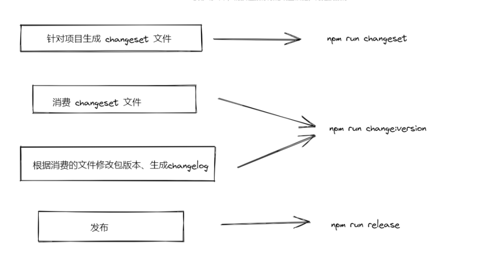
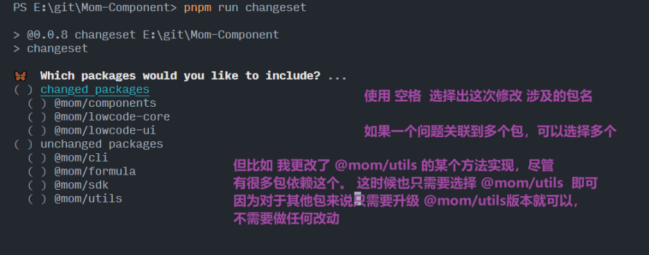
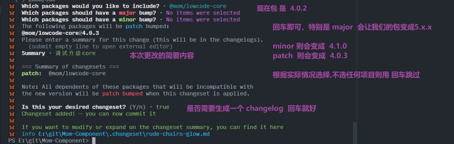
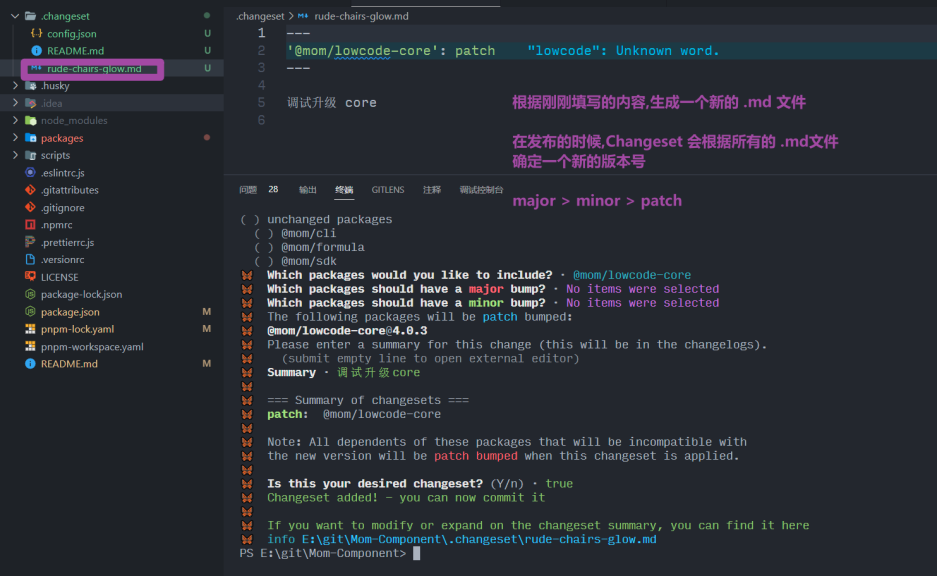
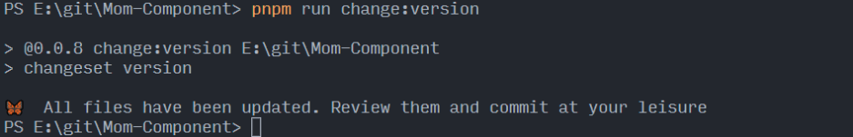
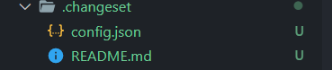
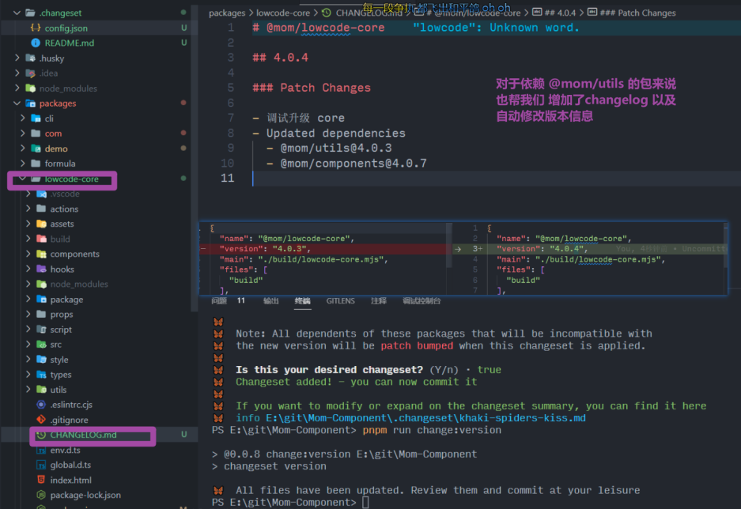
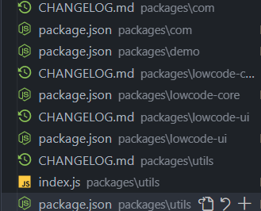
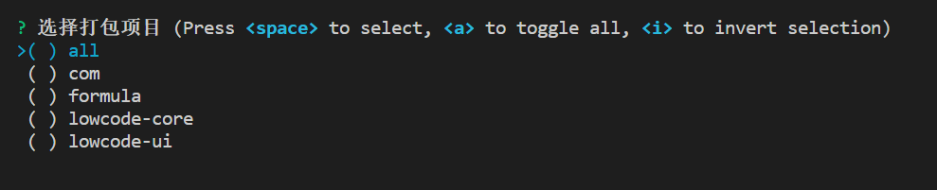
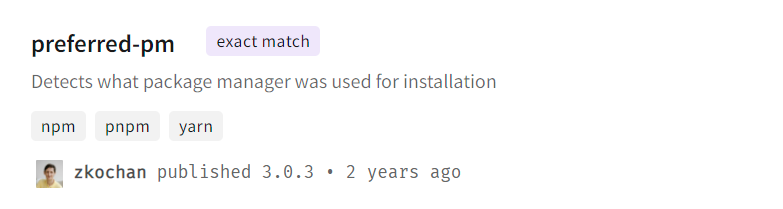

**Changesets**

Changesets 是一个用于 Monorepo 项目下版本以及 Changelog 文件管理的工具。目前一些比较火的 Monorepo 仓库都在使用该工具进行项目的发包例如 pnpm、mobx 等。



**Add**<br />在修改某个问题后,还不想发布一个新版本。只需要在根目录 npm run changeset ,根据可交互界面选择需要更改的包以及对应的版本信息,再填上这次修改的简要内容。即可在.changeset 的文件中生成一个.md 文件。<br />这个文件本质上是做个信息的预存储，在该文件被消耗之前，用于是可以自定义修改的。随着不同开发者的迭代积累，changeset 文件是可以在一个周期之内进行累积的。







**Version**<br />想发布版本后在这之前需要手动去修改包的版本,特别是对于互相依赖的包来说这一操作特别繁琐。<br />利用 `Changesets`后只需要在根目录运行` pnpm run change:version` 命令。<br />这里本质上做的工作是消耗 `changeset` 文件并且修改对应包版本以及依赖该包的包版本，同时会根据之前<br />.changeset 文件里面的信息来生成**对应项目**的 CHANGELOG 信息。

为了更加直观看到效果，我在运行之前增加一个 @mom/utils 的 changeset。这个包被 `@mom/components @mom/lowcode-core @mom/lowcode-ui` 依赖正常来说都需要手动去更改这些包的版本信息。










**Publish**<br />!!! 上面的 `pnpm run change:version`只会更改依赖包的 `package.json`的 `version`。但是需要在项目中去 run build 构建一次最新产物再 pnpm run release。这里可以运行 pnpm run build 去构建对应更改项目。 <br /><br />选择勾选了 all 会打包下面四个项目，否则打包对应勾选的项目。<br />发包的 changeset publish 本质上就是对 npm publish 做了一次封装，同时会检查对应的 registry 上有没有对应包的版本，如果已经存在了，就不会再发包了，如果不存在会对对应的包版本执行一次 npm publish。

这里有一个很有意思的点。就是比如我用 `pnpm workspace`那我就要用`pnpm publish`来替换掉`workspace:*`的版本。那`changesets`是如何知道我们是用哪个**包管理器**的呢？

### 如何识别当前用什么包管理器

`changesets`的源码按照工程拆分到不同的包中，所以要寻找对应的功能可以直接从 `cli`的`command`注册里开始找。

说回发布用什么包，那肯定是跟发布有关`publish`.

```typescript
// packages/cli/src/commands/publish/npm-utils.ts

async function internalPublish(
  pkgName: string,
  opts: { cwd: string; access?: string; tag: string },
  twoFactorState: TwoFactorState
): Promise<{ published: boolean }> {
  // 获取到当前的发布工具是什么
  let publishTool = await getPublishTool(opts.cwd);
  // 如果是pnpm 加上参数 不走git方面的检查
  if (publishTool.name === "pnpm" && publishTool.shouldAddNoGitChecks) {
    publishFlags.push("--no-git-checks");
  }

  const envOverride = {
    npm_config_registry: getCorrectRegistry(),
  };
  let { code, stdout, stderr } = await spawn(
    publishTool.name,
    ["publish", opts.cwd, "--json", ...publishFlags],
    {
      env: Object.assign({}, process.env, envOverride),
    }
  );
  }
  return { published: true };
}
```

发现由`getPublishTool`这个方法得到项目所用**包管理器**,那就再来看看这个方法的实现。

```javascript
// packages/cli/src/commands/publish/npm-utils.ts
async function getPublishTool(
  cwd: string
): Promise<{ name: "npm" } | { name: "pnpm", shouldAddNoGitChecks: boolean }> {
  const pm = await preferredPM(cwd);
  if (!pm || pm.name !== "pnpm") return { name: "npm" };
  // 判断pnpm的不同版本增加 no-git-checks参数，如果失败就降级处理
  try {
    let result = await spawn("pnpm", ["--version"], { cwd });
    let version = result.stdout.toString().trim();
    let parsed = semver.parse(version);
    return {
      name: "pnpm",
      shouldAddNoGitChecks:
        parsed?.major === undefined ? false : parsed.major >= 5,
    };
  } catch (e) {
    return {
      name: "pnpm",
      shouldAddNoGitChecks: false,
    };
  }
}
```

从上面可得知重点还在 `preferredPM`这个函数上,这个函数由`preferred-pm`提供。<br /><br />嗯。没错就是开发`pnpm`那位大佬在两年前写的一个小工具库，来看看他是如何实现的。

```javascript
module.exports = async function preferredPM(pkgPath) {
  if (typeof pkgPath !== "string") {
    throw new TypeError(`pkgPath should be a string, got ${typeof pkgPath}`);
  }
  if (await pathExists(path.join(pkgPath, "package-lock.json"))) {
    return {
      name: "npm",
      version: ">=5",
    };
  }
  if (await pathExists(path.join(pkgPath, "yarn.lock"))) {
    return {
      name: "yarn",
      version: "*",
    };
  }
  if (await pathExists(path.join(pkgPath, "pnpm-lock.yaml"))) {
    return {
      name: "pnpm",
      version: ">=3",
    };
  }
  if (await pathExists(path.join(pkgPath, "shrinkwrap.yaml"))) {
    return {
      name: "pnpm",
      version: "1 || 2",
    };
  }
  if (await findUp("pnpm-lock.yaml", { cwd: pkgPath })) {
    return {
      name: "pnpm",
      version: ">=3",
    };
  }
  try {
    if (typeof findYarnWorkspaceRoot(pkgPath) === "string") {
      return {
        name: "yarn",
        version: "*",
      };
    }
  } catch (err) {}
  const pm = await whichPM(pkgPath);
  return pm && { name: pm.name, version: pm.version || "*" };
};
```

没想到**大道至简**往往高端的工具采用最朴素的写法。就是在项目目录中检查有哪个`packjson.lock`。其中优先级最高的是 `npm`>`yarn`>`pnpm`

也就是说 如果你项目除了含有`pnpm.lock.yaml`之外的其他**锁定版本的文件并且你刚好又用了**`**pnpm workspace**`，`changesets`在`run publish`的时候都会使用`npm run publish`来发布。这就会导致别人在装包的时候不认识 `workspace:*`关键字导致`npm`报错
