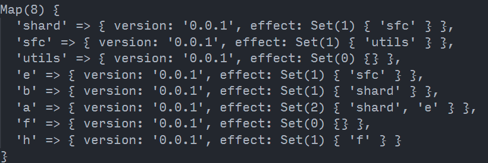

用过`changesets`的都知道,他在`changeset version`的时候会去寻找依赖`当前包`的包。然后提升另外一个包的依赖，递归下去。<br />简单来说就是假如你有 `A,B,C,D`四个包，且他们存在下面的依赖关系

```json
// A pakcage.json
"dependencies":{
  "B":"workspace:*"
}
// B pakcage.json
"dependencies":{
  "C":"workspace:*"
}
// C pakcage.json
"dependencies":{
  "D":"workspace:*"
}
// D pakcage.json
"dependencies":{
  "lodash":"^1.0.0"
}
```

如果`A`需要发布新版本那 `changesets`只会发布 `A`<br />如果`B`发布新版本`changesets`会发布`B ,A`<br />如果`D`发布新版本`changesets`会发布`D,C,B,A`<br />那是如何实现这样的呢？

## 实现

假设工作区内的包版本数据如下

```javascript
const deps = {
  shard: { version: "0.0.1", dep: { a: "0.0.1", b: "0.0.1", c: "0.0.1" } },
  sfc: { version: "0.0.1", dep: { d: "0.0.1", e: "0.0.1", shard: "0.0.1" } },
  utils: { version: "0.0.1", dep: { sfc: "0.0.1" } },
  e: { version: "0.0.1", dep: { a: "0.0.1" } },
  b: { version: "0.0.1", dep: {} },
  a: { version: "0.0.1", dep: {} },
  f: { version: "0.0.1", dep: { h: "0.0.1" } },
  h: { version: "0.0.1", dep: {} },
};
```

目标

- h 升级变成 0.0.2 那 f 的 version 要变成 0.0.2
- a 升级变成 0.0.2 那 shard sfc utils e 的 version 要变成 0.0.2

```javascript
function getDepsGraph(pkgs) {
  let depsMap = new Map();
  let workspacePkgs = Object.keys(pkgs);
  // 初始化图谱
  for (let pkg of workspacePkgs) {
    depsMap.set(pkg, { version: pkgs[pkg].version, effect: new Set() });
  }
  // 遍历所有数据 将是工具区内的包加入到本包的 effect 中。
  for (let pkg in pkgs) {
    const curItem = pkgs[pkg];
    for (let dep in curItem.dep) {
      if (workspacePkgs.includes(dep)) {
        const target = depsMap.get(dep);
        target.effect.add(pkg);
      }
    }
  }
  return depsMap;
}

function getUpdatePkgs(updatePkg, pkgs) {
  const depsMap = getDepsGraph(pkgs);
  // 根据需要更新的包,找到它的依赖关系
  let updateEffects = getEffect(updatePkg, depsMap);

  return [...new Set(updateEffects)];
}

function getEffect(updatePkg, depsMap) {
  let arr = [];
  let effects = [...depsMap.get(updatePkg).effect];
  // 根据依赖关系找到 依赖包的依赖包
  // 比如 a=>b b=>c  所以需要找到C
  for (let effect of effects) {
    arr.push(effect);
    arr = arr.concat(getEffect(effect, depsMap));
  }
  return arr;
}
```

在`getDepsGraph`方法调用后我们会得到一份与元数据相反的 `索引MAP`<br /><br />它并不是记录那个包依赖那个包。**而是记录当前包被哪个包所依赖。**这个是关键！！！

```javascript
console.log(getUpdatePkgs("shard", sfc)); // [ 'sfc', 'utils' ]

console.log(getUpdatePkgs("h", sfc)); // [ 'f' ]

console.log(getUpdatePkgs("a", sfc)); // [ 'shard', 'sfc', 'utils', 'e' ]
```

`changesets`实现这部分的逻辑在 `packages/get-dependents-graph/index.ts`可自行查看。

有了这些关系,我们甚至可以做更多的事情。比如 根据这个依赖关系 实现依赖关系的构建 ? 这是`changesets`没有的功能
