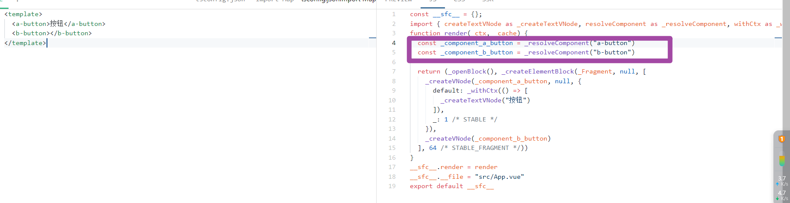
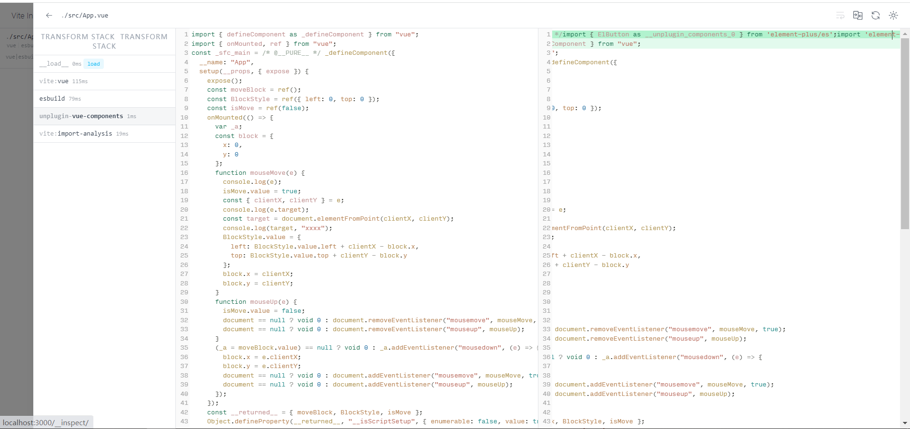

## babel-plugin-import

在之前如果想要做按需加载那肯定不会陌生这个插件 `babel-plugin-import` 或者是 `babel-plugin-component` 。他们出现在 `element-ui` 和 `VantUI` 按需加载章节

他们的原理都是在 `babel` 解析 `JS` 文件时候利用解析后 `AST` 树去匹配关键字

```js
import { Button } from "element-ui";
```

使用插件后大概会变成这样

```js
import Button from "element-ui/lib/button/index.js";
import "element-ui/lib/theme/button.css";
```

为了适应这样的结构,你会发现 `element-ui` 会吧每个组件都打包成一个单独的 `.js` 和 `.css` 。用的打包工具分别是 `webpack` 和 `gulp`

`webpack` 在打包的时候需要设置多入口打包

```js
module.exports = {
  entry: {
    button: path.resolve(__dirname, "src/button/index.js"),
    // ...其他组件
  },
};
```

而处理`css` 的时候就更方便了不难发现大多数组件库的 `css` 都不会向我们平时写 `SFC` 一样直接写 `.vue` 文件中，而是直接写在单独的 `scss` 文件中。这样的好处是可以直接让 `gulp` 进行单文件编译。

这是以前 `webpack` 的通用解决方案,但是现在我们的工程逐步像 `vite` 靠拢且 `vite` 目标是现代浏览器,对于大多数语法已经无需进行降级,也就没有了 `babel` 生成 `AST` 这一核心工作，上面的插件自然而然就用不了了。

## unplugin-vue-components

`unplugin-vue-components` 可以不需要手动引入组件，能够让开发者就像全局组件那样进行开发，但实际上又是按需引入，且不限制打包工具，不需要使用 `babel`。

使用效果以 `element-plus` 为例

```js
import Components from "unplugin-vue-components/vite";
import { ElementPlusResolver } from "unplugin-vue-components/resolvers";

export default {
  plugins: [
    Components({
      resolvers: [ElementPlusResolver()],
    }),
  ],
};
```

这样就能自动引入 `element-plus` 的组件，甚至不需要手动 `import` 组件以及组件样式，使用起来就像全局组件一样，但这是按需自动引入，可以减少产物大小。

```vue
<template>
  <el-input />
</template>
```

### 解析器

对于这个插件来说它不可能兼容各种库的写法然后做一个汇总。它是一个插件但也是一个核心，而解析各种库的工作则是交给**插件的 resolver**

用户可以自定义这个 `resolver` 解析器的规则

`resolver` 需要下面这个格式

```js
function createElementPlusResolver() {
  return {
    type: "component" | "directive",
    resolve: function (name) {
      return {
        from: "", // 真实引入的文件路径
        sideEffects: "", // 如果有css的话则加载这里
      };
    },
  };
}
```

当页面中使用 `<el-input />` 的时候就会将 `ElInput` 传入函数。这时候就需要 `resolve` 去解析这个参数返回具体的路径以及可能有的 `css` 文件。

## 实现原理

我们先来看看 `Vue3` 在生成 `render` 函数的时候遇到组件时的 [编译结果](https://play.vuejs.org/#eNp9kUFLwzAUx79KfJcqzA3ZbXQDlYF6UFHBSy6je+sy0yQkL7NQ+t19SVn1ILv1/X//l/7SdnDr3PQYERZQhsorRyIgRbeSRjXOehKd8LgTvdh524iCq4U00lTWBBJNqMUy8cviAbW24tN6vb0orqQpZ8NxfBAPhI3TG0KehCj3N6uuy8t9X854yqkyLpI4Xjd2i3opgbkERuVs3IYJUOBX71Q9PQRr2LpLuxIq2zil0b84UqwmYSEySWzDZt9POSMfcXLKqz1WX//kh9CmTMKrx4D+iBJGRhtfIw14/f6MLT+PkM2j5vYZ+IbB6pgch9pdNFvW/tPLto/52ytTf4R1S2jC6VJJNDX73JfA/+P+zNV/defTed6Tpof+B7x8phs=)



可以看到，全局组件编译后会用 `resolveComponent` 包裹，该函数在 `Vue` 官网有说明，就是按名称找到已注册的全局组件。

`unplugin-vue-components` 只需要正则匹配 `_resolveComponent`，拿到入参 `el-button`，然后根据将名称标准化为 `ElButton`，然后交给解析器，解析器会返回如下对象：

```js
{
  from:'element-plus/es',
  sideEffects:'element-plus/es/components/button/style/index'
}
```



上面对象转换成以下链接注入到文件头部

```js
import { ElButton as __unplugin_components_0 } from "element-plus/es";
import "element-plus/es/components/button/style/index";
```

最后将`const _component_el_button = _resolveComponent('a-button')` 替换成 `const _component_el_button = __unplugin_components_0` 就这样完成按需引入

### 局限性

1. 不能作用于 `JSX`，因为插件只处理 `template` 模板的代码。不过 `JSX` 则需要配合 `unplugin-auto-import`（用于自动引入变量）
2. 在 `Vite` 中 `CSS 无法 tree shaking`，不过这个是 `Vite` 的问题。但 `JS` 仍然是可以 `tree shaking`，相对于全局注册组件，对构建产物体积的优化还是非常可观的
