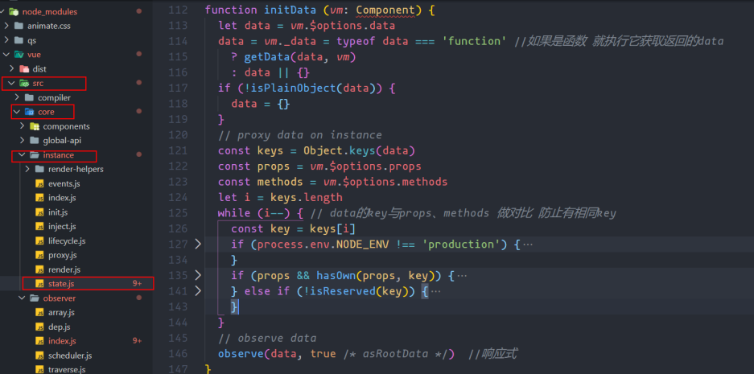
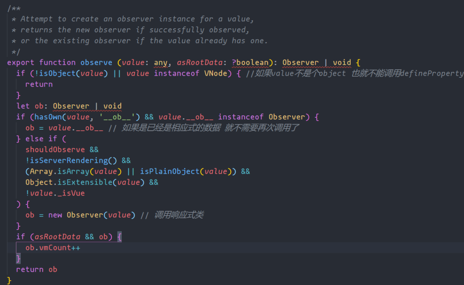
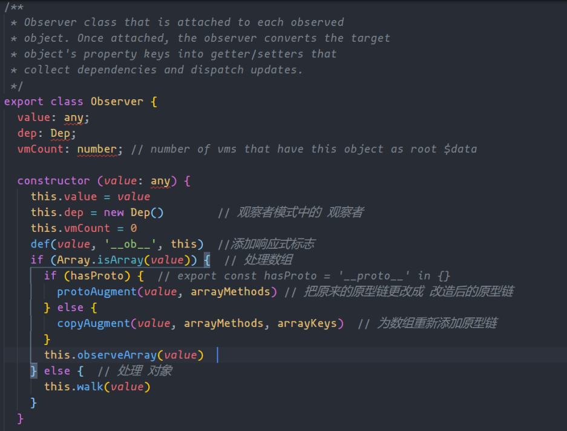
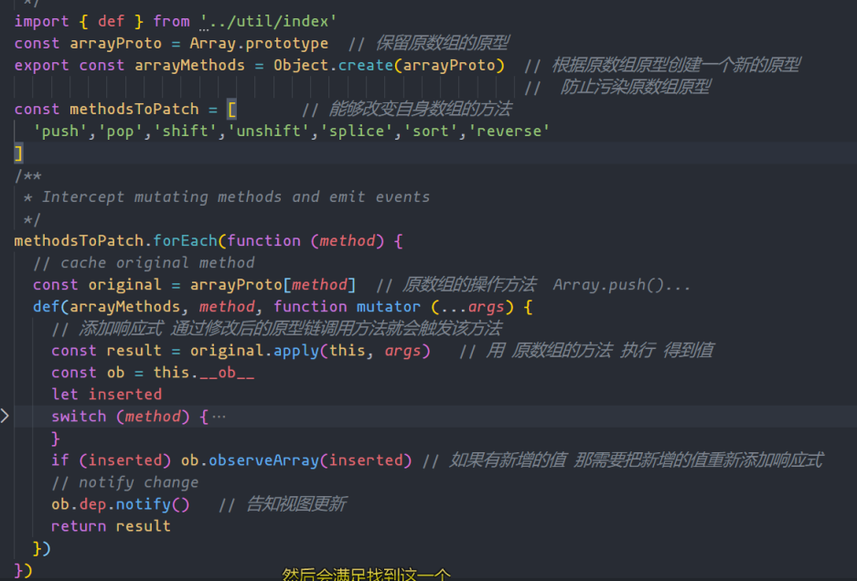
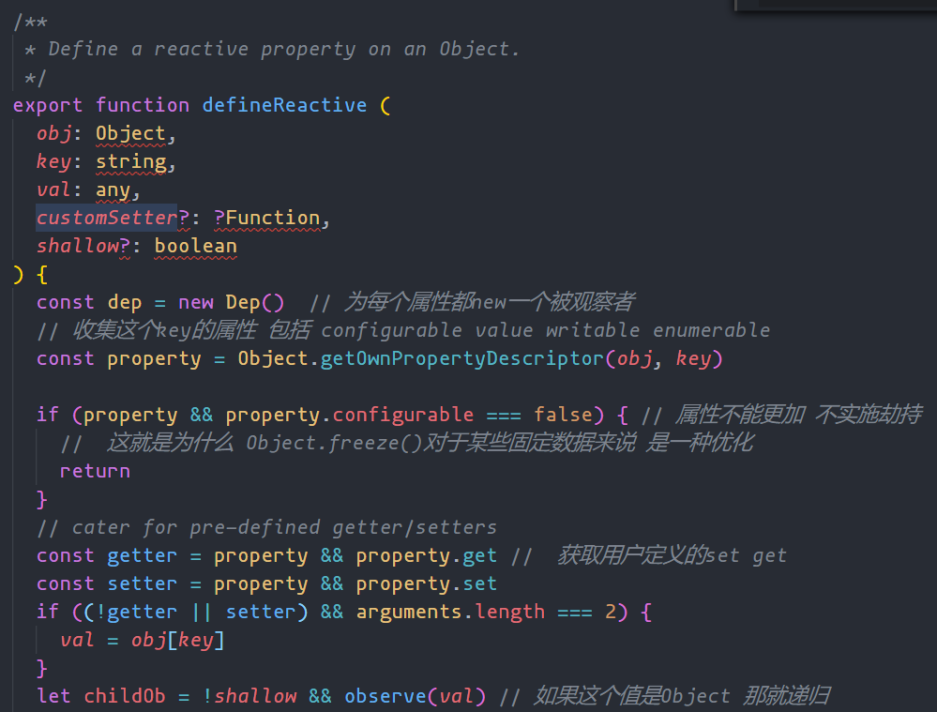
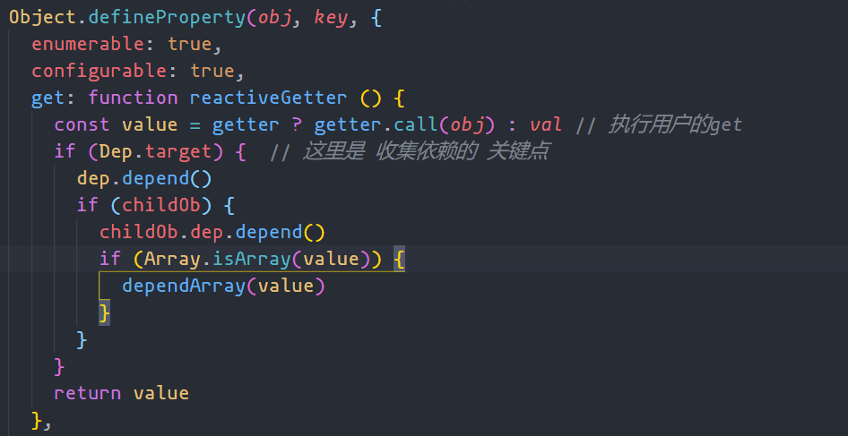
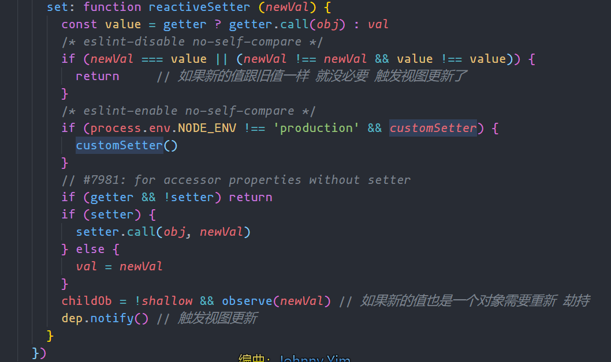

### 前言

最近也是一直学习 `Vue` 的源码,也看了许多机构解析源码的视频(大部分都是白嫖~但是珠峰讲的是真的不错)。但是光看他们讲是没用滴,我们想要提 `(wei)高(le)自(mian)身(shi)` ,则需要将他们所讲再加上我们自己的理解。形成自己对 `Vue` 不说有一套独特见解,但也需要讲得出一二。

### 入口

`vue` 的入口就不说啦,在 `/src/core/instance/index.js` 中明明白白写了 `Vue` 的构造函数,然后在这里执行了化一些系列功能。今天所要探讨的相应是也在 `initMixin(Vue)` 中得到初始化。<br />`路径 /src/core/instance/state.js`



`没错,在调用observe(data, true /* asRootData */) //响应式` 就是在把我们定义的 `data` 进行数据劫持,在劫持前 Vue 也有一些值得注意的优化点。

### Observer 类

`路径 /src/core/observer/index.js`



`def 函数`是⼀个⾮常简单的 `Object.defineProperty` 的封装，这就是为什么我在开发中输出 `data` 上对象类型的数据，会发现该对象多了⼀个 `__ob__` 的属性。

`调用Observer类` 实质上就是将 `data` 中定义的每一个 `key` 通过 `defineProperty` 来修改相对应的 `get` 和`set` 来做到所谓的数据劫持。但是道理我们都懂但是它具体是怎么做的呢？



#### 数组

`路径 /src/core/observer/array.js`

由于 `Object.defineProperty()` 不能够为数组进行劫持,然而数组这种数据结构又是我们日常用的最多的数据结构之一。所以`Vue` 通过修改 `数组原来的原型链` 。假如修改后的原型链为 `prtototype1` 。我们调用 `this.arr.push()` => `this.arr.protype1.push()`



#### 对象

`路径 /src/core/observer/index.js`

对于对象来说,有天然的 `Object.defineProperty` 加持在所以就直接就可以了。

```javascript
/**
   * Walk through all properties and convert them into
   * getter/setters. This method should only be called when
   * value type is Object.
   */
  walk (obj: Object) {
    const keys = Object.keys(obj)
    for (let i = 0; i < keys.length; i++) {
      defineReactive(obj, keys[i]) // 为每一个熟悉进行Object.defineProperty()
    }
  }
```

哦豁重头戏来了, `defineReactive()` 是响应式的核心方法,通过 `递归` 对每个属性进行劫持,这也是这个 `Vue2.x` 的一个的缺点吧。在层级深的情况下，这里花费的时间就很长







够成响应式中不可缺少的就是 `watcher` 和 `dep` 这一观察者模式的最佳体现。`this.name` 则会触发 `name`属性的 `get` 而在每一次触发 `get` 都会 `new Dep()` 记录下这种依赖方式。 当 `this.name = xxxx` 时则会触发 `name` 属性的 `set` 而每次触发 `set` 都会 `dep.notify()` 来通知这个值依赖的地方 进行视图更新。

### Watcher 类

watcher 按照功能可分为 **渲染 watcher**、**用户 watcher、computed**

- 渲染 wathcer

负责收集模板中用到的数据，当数据更新时则重新渲染页面，在 `Vue`中是以一个组件为单位创建 `渲染watcher`

- 用户 watcher

就是比如我们在 `.vue` 中写的 `watch` 选项或者是 `$watch`统称为 `用户watcher`。在实例化 `watcher`的时候会传入参数 `{user:true}`标识

- computed

在 `.vue`文件中的 `computed`选项，内部实现 也是 `watcher`但是会传入 `lazy:true`参数作为标识，好处是在取值的时候有缓存效果。只会在 `watcher`中依赖的数据变化后 才会再次取值

### dep 类

用于收集 数据与 `wacher`的关系，在数据发生变化时遍历这个数据依赖的所有 `watcher`通知 `通知watcher`执行 `update`方法去更新页面或者去更新 `computed`的值

这个类中还有一个有意思的点是 维护了一个 栈 结构

在 watcher 初始化 取值前，将 `watcher`实例 `this`推入栈中,让 `dep`收集此`watcher`作为数据依赖。在取值 让这个 实例 剔除

```javascript
function get() {
  pushTarget(this);
  const vm = this;
  const value = this.getter.call(vm);
  popTarget();
}
```

### 页面更新渲染流程

初始化数据,方法等，通过 definedProperty,对数据进行 getter/setter 劫持。将方法属性数据 代理到<br />this。
