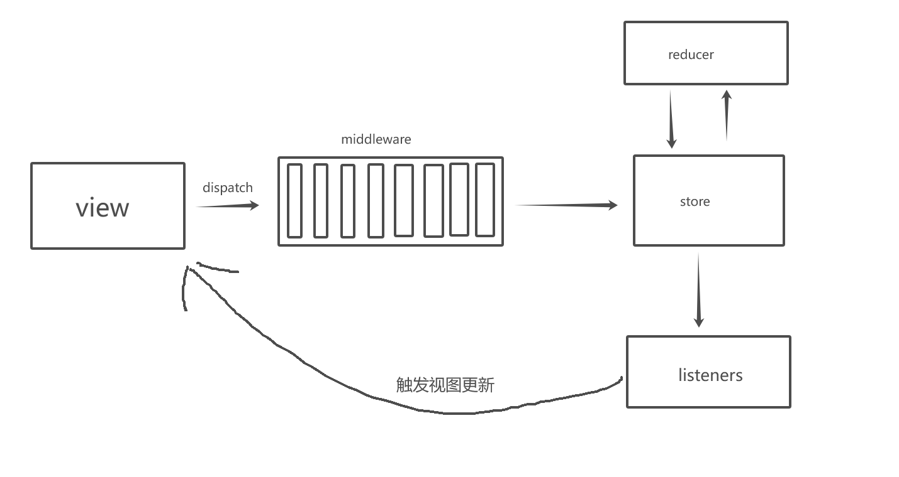

## redux

`Redux` 是 `JavaScript` 应用的状态容器，提供可预测的状态管理。它的核心概念和之前用过的 `Vuex` 类似但是核心思想会有不一样的地方。

1. 对于 `State` 的维护 `redux` 使用 `reducer` 的概念而 `Vuex` 使用的是 `mutations`
2. `action` 不能直接修改 `state` 数据而是通过调用对应的 `reducer`

### 基本用法

::: details 示例代码

```js
import { createStore } from "redux";
import { createContext, useContext } from "react";
const initState = {
  name: "sam",
  age: 20,
};
function reducer(state = initState, action) {
  switch (action.type) {
    case "SET_NAME":
      return {
        ...state,
        name: action.payload,
      };
    case "SET_AGE":
      return {
        ...state,
        age: action.payload,
      };
    default:
      return state;
  }
}
const store = createStore(reducer);
const StoreContext = createContext();

export { store, StoreContext };

// 组件中使用
function Home() {
  const { getState, dispatch, subscribe } = useContext(StoreContext);
  const { name } = getState();

  const [, forceRender] = useState(0);

  useEffect(() => {
    subscribe(() => forceRender(Math.random()));
  }, []);

  return <div>{name}</div>;
}

function App() {
  return (
    <>
      <StoreContext.Provider value={store}>
        <Home />
      </StoreContext.Provider>
    </>
  );
}
```

:::

### 注意的点

1. 需要自身创建一个 `Context`,然后通过 `Provider` 传递给子组件
2. 需要使用 `useContext` 获取 `store` 实例
3. 为了能够让页面同步发生变化需要有**一个强制渲染的函数**,使组件能够重新渲染
4. 如果页面中有多个 `reducer` 需要使用 `combineReducers` 进行合并成一个 `rootState` 进行管理，并通过 `key` `将state` 进行区分。实现类似命名空间的效果

### 原理

#### createStore

这个函数是一个核心需要收集每一个 `reducer` 中的状态,并且需要用户提供**更新组件的方法**。

```js
function createStore(reducer) {
  let currentState = undefined;
  let currentListeners = [];

  function getState() {
    return currentState;
  }

  function subscribe(listener) {
    if (!currentListeners.includes(listener)) {
      currentListeners.push(listener);
    }
    // 返回卸载的方法
    return function () {
      currentListeners = currentListeners.filter((item) => item !== listener);
    };
  }

  function dispatch(action) {
    let newState = reducer(currentState, action);
    if (currentState !== newState) {
      // 通知组件进行更新
      currentListeners.forEach((listener) => listener());
      currentState = newState;
    }
  }
  // 初始化调用一次 dispatch 拿到初始化的 state
  dispatch({ type: "@@REDUX/INIT" });

  return { getState, subscribe, dispatch };
}
```

#### combineReducers

这个函数是用来合并多个 `reducer` 函数的,并且需要将合并后的 `state` 进行命名空间的管理。

```js
function combineReducers(reducers) {
  const rootState = {};
  for (const key in reducers) {
    const reducer = reducers[key];
    rootState[key] = reducer(undefined, { type: "@@REDUX/INIT" });
  }
  return function combineReducer(state, action) {
    let hasChanged = false;
    const nextState = {};
    for (const key in reducers) {
      const reducer = reducers[key];
      // 不管上一次是否有命中 action 都会继续去执行，所以就要规范 action 的命名需要唯一
      const nextStateForKey = reducer(rootState[key], action);
      nextState[key] = nextStateForKey;
      hasChanged = hasChanged || nextStateForKey !== rootState[key];
    }
    return hasChanged ? nextState : state;
  };
}

// 用法
const reducer = combineReducers({
  user: userReducer,
  login: loginReducer,
});
const store = createStore(reducer);
const { user, login } = store.getState();
```

### 缺陷

1. 缺少追踪异步数据的能力
2. 结合 `react` 需要手动加上重复代码，如 获取上下文、更新组件方法等

## react-redux

`react-redux` 是一个 `react` 应用的 `redux` 库，它提供了一些 `react` 组件和函数，可以方便地在 `react` 应用中使用 `redux`。解决了上面的 `痛点 2`

核心思想一致,但是在用法上做了对应调整。

### 基本用法

```js
import { Provider, connect } from "react-redux";
import { createStore } from "redux";
import { createContext, useContext } from "react";
const initState = {
  name: "sam",
  age: 20,
};
function reducer(state = initState, action) {
  switch (action.type) {
    case "SET_NAME":
      return {
        ...state,
        name: action.payload,
      };
    case "SET_AGE":
      return {
        ...state,
        age: action.payload,
      };
    default:
      return state;
  }
}
const store = createStore(reducer);
export { store };

// 组件中使用
connect(
  (state) => ({ name: state.name }),
  (dispatch) => ({
    setName: (name) => dispatch({ type: "SET_NAME", payload: name }),
  })
)(function Home(props) {
  const { name, dispatch } = props;

  return <div>{name}</div>;
});

function App() {
  return (
    <>
      <Provider store={store}>
        <Home />
      </Provider>
    </>
  );
}
```

核心就是通过 `connect` 包裹需要接受 `Store` 的组件，并通过返回的**映射状态**和 **dispatch** 传递到组件的`props`中接收，确实少了很多重复代码。

### 原理分析

#### Provider

```js
import { createContext } from "react";
const Context = createContext();
function Provider({ store, children }) {
  return <Context.Provider value={store}>{children}</Context.Provider>;
}
export { Provider, Context };
```

主要目的还是要拿到 `store` 的内容，然后再传递下去,再者就是方便 `connect` 函数的获取 `state`。

#### connect

```js
import { useContext, useMemo, useState, useEffect } from "react";
function connect(mapStateToProps, mapDispatchToProps) {
  return function () {
    return function Hoc(props) {
      const { getState, dispatch, subscribe } = useContext(Context);
      if (!mapStateToProps) {
        mapStateToProps = (state) => ({});
      }
      if (!mapDispatchToProps) {
        mapDispatchToProps = (dispatch) => ({ dispatch });
      }
      const [, forceUpdate] = useState(0);
      useEffect(() => {
        subscribe(() => forceUpdate(Math.random()));
      }, []);
      const state = getState();
      const nextStateProps = useMemo(
        () => mapStateToProps(state, props),
        [state]
      );
      const dispatchProps = mapDispatchToProps(dispatch);

      return <Component {...props} {...nextStateProps} {...dispatchProps} />;
    };
  };
}
```

这个只是简略的写法源码中还有大量的判断和处理，这里就不一一贴出来了。主要就是利用 `Hoc` 的形式对组件重新处理，让它可以少些一些重复性的代码。

#### useSelector 和 useDispatch

对于上面 `connect` 的代码来说可能不太美观还需要去理解 HOC,最重要的是通过 `props` 传递可能会有一些意想不到的 `bug`。比如属性覆盖等等,所以就出现了 `useSelector/useDispatch` 来简化这一操作

```js
function Home(props) {
  const name = useSelector((state) => state.name);
  const dispatch = useDispatch();

  const changeName = useCallback(() => {
    dispatch({ type: "SET_NAME", payload: "123" + Math.random() });
  }, [dispatch]);

  return (
    <>
      {name}
      <button onClick={changeName}>点击我</button>
    </>
  );
}

function App() {
  return (
    <>
      <Provider store={store}>
        <Home />
      </Provider>
    </>
  );
}
```

::: warning
如果想要使用多个状态的需要调用多次 `useSelector`。不然会有重复渲染的情况

> https://redux.js.org/usage/deriving-data-selectors#optimizing-selectors-with-memoization

```js
// ❌ WARNING: this _always_ returns a new reference, so it will _always_ re-render!
const { name, age } = useSelector((state) => ({
  name: state.name,
  age: state.age,
}));

// good
const name = useSelector((state) => state.name);
const age = useSelector((state) => state.age);
```

:::

## redux-thunk/redux-promise

我们经常会有需求是经过异步请求后再去修改状态，redux 本身是不支持这种操作的，所以就出现了 `redux-thunk/redux-promise` 这两个中间件。

```js
function Home(props) {
  const name = useSelector((state) => state.name);
  const dispatch = useDispatch();

  const validName = useCallback(async () => {
    await sleep(3000);
    return { type: "SET_NAME", payload: "123" + Math.random() };
  }, [dispatch]);

  const changeName = useCallback(() => {
    dispatch(validName());
  }, [dispatch]);

  return (
    <>
      {name}
      <button onClick={changeName}>点击我</button>
    </>
  );
}
```

这个时候因为 `validName` 执行返回的是一个 `Promise`,并不会去等待这个 `Promise` 执行完毕再去执行 `dispatch` 所以就导致这个 `dispatch(Promise)` 是无效的,且会发出报错。

::: danger
createStore.ts:201 Uncaught Error: Actions must be plain objects. Instead, the actual type was: 'Promise'. You may need to add middleware to your store setup to handle dispatching other values, such as 'redux-thunk' to handle dispatching functions
:::

这两个都是让 `redux` 拥有异步处理 `action` 能力的中间件。用法会不一样，两者选其一就行

```js
import { createStore, applyMiddleware } from "redux";
import thunk from "redux-thunk";
import { rootReducer } from "./reducer";
import promise from "redux-promise";
const store = createStore(reducer, applyMiddleware(thunk));

const store = createStore(reducer, applyMiddleware(promise));
```

### 基本用法

::: details

```js
// redux-thunk
function Home(props) {
  const name = useSelector((state) => state.name);
  const dispatch = useDispatch();

  // const validName = useCallback(async () => {
  //   await sleep(3000);
  //   return { type: "SET_NAME", payload: "123" + Math.random() };
  // }, [dispatch]);

  const validName = useCallback(() => {
    return async (dispatch) => {
      await sleep(3000);
      dispatch({ type: "SET_NAME", payload: "123" + Math.random() });
    };
  }, [dispatch]);

  const changeName = useCallback(() => {
    dispatch(validName());
  }, [dispatch]);

  return (
    <>
      {name}
      <button onClick={changeName}>点击我</button>
    </>
  );
}

// redux-promise
function Home(props) {
  const name = useSelector((state) => state.name);
  const dispatch = useDispatch();

  // const validName = useCallback(async () => {
  //   await sleep(3000);
  //   return { type: "SET_NAME", payload: "123" + Math.random() };
  // }, [dispatch]);

  const validName = useCallback(() => {
      await sleep(3000);
      dispatch({ type: "SET_NAME", payload: "123" + Math.random() });
  }, [dispatch]);

  const changeName = useCallback(() => {
    dispatch(validName());
  }, [dispatch]);

  return (
    <>
      {name}
      <button onClick={changeName}>点击我</button>
    </>
  );
}
```

:::

### 原理分析

#### 中间件原理

`redux-thunk/redux-promise` 是利用了 `redux` 的中间件机制，所以很有必要了解下 `redux` 的中间件是个什么东西。

加入了 `middleware` 的流程张这样



一个符合 `redux` 规范的中间件长这样

```js
function middleware(store) {
  return function (next) {
    return function (action) {
      // 中间件的逻辑
      next(); // 调用下一个中间件
    };
  };
}
```

其中 `next` 表示下一个中间件执行，也就是说在**中间件中能够控制什么时机让下一个中间件执行**。试想我们可不可以这样子

```js
function middleware(store) {
  return function (next) {
    return function (action) {
      // 中间件的逻辑
      action instanceof Promise ? action.then(() => next()) : next();
    };
  };
}
```

这样子好像就可以解决 action 是异步调用的问题了。搞定收工！

这样的中间件再被 `applyMiddleware` 方法调用，主要流程如下

根据上面的结构我们我们来看看 `applyMiddleware` 方法的实现是怎么样的

```js
function applyMiddleware(...middlewares) {
  return function (createStore) {
    return function (reducer, preloadedState) {
      const store = createStore(reducer, preloadedState);
      const middlewareAPI = {
        getState: store.getState,
        dispatch: store.dispatch,
      };
      const chain = middlewares.map((middleware) => middleware(middlewareAPI));

      dispatch = compose(...chain)(store.dispatch);
      return {
        ...store,
        dispatch,
      };
    };
  };
}

function compose(...funcs) {
  // 这里因为我们需要按照 middleware 的顺序执行，而 next 又是 下一个中间件
  // 顺序执行的话，对于如何拿下一个中间件 又是一件麻烦事，所以我们可以倒序执行
  return (dispatch) => {
    for (let i = funcs.length - 1; i >= 0; i--) {
      // 这样就拿到下一个中间件,然后通过闭包的机制存储起来
      // 这里的 dispatch[i] = function (next){ return function(action){}}
      // dispatch[i] 执行后通过闭包就保存了 next 变量
      // 这里实现的很妙
      dispatch = funcs[i](dispatch);
    }
    // 返回第一个中间件
    return dispatch;
  };
}
```

其中 `compose` 在源码中还有一个简写版本 ,但是功能跟上一个是一样的

```js
function compose(...funs) {
  if (funs.length === 0) return (arg) => arg;
  if (funs.length === 1) return funs[0];
  /// a(b(c(d))
  return funs.reduce(
    (a, b) =>
      (...args) =>
        a(b(...args))
  );
}
```

#### redux-thunk

理解 `redux` 的中间件原理后,对于 `redux-thunk` 就很好理解了

```js
function thunk({ dispatch, getState }) {
  return function (next) {
    return function (action) {
      if (action === "function") {
        return action(dispatch, getState);
      }
      return next(action);
    };
  };
}

// 结合使用理解
const dispatch = useDispatch();

const validName = useCallback(() => {
  return async (dispatch) => {
    await sleep(3000);
    dispatch({ type: "SET_NAME", payload: "123" + Math.random() });
  };
}, [dispatch]);

const changeName = useCallback(() => {
  dispatch(validName());
}, [dispatch]);
```

#### redux-promise

这个就更好理解了

```js
import isPromise from "is-promise";
import { isFSA } from "flux-standard-action";
function promiseMiddleware({ dispatch }) {
  return (next) => (action) => {
    if (!isFSA(action)) {
      return isPromise(action) ? action.then(dispatch) : next(action);
    }

    return isPromise(action.payload)
      ? action.payload
          .then((result) => dispatch({ ...action, payload: result }))
          .catch((error) => {
            dispatch({ ...action, payload: error, error: true });
            return Promise.reject(error);
          })
      : next(action);
  };
}
```

`isFSA` 则是检查 `action ` 是否符合这种格式
`action creator`也是一个函数，其返回值必须是一个`payload`为`promise`的`FSA`,`FSA`全称`flux standard action`，意指符合`flux`标准的`action`，该`action`的判断函数如下：

```js
{
  type: 'ADD_TODO',
  payload: {
    text: 'Do something.'
  }
}

{
  type:'SET_EMOJIS1',
  payload:fetch('https://api.github.com/emojis').then(res=>res.json())
}

```

## redux-saga

todo

## dva

todo

## @reduxjs/toolkit

`Redux Toolkit` 以两个关键的 `API` 开始，这简化了在每个 `Redux` 应用中常见的操作：

1. `configureStore` 通过单个函数调用设置一个配置完善的 `Redux store`，包括合并 `reducer`、添加 `thunk` 中间件以及设置 `Redux DevTools` 集成。与 `createStore` 相比更容易配置，因为它接受命名选项参数。
2. `createSlice` 让你使用 `Immer` 库 来编写 `reducer`，可以使用 `"mutating"` JS 语法，比如 `state.value = 123`，不需要使用拓展运算符。 内部基于你的 `reducer` 名称生成 `action type` 字符串。最后，它在 `TypeScript` 中表现的很好。

### 基本用法

先来看看没有带异步操作的用法

```tsx
import { createSlice, configureStore } from "@reduxjs/toolkit";
const userModule = createSlice({
  name: "user",
  initialState: {
    name: "sme",
    age: 20,
  },
  reducers: {
    updateName(state, action) {
      state.name = action.payload;
    },
  },
});
export const { updateName } = userModule.actions;
export const store = configureStore({
  reducer: {
    user: userModule.reducer,
  },
});
export type RootState = ReturnType<typeof store.getState>;

// 使用
function Home(props) {
  const name = useSelector((state) => state.name);
  const dispatch = useDispatch();

  const changeName = useCallback(() => {
    // 直接通过 暴露出来的 action 来派发
    dispatch(updateName("123" + Math.random()));
  }, [dispatch]);

  return (
    <>
      {name}
      <button onClick={changeName}>点击我</button>
    </>
  );
}
```

从目前为止看,好像对比以前的代码是简单了不少，而且逻辑也比较分明。唯一一点就是 需要手动导出 `Slice` 中的 `action`

再来看看如果有异步的情况

```js
function sleep(ms) {
  return new Promise((resolve) => {
    setTimeout(() => {
      resolve("");
    }, ms);
  });
}

export const asyncUpdateName = createAsyncThunk(
  "user/asyncUpdateName",
  async (value: string) => {
    await sleep(3000);
    console.log("异步执行完毕", value);
    return {
      name: "async_sme",
    };
  }
);

const userModule = createSlice({
  name: "user",
  initialState: {
    name: "sme",
    age: 20,
  },
  reducers: {
    updateName(state, action) {
      state.name = action.payload;
    },
  },
  extraReducers(builder) {
    // 异步action 的各种状态
    builder
      .addCase(asyncUpdateName.pending, (state, action) => {
        state.name = "loading";
      })
      .addCase(asyncUpdateName.fulfilled, (state, { payload }) => {
        state.name = payload.name;
      })
      .addCase(asyncUpdateName.rejected, (state, { payload }) => {
        state.name = "error";
      });
  },
});

function Home(props) {
  const name = useSelector((state) => state.name);
  const dispatch = useDispatch();

  const changeName = useCallback(() => {
    // 直接通过 暴露出来的 action 来派发
    dispatch2(asyncUpdateName("asymc555555"));
  }, [dispatch]);

  return (
    <>
      {name}
      <button onClick={changeName}>点击我</button>
    </>
  );
}
```

emmmmm,看起来就很头疼。。。。明明只是调用一个异步函数而已，却要写一大堆方法

另外有一个小技巧，因为我们每一个`useDispatch` 和 `useSelector` 都要写类型，实际上有一种简洁的办法

```ts
import { TypedUseSelectorHook, useDispatch, useSelector } from "react-redux";

export type RootState = ReturnType<typeof store.getState>;
export type AppDispatch = typeof store.dispatch;

// 二次封装：对useDispatch，useSelector进行封装，解决每次使用都要导入RootState,AppDispatch
export const useAppDispatch = () => useDispatch<AppDispatch>();
export const useAppSelector: TypedUseSelectorHook<RootState> = useSelector;
```

## 总结

这篇文章也是对 `redux` 系列的一次学习，是没想到为什么一个状态管理会变得如此复杂...
