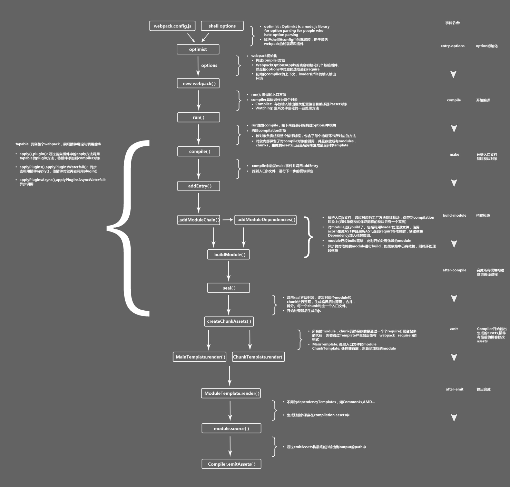

基本的`webpack`配置如下

```js
const path = require("path");
const webpack = require("webpack");
module.exports = {
  entry: {
    index: "./src/main.js",
  },
  output: {
    filename: "[name]-[chunkhash].js",
    path: path.resolve(__dirname, "dist"),
  },
  plugins: [new webpack.HotModuleReplacementPlugin()],
  modules: {
    rules: [
      {
        text: /.less$/,
        loaders: ["style-loader", "css-loader", "less-loader"],
      },
    ],
  },
};
```

# webpack 构建流程

`webpack`的运行流程是一个串行的过程,从启动到结束会走以下过程

1. 初始化参数:从配置文件和 Shell 语句中`读取/合并`参数。得到最终结果
2. 开始编译：将上面的到的参数传递至`compiler`类中,加载所有的插件`(依赖tapable)`库后运行`run()`
3. 确定入口：根据配置文件的`enrty`字段
4. 开始编译：从入口文件触发,借助`(babylon、@babel/traverse、@babel/types、@babel/generator)`库，获取文件的内容和调用所有配置的`Loader`对模块进行翻译，再找出该模块依赖的模块。递归本步知道入口文件所有的依赖都经过本步骤处理。
5. 完成模块编译：第四步骤走完后就会得出每个模块被翻译后的最终内容，以及他们之间的依赖关系。
6. 输出资源： 根据入口文件和模块之间的关系，组装成一个个含有多个模块的`chunk`。再把每个`chunk`转换成一个单独的文件加入到`fs.writeSync()`队列中。
7. 完成输出：在确定好输出内容后，根据配置的`output`路径写入文件。

在以上过程中，`webpack`会在特点运行步骤中广播出特定的事件，插件在监听到这个事件后会执行待定的逻辑。并且插件可以调用`webpack`提供的`api`改变`webpack`的结果;


