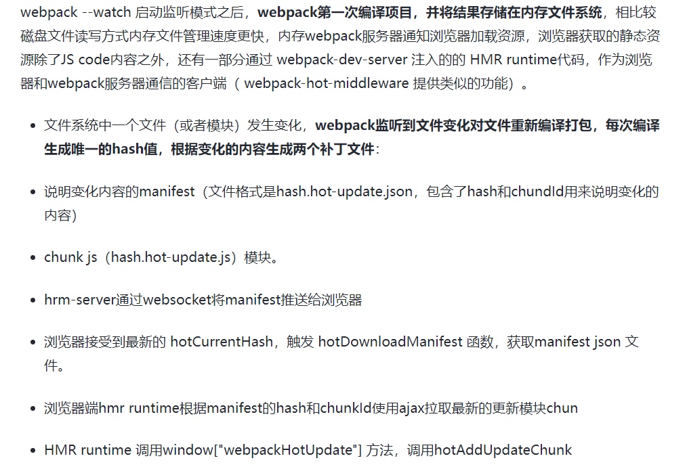
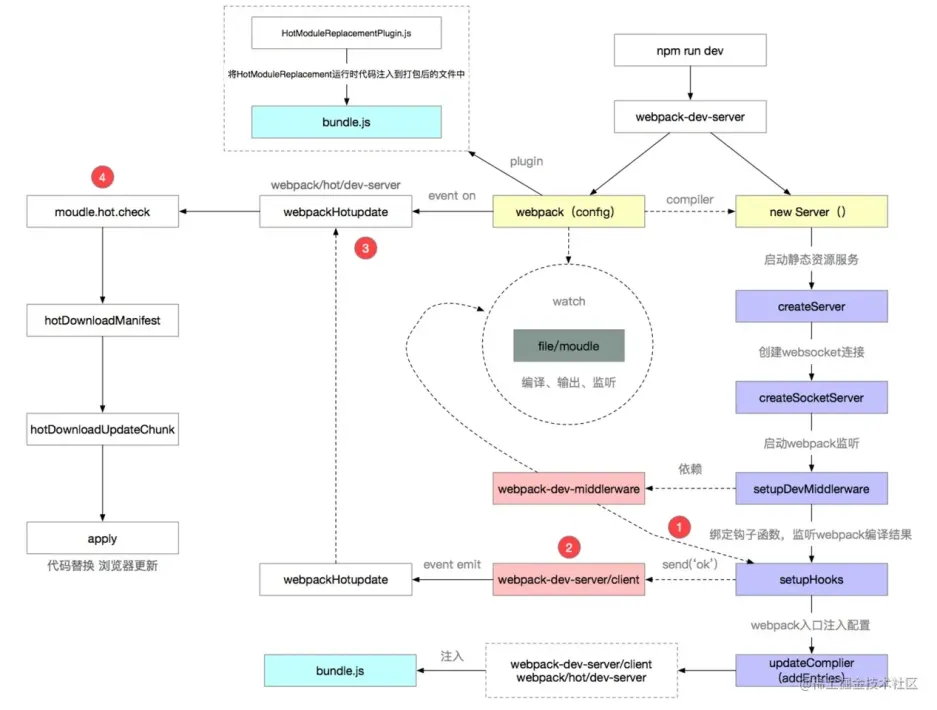

### webpack 中开启热更新

热更新主要是引用 `webpack` 中的内置 `HotModuleReplacementPlugin` 模块,借助 `webpack-dev-server` 这个服务中运行。

```javascript
const webpack = require("webpack");
module.exports = {
    entry:'',
    output:'',
    plugins:[new webpack.HotModuleReplacementPlugin()],
    devServer:{
        contentBase:'./dist'
        hot:true
    }
}
```

### 原理分析

服务启动的时候，会利用`node`提供的内置模块`FS`中的`watch`监听工作目录的所有文件，因为在打包的时候就已经可以确定当前文件修改会影响哪些文件。所以在文件修改后根据依赖关系重新打包生成新的`chunk`。再利用创建的服务时创建的`websocket`服务器进行`Hash`比较，浏览器来根据**最新的 hash 值**来判断是否创建`JSONP`的请求来请求最新的`chunk`



