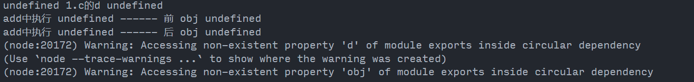
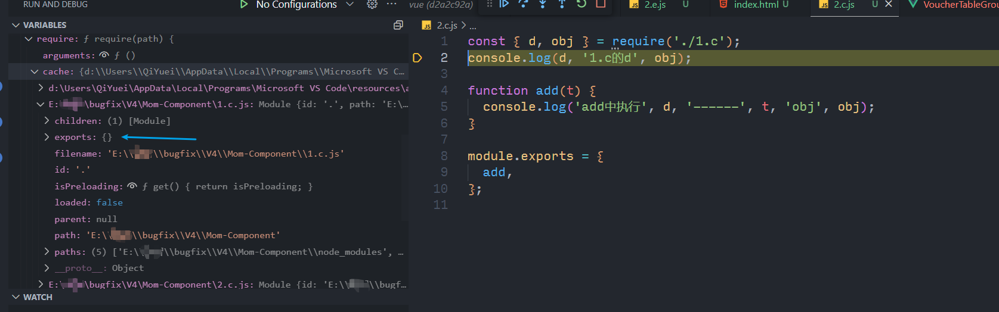
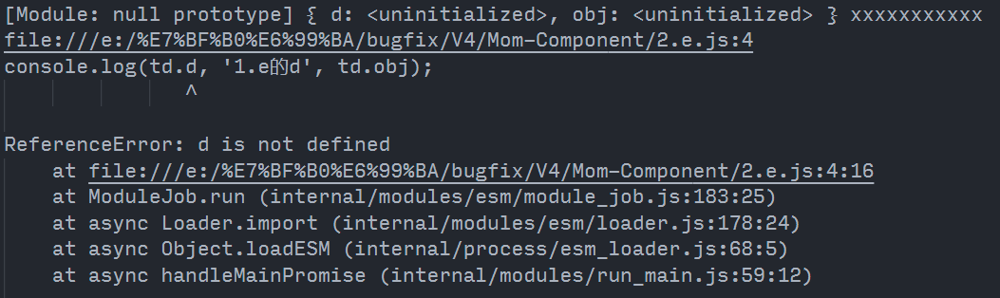
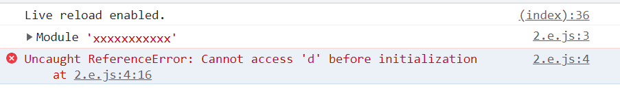
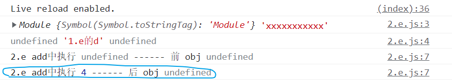
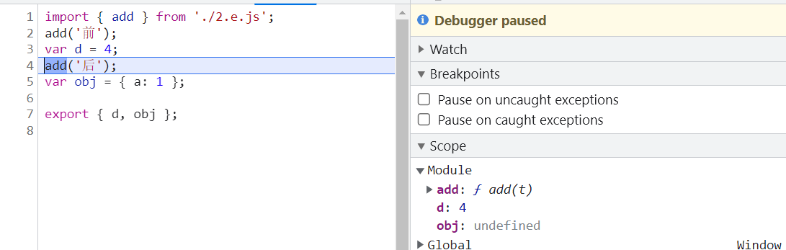

## 概述

模块化主要有 `AMD`、`CMD`、`CommonJS`、`ESM` 。其中 `UMD` 并不是一种模块规范而是一种兼容了`AMD/CommonJS/iife`的加载方式。

- `AMD` 是基于 `require.js` 它推崇依赖前值
- `CMD` 是基于 `Sea.js` 它推崇依赖就近
- `CommonJS` 设计初衷就是用于服务端的模块化

## 区别

### 导出

`ESM` 导出是值的一份 **引用** 而 `CommonJS` 导出是值的 **拷贝** 。也就是说，`CommonJS` 是把暴露的对象拷贝一份，放在新的一块内存中，每次直接在新的内存中取值，所以对变量修改没有办法同步；而`ESM`则是指向同一块内存，模块实际导出的是这块内存的地址，每当用到时根据地址找到对应的内存空间。

```js
// b.mjs
export let count = 1;
export function add() {
  count++;
}
export function get() {
  return count;
}

// a.mjs
import { count, add, get } from "./b.mjs";
console.log(count); // 1
add();
console.log(count); // 2
console.log(get()); // 2
```

可以看到调用后，导出的数字同步增加了。

接下来看看 `CommonJS` 的表现

```js
// a.js
let count = 1;
module.exports = {
  count,
  add() {
    count++;
  },
  get() {
    return count;
  },
};

// index.js
const { count, add, get } = require("./a.js");
console.log(count); // 1
add();
console.log(count); // 1
console.log(get()); // 2
```

可以看到，在调用 `add` 对变量 `count` 增加后，导出 `count` 没有改变，因为 `CommonJS` 基于缓存实现，入口模块中拿到的是放在新内存中的一份拷贝，调用 `add` 修改的是模块 `a` 中这块内存，新内存没有被修改到，所以还是原始值，只有将其改写成方法才能获取最新值。

### 导入

对于导入就不得不提到 **循环引用** 这个问题。这两种模块化规范对于解决循环引用问题也是不同的方案。

#### CommonJS

```js
// 1.c.js
const { add } = require("./2.c");
add("前");
const d = 4;
add("后");
const obj = { a: 1 };
module.exports = {
  d,
  obj,
};

// 2.c.js
const { d, obj } = require("./1.c");
console.log(d, "1.c的d", obj);

function add(t) {
  console.log("add中执行", d, "------", t, "obj", obj);
}

module.exports = {
  add,
};
```



可以看到在执行的时候竟然没有报错,对于这种互相引用的关系按理来说回报错才对。我们接下来打断点看看 `node` 中是如何处理这种关系的。



可以看到在执行 `2.c.js` 的时候,在 `require` 中有缓存的 `cache` 但是 `exports` 是一个空对象。这也正常因为 `1.c.js` 并没有执行完。

也就是说使用 `require` 一个模块的时候，内部会先将这个模块推入缓存 `cache` 中,但是 `exports` 是一个空对象,等到执行完 `1.c.js` 的时候在赋值。

这就很好解释上面的输出结果了

1. 执行 `1.c.js` 将 模块 ID 推入 `cache` 中,开始执行
2. 遇到 `2.c.js` 也是先加入缓存,开始执行遇到 `require('./1.c.js')` 先看是否命中缓存，如果命中则直接返回缓存中的 `exports` 否则先加载 `1.c.js`
3. 此时因为 `1.c.js` 还没有执行完所以 `exports = { }`
4. 从 `exports` 中解构 `obj` 、`d` 两者都为 `undefined`

<el-divider />

#### ESM

```js
// 1.e.js
import { add } from "./2.e.js";
add("前");
const d = 4;
add("后");
const obj = { a: 1 };

export { d, obj };

// 2.e.js

import * as td from "./1.e.js";

console.log(td.d, "1.e的d", td.obj);
function add(t) {
  console.log("2.e add中执行", td.d, "------", t, "obj", td.obj);
}

export { add };
```





目前环境中 `node` 版本 `14.20.0` 与 浏览器中的结果有出入，但是在高版本浏览器中的结果是与浏览器一致。

出现这个错的原因是因为我们用了 `const` 没有变量提升,改成 `var` 试试。



不认真看还真以为跟 `CommonJS` 的结果一致，但是仔细看 **给变量赋值后** 再打印。竟然有值出现！！！



### 总结

`ESM` 和 `CommonJS` 一样，发生循环引用时并不会导致死循环，但两者的处理方式大有不同。如果阅读了上文，应该还记得 `CommonJS` 对循环引用的处理基于他的缓存，即：将导出值拷贝一份，放在一块新的内存，用到的时候直接读取这块内存。

但 `ESM` 导出的是一个索引——内存地址，没有办法这样处理。它依赖的是“模块地图”和“模块记录”，模块地图在下面会解释，而模块记录是好比每个模块的“身份证”，记录着一些关键信息——这个模块导出值的的内存地址，加载状态，在其他模块导入时，会做一个“连接”——根据模块记录，把导入的变量指向同一块内存。
