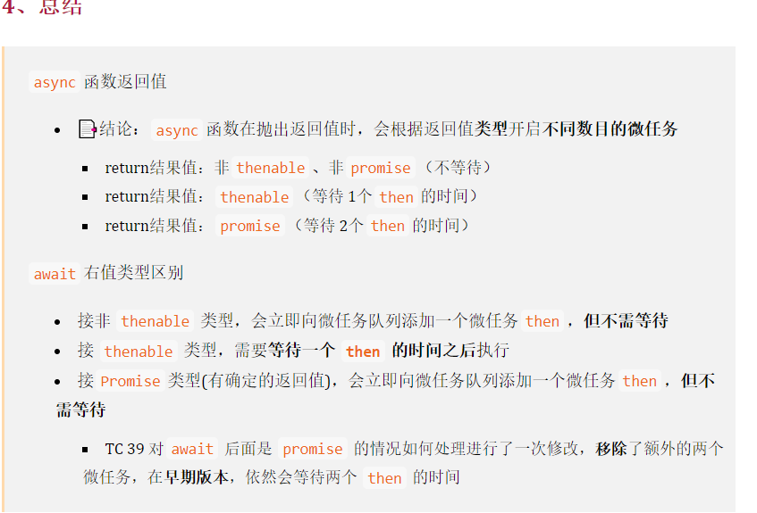

在学习事件循环之前，我们需要知道几个概念。进程和线程。以及 JS 常用的线程有哪些

## 进程

进程是计算机进行资源分配和调度的基本单位。现代一个浏览器中一个页卡就是一个进程。

## 线程

一个进程中可以拥有多个线程。在现代浏览器中，每个页卡中有

- 网络线程
- UI 渲染线程
- 事件触发线程(eventloop)
- ajax
- setTimeOut

其中在 `UI渲染线程`中，`JS引擎`也在这个线程之中。但是说`JS是单线程的`这句话是错的！！因为我们现在也有`worker`线程这玩意，而且在使用`setTimeOut`也会多开一个线程。<br />但是`JS主引擎`是单线程。

### 异步里的概念（宏任务和微任务）

宏任务：`setTimeout`,`setInterval`,`setImmediate(ie 生效)`等<br />微任务：`promise.then()`,`MutationObserve() (监测dom变化)`等

就想图里所展示的。<br />首先`<srcipt></script>`代码是从上往下执行的。如果遇到宏任务就将其放入到宏任务队列中。遇到微任务就将其放入微任务队列。在执行完同步代码后，会依次执行微任务上的任务。然后根据`个个浏览器的优化策略可能会执行一次GUI渲染，也有可能不执行。具体看浏览器策略`。最后就会执行宏任务里任务。

总的来说 就是有两个队列<br />宏任务->[]<br />微任务->[]<br />遇到相对应的就往里面扔，但是总是先清空微任务队列才会执行宏任务里面的任务。

### 题目 1

```javascript
app.style.background = "yellow";
console.log(1);
let p = Promise.reslove();
p.then(() => {
  console.log(2);
  app.style.background = "red";
});

//打印  1 2 颜色一直是red
```

### 题目 2

```javascript
buttom.addEventListener("click", () => {
  console.log(1);
  Promise.reslove().then((res) => {
    console.log("click1");
  });
});
buttom.addEventListener("click", () => {
  console.log(2);
  Promise.reslove().then((res) => {
    console.log("click2");
  });
});
buttom.click(); // 这里是同步执行点击事件

// 打印  1 2 click1 click2
```

### 题目 3

```javascript
// 手动点击按钮
<button>点击</button>

<script>
buttom.addEventListener('click', () => {
  console.log(1)
  Promise.reslove().then((res) => {
    console.log('click1')
  })
})
buttom.addEventListener('click', () => {
  console.log(2)
  Promise.reslove().then((res) => {
    console.log('click2')
  })
})
</script>
// 打印
1 click1 2 click2
```

#### 题目三题目四区别

其实可以很容易可以两者在执行上的区别。第三题是`同步调用点击方法`，而第四题是等用户`手动点击调用`。<br />在`JS`中每次点击都是一个`宏任务`。然后同步调用就相当于同步执行了`回调中的方法`。

```javascript
// 可以当成
buttom.addEventListener("click", f1);
buttom.addEventListener("click", f2);
const f1 = () => {
  console.log(1);
  Promise.reslove().then((res) => {
    console.log("click1");
  });
};
const f2 = () => {
  console.log(2);
  Promise.reslove().then((res) => {
    console.log("click2");
  });
};
buttom.click(); // => f1() f2()
```

这样就按照同步的代码执行下去。就是`1 2 click1 click2`<br />而第四题，我们知道点击是`宏任务`。就会把`f1 f2`放入宏任务队列`[f1,f2]`<br />在执行`f1`的时候`先打印1，然后在将这个异步放入微任务中。继续执行。在执行f2之前会将微任务队列清空。`所以就是`1 click1 2 click2`

### 第五题

```javascript
console.log(1);
async function async() {
  console.log(2);
  await console.log(3); // await可以看成promise.reslove(console.log(3)).then(res=>console.log(4))
  console.log(4);
}
setTimeout(() => {
  console.log(5);
});
let p = new Promise((resolve) => {
  console.log(6);
  resolve(7);
});
async();
p.then((res) => {
  console.log(7);
});
console.log(8);

// 打印  1 6 2 3 8 4 7 5
// 16238475
```


