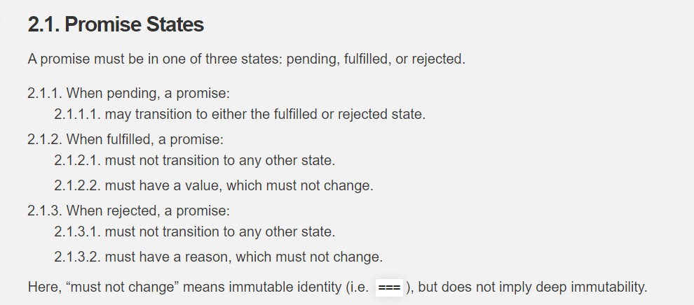
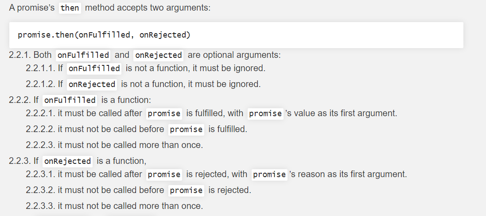
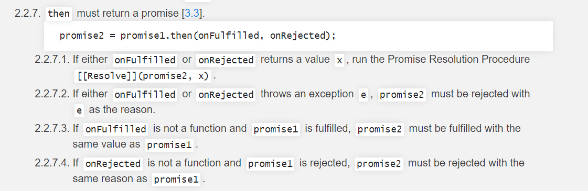
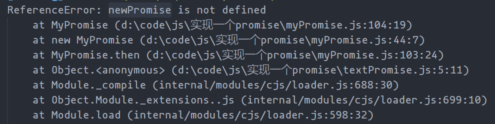
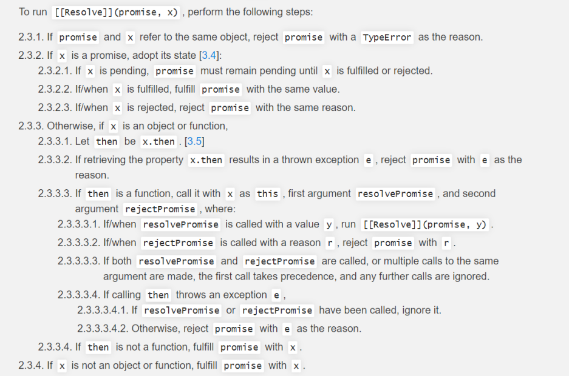
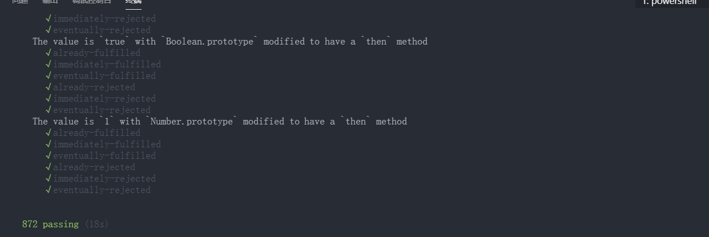

### 概述

在早期处理异步的方式都是采用回调函数的形式,比如`nodeApi`,多个回调中就形成了回调多层嵌套(也叫回调地狱)。后来出现的`generater`和`Promise`解决了回调地狱的问题。<br />`Promise` 是 `JavaScript` 异步编程的一种流行解决方案，它的出现是为了解决 回调地狱 的问题，让使用者可以通过链式的写法去编写写异步代码，具体的用法笔者就不介绍了，大家可以参考阮一峰老师的 ES6 Promise 教程。

### 课前知识

#### 观察者模式

发布观察者模式简单的来说比如场景中有用户、代理商、总公司三种身份。用户通过下单告诉总公司我要订牛奶,总公司告诉代理商 xx 用户定了牛奶要给他送去。这种就形成了一种观察者的模式 由用户做为被观察者 总公司做为观察者观察用户的需求并由中间商执行用户需求。

> 发布订阅模式定义了一种一对多的依赖关系，让多个观察者对象同时监听某一个目标对象，当这个目标对象的状态发生变化时，会通知所有观察者对象，使它们能够自动更新。<br />`Promise` 是基于 观察者的设计模式 实现的，`then` 函数要执行的函数会被塞入观察者数组中，当 `Promise` 状态变化的时候，就去执行观察组数组中的所有函数。

#### 事件循环机制（EventLoop）

EventLoop 主要分为`宏任务`和`微任务`两种形式。

在浏览器中`宏任务`主要分为

- `setTimeOut`
- `setInterval`
- `ui渲染`<br />而微任务主要有`Promise`,`MotationObserver`等<br />再来看一道经典题目

```javascript
console.log(1);
setTimeout(() => {
  console.log(2);
}, 0);
let a = new Promise((resolve) => {
  console.log(3);
  resolve();
})
  .then(() => {
    console.log(4);
  })
  .then(() => {
    console.log(5);
  });
console.log(6);
```

> 最终打印为  1 3 6 4 5 2

#### PromiseA+规范

`PromiseA+`规范是在`Promise`社区中应该遵循的规范。或者说遵循它的规范你所写的`Promise`才会被认可。在 npm 上有一个包`promise-aplus-tests`这个包中有大量的测试用例来检验是否符合此规范。

#### 问题

我们在学习的过程中需要带着问题(脑子)去思考为什么我们要这样做

- `Promise` 中是如何实现回调函数返回值穿透的？
- `Promise` 出错后，是怎么通过 冒泡 传递给最后那个捕获异常的函数？
- `Promise` 如何支持链式调用？
- 怎么将 `Promise.then` 包装成一个微任务？

### 一步步实现 Promise

#### Promise 三种状态

因为我们要遵循`promiseA+`规范所以我们就完全按照文档的描述来写<br /><br />图片的大概意思就是`Promise`有三种状态分别为`pending` 、`fulfilled` 、`rejected`<br />且 padding 状态可以转化成`fulfilled`或者`rejected`状态<br />而`fulfillded`和`rejected`不能转换成其他状态

```javascript
const PADDING = "padding";
const FULFILLED = "fulfilled";
const REJECTED = "rejected";
```

#### executor 执行器

在 Promise 中会都有一个`executor`它在`new Promise()`的时候就要执行,这个`executor`中还有两个回调分别是`resolve`和`reject`

```javascript
class MyPromise {
  constructor(executor) {
    // 初始化Promise
    this.value = null;
    this.reason = null;
    this.status = PADDING; // 当前的状态
    // 定义resolve和reject
    let resolve = (value) => {
      // 是一个函数成功回调
    };
    let reject = (reason) => {
      // 失败的回调
    };
    try {
      executor(resolve, reject); // 同步执行
    } catch (e) {
      reject(e);
    }
  }
}
```

上面的代码是不是就可以很好地解释为什么`new Promise(()=>{ //todo... 是同步执行的 })`的问题啦。

#### then()方法

用过`Promise`的都知道会有一个`then()`方法。让我们来看下`PromiseA+`中是怎么定义这个`then`的<br /><br />首先`then()`方法一样接收两个回调`onFulfilled` 和`onRejected`。并且只有`status`的状态为`fulfilled`的时候才能执行`onFulfilled`回调,只有`status`的状态为`rejected`的时候才能执行`onRejected`回调。如果`padding`的状态说明`new Promise(()=>{// 这里有异步方法})`就需要将他的回调放入一个专门的数组中等到状不为`padding`的时候再依次执行回调。

```javascript
class MyPromise{
   constructor(executor){
       // 存放成功回调
       this.onFulfilledCb = []
       // 存放失败回调
       this.onRejectedCb = []
       // 定义resolve和reject
     let resolve = (value)=>{ // 是一个函数成功回调
         if(this.status === PADDING){
             // 执行异步回调
            this.onFulfilledCb(cb=>cb())
         }
     }
     let reject = (reason)=>{ // 失败的回调
          if(this.status === PADDING){
            this.onRejectedCb(cb=>cb())
         }
     }
   }
}
then(onFulfilled,onRejected){
  //首先判断 两个参数是不是方法 不是的话就构造成方法
  // 这里很妙 这里也叫透传参 下面会介绍到
  typeof onFulfilled === 'function' ? onFulfilled: (val)=>val
  typeof onRejected === 'function' ? onRejected : (reason)=>{throw reason}
  // 状态为 fulfilled
  if(this.status === FULFILLED){

  }
   // 状态为 Reject
  if(this.status === REJECTED){

  }
  // 状态为padding
  if(this.status === PADDING){
    this.onFulfilledCb.push(()=>{
        onFulfilled()
    })
    this.onRejectedCb.push(()=>{
        onRejected()
    })
  }
}
```

#### 传参透传

> 表面意思就是 .then().then(res=>{// 我依然可以接收到参数}).catch(e=>{// 我可以最后再捕获错误})<br />还记得 typeof onFulfilled === 'function' ? onFulfilled: (val)=>val 当 then 中没有传任何参数的时候，Promise 会使用内部默认的定义的方法，将结果传递给下一个 then。

<br />图片大概的意思就是

- `then()`方法必须返回一个新的`Promise`
- 用变量`x`接收`onFulfilled`、`onRejected` 参数的返回值
- 并且需要判断变量`x`是不是一个新的`Promise` 。则需要返回新`Promise`的`resolve()`值<br />既然这样那我们就按照它的要求来重新编写 then 方法

```javascript
then(onFulfilled,onRejected){
  let promise2 = new MyPromise((resolve,reject)=>{
  typeof onFulfilled === 'function' ? onFulfilled: (val)=>val
  typeof onRejected === 'function' ? onRejected : (reason)=>{throw reason}
  // 状态为 fulfilled
  if(this.status === FULFILLED){
      let x = onFulfilled(this.value)
      // 这里还要判断x 是否为Promise
      reslovePromise(x,promise2,resolve,reject)
  }
   // 状态为 Reject
  if(this.status === REJECTED){
     let x = onRejected(this.reason)
     // 这里还要判断x 是否为Promise
      reslovePromise(x,promise2,resolve,reject)
  }
  // 状态为padding
  if(this.status === PADDING){
    this.onFulfilledCb.push(()=>{
      // 这里还要判断x 是否为Promise
        reslovePromise(x,promise2,resolve,reject)
    })
    this.onRejectedCb.push(()=>{
      // 这里还要判断x 是否为Promise
       let x =  onRejected()
        reslovePromise(x,promise2,resolve,reject)
    })
  }
  })
  // 返回一个新的Promise
  return promise2
}
```

咦,好像不知不觉又解决了一个问题

> Promise 如何实现链式调用<br />因为在 then() 方法中永远返回了一个新的 Promise 实例 新的 Promise 实例上有 then()方法<br />上面这一版`then()`看上去并没有上面问题。运行起来会报错,
> <br />这是因为在 new 过程中并没有 并没有还没有定义 promise2 这个变量 所以就会报这个错误<br />在这里应该是需要引入一个微任务来包裹 比如 `process.nextTick`、`MutationObserver`、`postMessage`<br />这里暂且用 setTimeOut 包裹看下效果

```javascript
then(onFulfilled,onRejected){
  let promise2 = new MyPromise((resolve,reject)=>{
  typeof onFulfilled === 'function' ? onFulfilled: (val)=>val
  typeof onRejected === 'function' ? onRejected : (reason)=>{throw reason}
  // 状态为 fulfilled
  if(this.status === FULFILLED){
     setTimeout(() => {
      let x = onFulfilled(this.value)
      // 这里还要判断x 是否为Promise
       reslovePromise(promise2,x,resolve,reject)
      }, 0)
  }
   // 状态为 Reject
  if(this.status === REJECTED){
     setTimeout(() => {
     let x = onRejected(this.reason)
     // 这里还要判断x 是否为Promise
      reslovePromise(promise2,x,resolve,reject)
       }, 0)
  }
  // 状态为padding
  if(this.status === PADDING){
    this.onFulfilledCb.push(()=>{
      setTimeout(() => {
      // 这里还要判断x 是否为Promise
        reslovePromise(promise2,x,resolve,reject)
         }, 0)
    })
    this.onRejectedCb.push(()=>{
      setTimeout(() => {
      // 这里还要判断x 是否为Promise
       let x =  onRejected()
        reslovePromise(promise2,x,resolve,reject)
         }, 0)
    })
  }
  })
  // 返回一个新的Promise
  return promise2
}
```

这样就能顺利拿到`promise2`啦。紧接着就要编写`reslovePromise`方法

#### reslovePromise()

<br />上图主要内容有

- 如果 变量`x`的值跟`Promise2`是同一个就要抛出错误(没有返回新的`Promise`)
- 判断`x`是不是一个`Promise`(`object`||`function`)
  - 获取`x.then`并且判断是否为`function`,不是也直接`resolve(x)`
    - 用`call`方式执行`x.then()`方法,成功的回调为 `y` 失败的回调为 `r`
    - 递归使用 `reslovePromise()`防止`x.then()`的结果`y`也是`Promise`
    - 如果当前`Promise`已经被`called`那就`return`
- `x` 不是`Promise`就直接`resolve(x)`

```javascript
reslovePromise(promise2,x,resolve,reject){
  if(x === promise2 ){
     throw new TypeError('不能返回本身Promise,Chaining cycle detected for promise #<Promise>')
  }
  let called
  if(typeof x !==null&&(typeof x==='function'||typeof x === 'object')){
    let then = x.then
    if(typeof then === 'function' ){
        then.call(x,y=>{
          if(called){
            return
          }
          called = true
           reslovePromise(promise2,y,resolve,reject)
        },r=>{
           if(called){
            return
          }
          called = true
          reject(r)
        })
    }else{
      resolve(x)
    }
  }else{
     if(called){
            return
          }
          called = true
    resolve(x)
  }
}
```

就这样我们就完成了一个符合`PromiseA+`的`Promise`啦~~~

### 测试是否符合 PromiseA+规范

使用官方测试包`npm i promises-aplus-tests -g`<br />编写测试脚本

```javascript
MyPromise.defer = MyPromise.deferred = function () {
  let dfd = {};
  dfd.promise = new MyPrmose((resolve, reject) => {
    dfd.resolve = resolve;
    dfd.reject = reject;
  });
  return dfd;
};
```

<br />咳咳好像全部通过了哈哈哈哈哈哈!在这里给自己点个赞赞赞

### catch()

之前我们已经在`then()`中实现了参数透传,聪明的是不是很容易就想到`catch`是怎么实现的了？<br />没错就是这么简单

```javascript
catch(onRejected){
  this.then(null,onRejected)
}
```

### resolve()

`resolve()`是一个静态方法。实际上就是创造一个`Promise`对象。创造一个微任务

```javascript
static resolve(val){
  return new MyPromise((resolve,reject)=>{
      resolve(val)
  })
}
```

### reject()

`reject()`和`resolve()`一样是`Promise`的静态方法。

```javascript
static reject(val){
  return new MyPromise((resolve,reject)=>{
    reject(val)
  })
}
```

### all()

`Promise.all()`是一个静态方法,它能接受一个数组,数组里面可以是任意值(包括`Promise`)。它有一个规则就是将值依次放入到新的数组中。如果遇到错误则会`reject()`并不会往下执行。

```javascript
const isPromise = (n)=>{
   if((typeof n!==null&&typeof n ==='object')){
        return typeof n.then === 'function'
   }else{
     return false
   }
}

static all(arr){
   return new MyPromise((resolve,reject)=>{
      let newArr = []
      const forMatter = (data,i,flag)=>{
         if(flag){
           data.then((res)=>{
              newArr[i] =res // 保证 值的位置不会错
           },e=>{
             reject(e)
           })
         }else{
            newArr[i] =res
         }
         if(newArr.length === arr.length){ // 当新数组和原来数组长度相等的时候就表示成功了
           resolve(newArr)
         }
      }
      for(let i =0;i<arr.length;i++){
         if(isPromise(arr[i])){
            forMatter(arr[i],i,true)
         }else{
             forMatter(arr[i],i,false)
         }
      }
   })
}
```

### finally()

`finally()`方法是 ES9 中提出,且只能在高版本中有用。是在`Promise`的`resolve()`和`reject()`之后都会执行的钩子函数。

```javascript
finally(fn){
  this.then(data=>{
    MyPromise().resolve(fn()).then().then(()=>data)
  },err=>{
     MyPromise().resolve(fn()).then().then(()=>throw err)
  })
}
```
