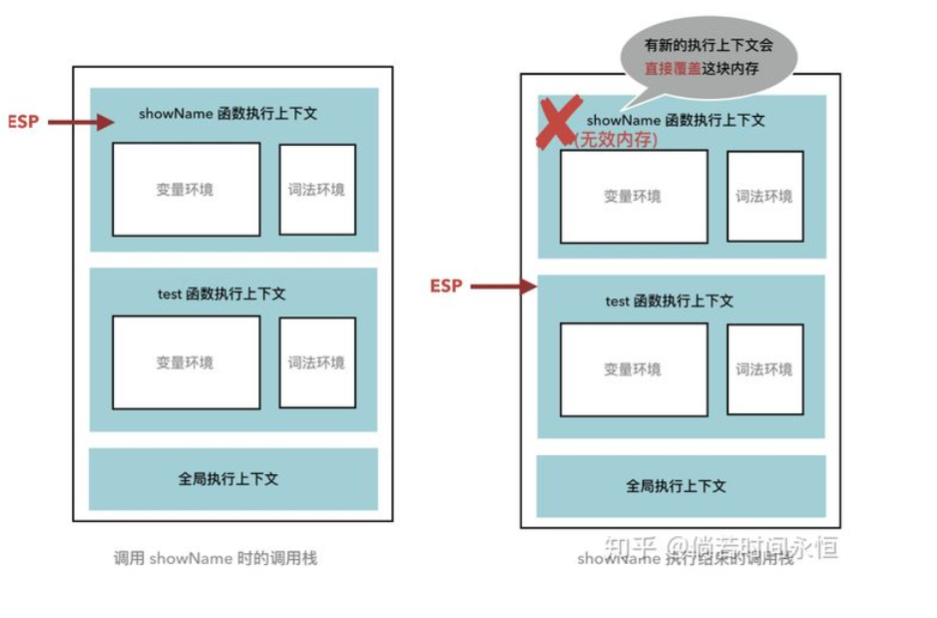
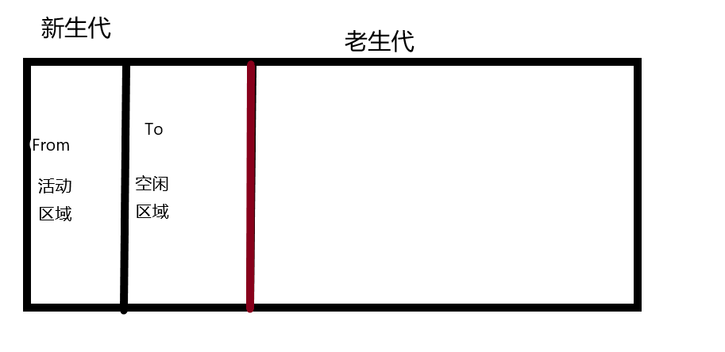
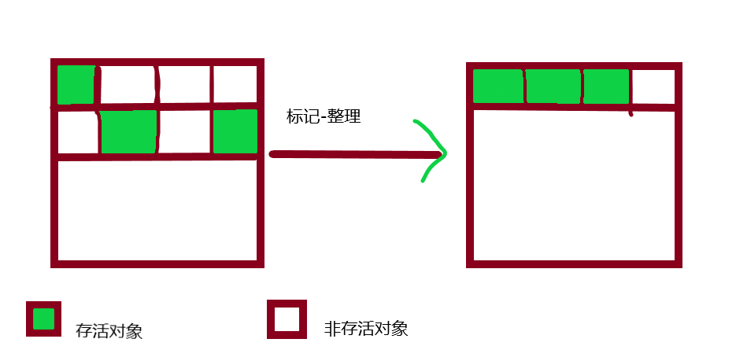

## 引言

`JavaScript`  不像 `c语言`  一般，在创建变量后，需要手动将变量赋值成 `null`

```c
int a = 1
// toSomething...
a= null   // 回收这个变量
```

##

## 引用类型和基本类型

我们都知道在`JavaScript`中分为两种类型 `引用类型`  和 `基本类型` 。其中 `基本类型`  存储在 `栈`  中， `引用类型`  存储在 `堆`  中。<br />基本类型有 `String` , `Number` , `Boolean` , `undefined` , `null` , `Symbol`  ， `BigInt` <br />基本上除了基本类型外都属于引用类型, `Object` , `Array` , `Function` , `Date` ...等

## 基本类型垃圾回收

     基本类型存储在栈中，当指针切换时(也就是上下文切换)，上一个栈被抛出，空间被自动回收。

```javascript
function test() {
  const a = { name: "a" };
}
function showName() {
  const b = { name: "b" };
}
showName();
test();
```



## 引用类型垃圾回收

    <br />引用类型存储在堆中。当我们构造一个对象进行赋值操作的时候，其实相应的内存已经被分配到堆上面了。通过不断地创建对象，让堆的大小达到 `V8引擎` 的限制时就会触发垃圾回收机制。

在 `V8引擎`  中 在 `64位`  的情况下会最大分配 `1.4G` ，而在 `32位`  中就更小了，只有`0.7G`。

这样分配的原因由两点

- `Js`  是单线程，意味着在垃圾回收的时候，主线程的任务会暂停。
- 垃圾回收非常耗费时间(后面 会有优化)

### 新生代和老生代

`V8引擎`  中又将堆里面的变量分成 `新生代`  和 `老生代` 。 <br /> `新生代`  一般指的是那些临时变量，存活时间短。（有晋升为老生代的可能）<br /> `老生代`  一般指存活时间长。

在垃圾回收领域有一个重要的术语—**代际假说**，它有以下两个特点：

- 大部分对象在内存中存在的时间很短，比如说函数内部的变量，或者块级作用域中的变量，当函数或块级代码块执行结束时，作用域内部定义的变量也会被销毁，这一类对象被分配内存后，很快就会变得不可用。
- 只要不死的对象，都会持续很久的存在，比如说 window、DOM、Web API 等。

既然代际假说将对象大致分为两种，长寿的和短命的，垃圾回收也顺势把堆分为新生代和老生代两块区域，短命对象存放在新生代中，反正新生代中的对象都是短命鬼，那么就没有必要分配很大的内存就管理这一块儿区域，所以新生代一般只支持 1~8M 的容量，那么长寿的对象放到哪里呢？老生代存放那些生存时间久的对象，与新生代相比，老生代支持的容量就大的多很多了。

既然非活动对象都存放在了两块区域，V8 也就分别使用了两个不同的垃圾回收器来高效的实施垃圾回收：

- 副垃圾回收器，主要负责新生代的垃圾回收。
- 主垃圾回收器，主要负责老生代的垃圾回收。

### 副垃圾回收器

通常情况下，大多数小的对象都会被分配到新生区，虽然这个区域不大，但是垃圾回收还是进行的非常频繁的。

新生代中采用 `**Scavenge 算法` **处理，就是把新生代空间对半分为活动区域和空闲区域，新加入的对象会放到活动区域，**当新生代活动区域快要被写满的时候就会执行一次垃圾清理的操作\*\*。

<br /> 在垃圾回收的时候 `V8引擎`  会去扫描一遍 `From`  区域，如果可以访问到那说明是**存活对象，**那就复制到 `To`  区域，并且**按照顺序从头开始排列（Scavenge 算法**）。如果不能访问到那就直接回收即可。

**提一嘴，按照顺序从头排序是为了防止产生垃圾碎片。方便大对象存储**

当 `From`  区域的对象都移动到`To`区域. `From`  和 `To`  两者的角色对调。 `From`  变成空闲区域。如此循环。

**当一个对象经历多次副垃圾回收，就会发生晋升，这个对象从 新生代 移动到 老生代 中。**

### 主垃圾回收器

前面我们提到了，主垃圾回收器主要是负责老生区的垃圾回收，除了新生区晋升的对象，一些大的对象会被直接分配到老生区。所以老生区的对象一般有两个特点：

1. 对象占用空间大
2. 对象存活时间长

**这个明显就不适用副垃圾回收的 **`**Scavenge**`**  算法。复制占用空间大的对象本身就要花费一定的时间。**

在主垃圾回收中主要采用的 还是**标记清除法**的算法来进行垃圾回收。

既然是标记清除，那肯定先要标记， `V8引擎`  在垃圾回收时，遍历堆中的所有对象，对他们做上标记，然后将代码环境中 `正在使用的变量`  和 `强引用`  的变量进行取消，剩下的则是要删除的变量了、在随后的**清除阶段**删除标记的变量。



**标记-整理阶段是在标记-清除后，将存活的对象进行排序。也是为了方便以后存储更大的对象。**

### 增量标记

由于 JS 的单线程机制，V8 在进行垃圾回收的时候，不可避免地会阻塞业务逻辑的执行，倘若老生代的垃圾回收任务很重，那么耗时会非常可怕，严重影响应用的性能。 那这个时候为了避免这样问题，V8 采取了增量标记的方案，即将一口气完成的标记任务分为很多小的部分完成，每做完一个小的部分就"歇"一下，就 js 应用逻辑执行一会儿， 然后再执行下面的部分，如果循环，直到标记阶段完成才进入内存碎片的整理上面来。其实这个过程跟 React Fiber 的思路有点像。

**经过增量标记之后，垃圾回收过程对 JS 应用的阻塞时间减少到原来了 1 / 6, **


