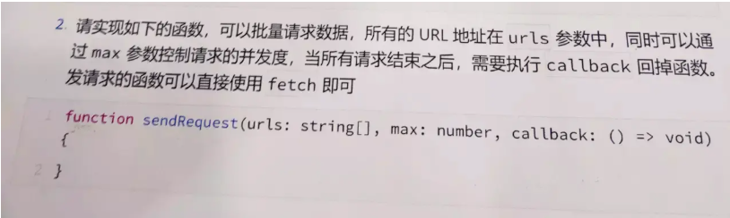

## 预备知识

这道题应该是很久上半年,头条的一个面试题了。这里如果单纯的用 `Promise.all()` 去处理全部的异步请求实际上会出现卡顿的情况。比如在 `chrome` 中同一时间最多支持 `6`个 `tcp`连接。

### 浏览器与服务器建立一个 TCP 连接后，是否会在完成一个 http 请求后断开？什么条件下会断开？

在 `HTTP/1.0` 中，一个 `http` 请求收到服务器响应后，会 `断开对应的TCP连接` 。这样每次请求，都需要重新建立 TCP 连接，这样一直重复建立和断开的过程，比较耗时。所以为了充分利用 TCP 连接，可以设置头字段 `Connection: keep-alive` ，这样 `http` 请求完成后，就 `不会断开当前的TCP连接`，后续的 http 请求可以使用当前 TCP 连接进行通信。

### 一个 TCP 连接可以同时发送几个 HTTP 请求？

尽管这样 `HTTP/1.1` 中，`单个TCP连接`，在同一时间只能处理`一个http请求`，虽然存在 Pipelining 技术支持多个请求同时发送，但由于实践中存在很多问题无法解决，所以浏览器默认是关闭，`所以可以认为是不支持同时多个请求`。<br />`HTTP2提供了多路传输功能，多个http请求，可以同时在同一个TCP连接中进行传输。`

### 浏览器 http 请求的并发性是如何体现的？并发请求的数量有没有限制？

页面资源请求时，浏览器会同时和服务器建立多个 TCP 连接，在同一个 TCP 连接上顺序处理多个 HTTP 请求。所以浏览器的并发性就体现在可以建立多个 TCP 连接，来支持多个 http 同时请求。<br />Chrome 浏览器最多允许对同一个域名 Host 建立 6 个 TCP 连接，不同的浏览器有所区别。

## 分析

- url 的地址全部存放至一个数组中
- 通过 max 来控制最大并发度
- 全部请求结束后,在执行 callback 回调

## 实现

```javascript
function sendRequest(urls, max, callback) {
  let len = urls.length;
  let finished = 0; // 已完成多少
  const request = (url) => {
    if (urls.length) {
      let url = urls.shift(); // 取出第0个
      fetch(url)
        .then()
        .finally((_) => {
          finished++;
          request(); // 完成一个请求补一个
        });
    }
    if (finished === len) {
      // 说明执行完了
      callback();
    }
  };
  for (let j = 0; j < max; j++) {
    // 一执行这个函数就发送max个请求
    request();
  }
}
```

#### async 版本

```javascript
async function pool(arr, max) {
  const ret = []; // 保存返回的结果
  const executing = []; // 正在执行的记录

  for (let item of arr) {
    let p = Promise.resolve().then(() => item());
    ret.push(p);
    if (max <= arr.length) {
      const e = p.then(() => executing.splice(executing.indexOf(e)), 1);
      executing.push(e);
      if (executing.length >= max) {
        await Promise.race(executing);
      }
    }
  }

  return Promise.all(ret);
}

async function sendRequest(urls, max, callback) {
  const requests = urls.map((url) => () => fetch(url));

  pool(requests, max).then(callback);
}
```

## 拓展

### 失败重试

按照上面的要求再加入一个需求,就是失败的请求自动请求 3 次如果三次错误的话就把错误信息放入结果中。

```javascript
function sendRequest(urls, max, callback) {
  const len = urls.length;
  let currentUrl = 0;
  let finished = 0;
  let result = [];
  const request = (index) => {
    let ind = index || currentUrl; // 如果index 有值则说明
    if (ind < len) {
      fetch(urls[ind])
        .then((res) => {
          result[ind] = res; // 保证顺序问题
          finished++;
          if (finished === len) {
            console.log(result, "Jieguo");
            callback();
          }
          request();
        })
        .catch((e) => {
          // 记录重试第几次
          if (result[ind]) {
            // 有值说明已经失败过了
            if (result[ind] > max - 1) {
              // 这里是3 说明执行之前已经发送三次了 这次是第四次
              console.log("我已经失败三次了");
              result[ind] = `e+e`;
              finished++;
              if (finished === len) {
                console.log(result, "Jieguo");
                callback();
              }
            } else {
              result[ind] += 1;
              request(ind);
            }
          } else {
            result[ind] = 1;
            request(ind);
          }
        });
    }
    !index && currentUrl++; // 没有index 说明是正常走
    // 有index  则是错误重试 他的currentUrl 不需要增加
  };
  for (let j = 0; j < max; j++) {
    request();
  }
}
```

## 总结

在控制并发数的同时，每结束一个请求并发起一个新的请求。依旧使用递归的方式，但这次添加一个请求队列，然后我们只要维护这个队列，不管是是否可重试,只需要结束一个请求的同时再加入一个请求。这样这个队里的请求就不会超过 `max`。
