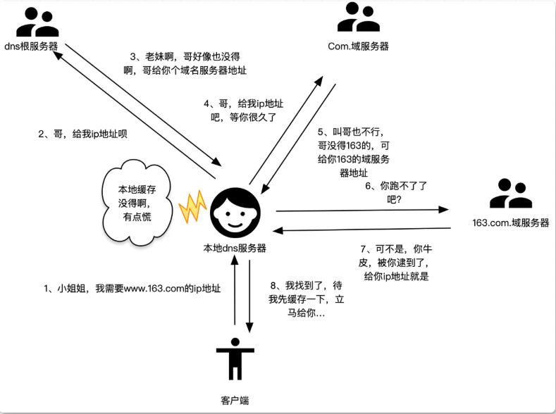
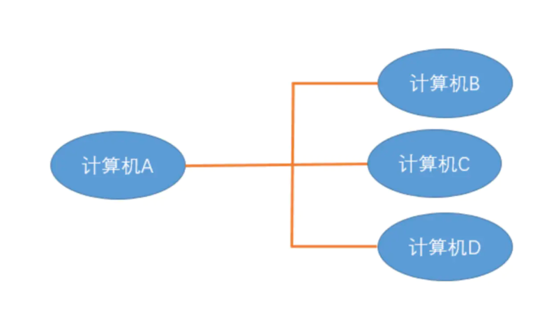

# 概述

这道面试题其实 5 6 句话就能搞定,难就难在这个问题能在繁衍出其他的子问题,不管是`计算机网络`还是`浏览器工作原理`还有`优化方面`都可以从这个问题拓展出。

> 1.DNS 解析:将域名解析成 IP 地址 2.TCP 连接：TCP 三次握手 3.发送 HTTP 请求 4.服务器处理请求并返回 HTTP 报文 5.浏览器解析渲染页面，构建 dom 树，样式树，渲染树，layout 布局，painting 绘制 6.断开连接：TCP 四次挥手

# 网络篇

## 讲讲 DNS 解析出 Ip 地址的大致过程

### DNS 是什么

「官方解释」：`DNS（Domain Name System，域名系统）`，因特网上作为「域名和 IP 地址相互映射」的一个「分布式数据库」，能够使用户更方便的访问互联网，而不用去记住能够被机器直接读取的 IP 数串。通过主机名，最终得到该主机名对应的 IP 地址的过程叫做域名解析（或主机名解析）。 「通俗的讲」，我们更习惯于记住一个网站的名字，比如`www.baidu.com`,而不是记住它的 ip 地址，比如：`167.23.10.2`。

### DNS 解析过程

我们通常是通过域名访问比如百度`www.baidu.com`,首先浏览器会查看本地的浏览器缓存中有没有该域名的`Ip`。如果没有则会访问计算机的`.host文件`查看是否有相对于记录。如果在没有那就没得办法了,`[浏览器会发送一个请求到本地dns服务器,这个服务器一般都是我们的运营商中国移动那些..]`如果本地的`dns`也没有,`[本地dns服务器会发送一个请求至域名的根服务器]`例如`www.baidu.com`中就是像`.com`这个`根服务器`查询。没有则会向`baidu.com`这个`域服务器`中查询！这一过程是`递归查询`。值得注意的是无论是`根服务器`还是`域服务器`都不会直接与`客户端`通信。而是与`本地dns`通信。查询出对应得`ip`后本地的`dns服务器`会其进行缓存。

## 我在东莞发一个请求,怎么让远在黑龙江的服务器接收

标识网络中的一台计算机，一般至少有三种方法，最常用的是`域名地址`、`IP地址`和`MAC地址`，分别对应`应用层、网络层、物理层`。网络管理一般就是在网络层针对`IP地址`进行管理，但由于一台计算机的 IP 地址可以由`用户自行`设定，管理起来相对困难，`MAC地址`一般不可更改，所以把 IP 地址同 MAC 地址组合到一起管理就成为常见的管理方式。

### 物理层

物理层，顾名思义，通过物理手段 ( 网线，光纤，无线 ) 将设备连接在一起，传输 0/1 电信号 ( 也叫比特流 ) ，就像我们上边讲到的计算机之间的物理连线 主要用来传输 0/1 信号，因为 0/1 信号没有任何的现实意义，所以用另一层用来规定不同 0/1 组合的意义

### 数据链路层

#### 以太网

`010101010101111000111011010`，像这么一串数据计算机并不知道是什么意思下层的物理层不能规定不同 0/1 组合的信号代表 什么意义，所以在数据链路层规定了一套协议，专门给`0/1`信号进行分组，规定不同的组代表的是什么意思，从而让双方计算机都 能够进行识别，这个协议就是我们常说的 以太网协议。但是把一台计算机的数据通过物理层和数据链路层发送给另外一台计算机， 怎么标识对方以及怎么知道对方的地址呢？ 唯一标示`MAC`地址 出现了

#### Mac 地址

`Mac地址实际上就是电脑中网卡的物理地址`,由制造商写入网卡中的`bios`中 MAC 地址通常表示为`12个16`进制数，每 2 个 16 进制数之间用冒号隔开，如：`08:00:20:0A:8C:6D`就是一个 MAC 地址，其中前 6 位 16 进制数`08:00:20`代表网络硬件制造商的编号，它由 IEEE 分配，而后 6 位 16 进制数`0A:8C:6D`代表该制造商所制造的某个网络产品（如网卡）的系列号。每个网络制造商必须确保它所制造的每个以太网设备都具有相同的前三字节以及不同的后三个字节。这样就可保证世界上每个以太网设备都具有唯一的 MAC 地址。 但是如何知道对应服务器的 MAC 地址呢？ 这时候`ip协议`就出来了

#### 广播

在同一子网络，就是我们常说的局域网中，计算机通过广播来通信，即向同子网中全部计算机发送数据包，其它计算机根据数据包中接收者的 MAC 地址 来判断是否接收数据包 通俗来讲，就是 A 会同时给 B/C/D 发送数据包，这个数据包中会包含着接收者的 MAC 地址 信息，当 B/C/D 接收到了数据包，会取出数据包中的 MAC 地址 与自身的 MAC 地址 对比，如相同就接收这个数据包，否则就丢弃这个数据包 (   丢包 )，这种方式我们称之为 广播 就像，你和女友在人群中走散了，你大喊一声她的名字，听到的人会自己匹配，是自己就会理会，不是自己就当你是傻子不理你 那么到了目前，我们知道了计算机之间的标示和如何通信，但是还有一个问题，要怎么知道对方的 `MAC地址` 呢 ？这又牵出了 ARP 协议 ，通过 `ARP协议` 来得知对方的 `MAC地址` ，这个协议是网络层的一个协议，所以我们暂且搁置，先接着往下看

### 网络层

#### Ip 协议

`ip`协议就是我们常说的`IP地址`,通常我们用的是`ipv4`,它由 32 位组成。前半部分是`网络部分`，后半部分是`主机名`。如果两个 ip 地址的网络部分是一样的那就说明它两处于同一子网中。但是问题了随便给两个 ip。我怎么知道它的网络部分是前几位，主机又是那几位。这时候就要考我们的`子网掩码`

#### 子网掩码

子网掩码中规定`网络部分`全部是`1`,`主机部分`全部是`0`。注意`全部`这很重要。想要判断两个 ip 是否处在相同的子网中，只 需要将两个 ip 地址跟子网掩码进行 AND 运算。如果解析结果一样则是同一子网中。 假设他们处在同一子网当中，计算机 A 要和计算机 B 发送数据时，我们通过是 ARP 协议 来得到计算机的 MAC 地址

#### ARP 协议

`ARP协议` 也是通过`广播`的形式，给同一个子网中每个电脑发送一个数据包，这个数据包会包含接收者的 `IP地址`，对方收到这个数据之后，会取出 `IP地址` 与自身的对比，相同则会把自己的 MAC 地址 回复给对方，否则就丢弃这个数据包，这样计算机 A 就知道计算机 B 的 `MAC地址` 了 可能大家会问，知道了 `MAC地址` 后，发送数据是通过广播的形式发送，询问对方的 `MAC地址` 也是通过广播的形式来发送，那其他计算机怎么知道你是要传输数据还是询问 `MAC地址` 呢？ 其实在询问 MAC 地址 的数据包里，在对方的 `MAC地址` 这儿填的是一个特殊的 `MAC地址` ，其他计算机看到这个特殊的 `MAC地址` 后，就知道`广播`是在询问了 如果两台计算机的 IP 不是处于同一个子网之中，这个时候我们就会把数据包发送给`网关`，然后让网关帮我们进行转发,

### 传输层

通过 `物理层` / `数据链路层` 以及 `网络层` 的互相协调，我们成功的把数据从计算机 A 传到了计算机 B，可是计算机 B 里面有各式各样的应用程序，计算机是如何知道这个数据是发给哪个应用程序的呢？ 这个时候，`端口` 就上场了，当计算机 A 传输给计算机 B 的时候，还得指定一个端口，以供特定的应用程序来接收处理，作为程序员的我们对端口就更熟悉了，端口范围：`0~65535`，其中前`1023`个端口被系统占用 那么也就是说，`传输层的功能就是建立端口到端口的通信`，而相比之下网络层的功能是建立主机到主机的通信

在传输层中具有两大协议也就是`UDP`和`TCP`协议

## TCP/IP 五层模型

物理层         `转化为二进制数据`

数据链构层

网络层         `ip`

传输层         `Tcp/UDP协议`

应用层         `HTTP/HTTPS/FTP协议`

## 什么时候用对称加密,什么时候时候用非对称加密

客户端和服务端在商量出对称加密的字符串之前使用对称加密

## 为什么需要三次握手和四次挥手

三次握手是为了确保客户端和服务端都能够正常的通信

四次挥手是确保服务端已发送完数据,并且客户端也接收完服务端发送的数据

## 讲讲 HTTP 的缓存

## http2.0 的特点

1. 加载资源速度更快(相比 http1.1)
2. 多路复用
   - http 在同一时间，针对同一域名有请求数量的限制,如果达到最大值会出现阻塞下现象，http2.0 允许发送多重请求
3. 二进制分针
   - http2.0 会将所以传输信息分为更小的信息或帧，并对他们进行二进制编码(http1.1 是明文传输)

## https 的优点和缺点

### 优点

- 相比 http https 采用信息加密，更加安全
- https 可认证用户和服务器，确保数据发送到正确的服务器或者客户端

### 缺点

- CA 证书需要费用，功能越强大的 SSL 证书也需要更多的钱，成本高
- https 的握手阶段比较费时间，延长页面加载时间
- ssl 需要绑定服务器 ip,不能再同一个 ip 上绑定多个域名

# 浏览器篇

## 为什么解析 JS 文件的时候会阻碍 DOM 的解析

因为浏览器并不清楚这个文件是否有 DOM 的相关操作,如果两者一起工作优先级无法确定

## 有什么办法能让 JS 异步加载

在 `` 中加入 `async` 或者 `defer` 字段。 两个同时存在时，`defer` 的优先级更高

### async

`async` 属性的脚本都在它下载结束之后立刻执行，但执行顺序不能控制，先下载完的先执行

### defer

`defer` 是在 `dom解析` 完成后立即执行，按照原本的顺序执行

#### CSS

CSS 不会阻塞 DOM 的 `解析` ，但会`阻塞 DOM 渲染`。

## 导致页面重绘和回流的操作

重绘不一定会触发回流，回流一定会触发重绘

### 重绘

在对文字的颜色、背景颜色等操作时就会发生重绘,浏览器不需要计算元素几何，跳过回流

### 回流

1. 窗体，字体大小
   - .增加样式表
2. 内容变化
3. class 属性
4. offserWidth 和 offsetHeight
5. fixed

## 怎么计算一个网站首屏的加载时间

# 优化篇

## 网站的优化手段有哪些

- 开启 Gzip 压缩,(webpack 可以直接配置开启,需要后端配合/_nginx 需要修改响应头信息_/)
- 将 CSS 样式表放在 body 前面 JS 脚本放在最后并添加 `async` 或 `defer`
- 图片懒加载
- 将小图片合并成雪碧图
- 使用浏览器缓存(服务端添加响应头)
- 合并请求

## 如果我一个页面拥有大量图片,应该怎么优化

- CDN 加载，可以计算出适配屏幕的宽度，然后去请求相应裁剪好的图片
- 图片懒加载

## 完整的渲染过程

- 构建 dom 树，浏览器根据 html 文件内容从上到下解析
- 构建 css 树，遇到样式相关的文件时，会异步去加载它，但是在解析 css 的时候会阻碍 dom 的解析
- 遇到 script 标签如果没有 `async` 或者 `defer` 标识的话会停止解析去加载 js 文件并运行这个 js 文件
- 将 dom 树和 css 合并成 render 树。
- 计算 render 树上的每个节点在屏幕上的位置
- 绘制 根据渲染树上的节点绘制到屏幕上
  1. 需要对 render 树进行分层，生成一个个图层
  2. 每一个图层会被拆分成一个个渲染执行，并根据顺序组成渲染列表并提交到合成线程中
  3. 光栅化生成位图：合成现成将图层划分成一个个图块，并经过光栅化线程池中渲染形成位图。
     - 因为用户大概率只看到视口部分，所以合成线程会根据视口部分优先生成位图
  4. 显示: 一旦所有的图块都变成位图就会交给浏览器，浏览器将内容显示出来。
