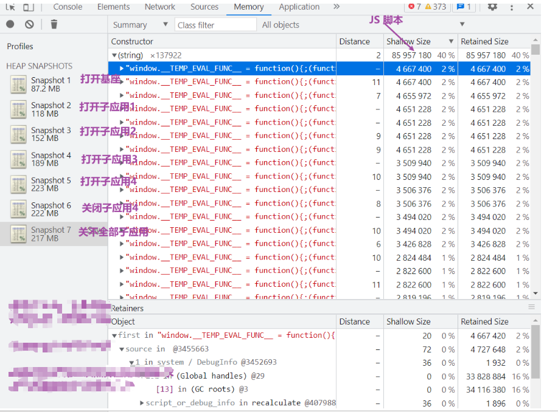
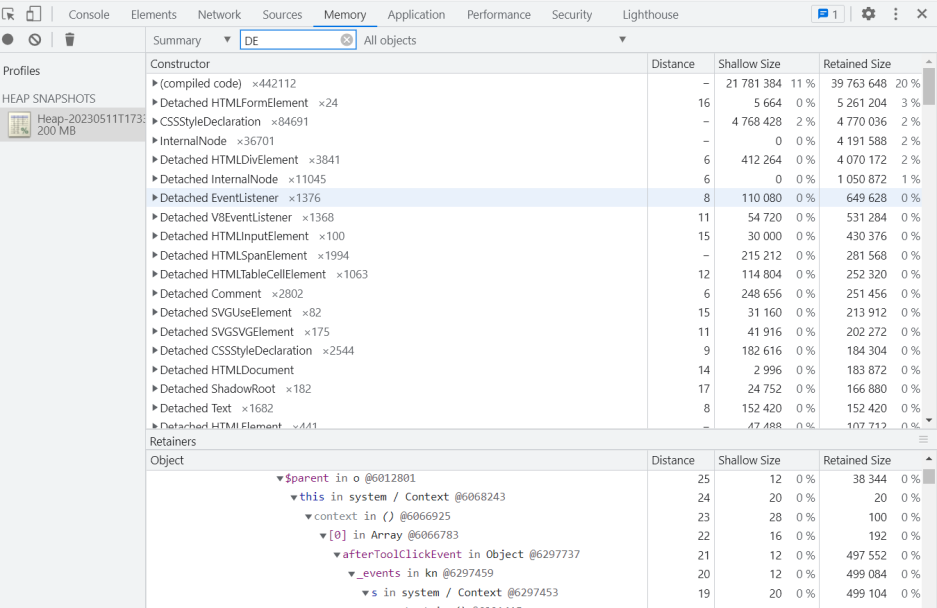
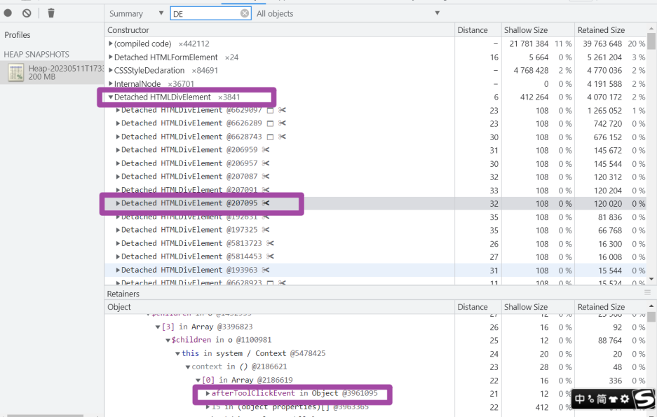
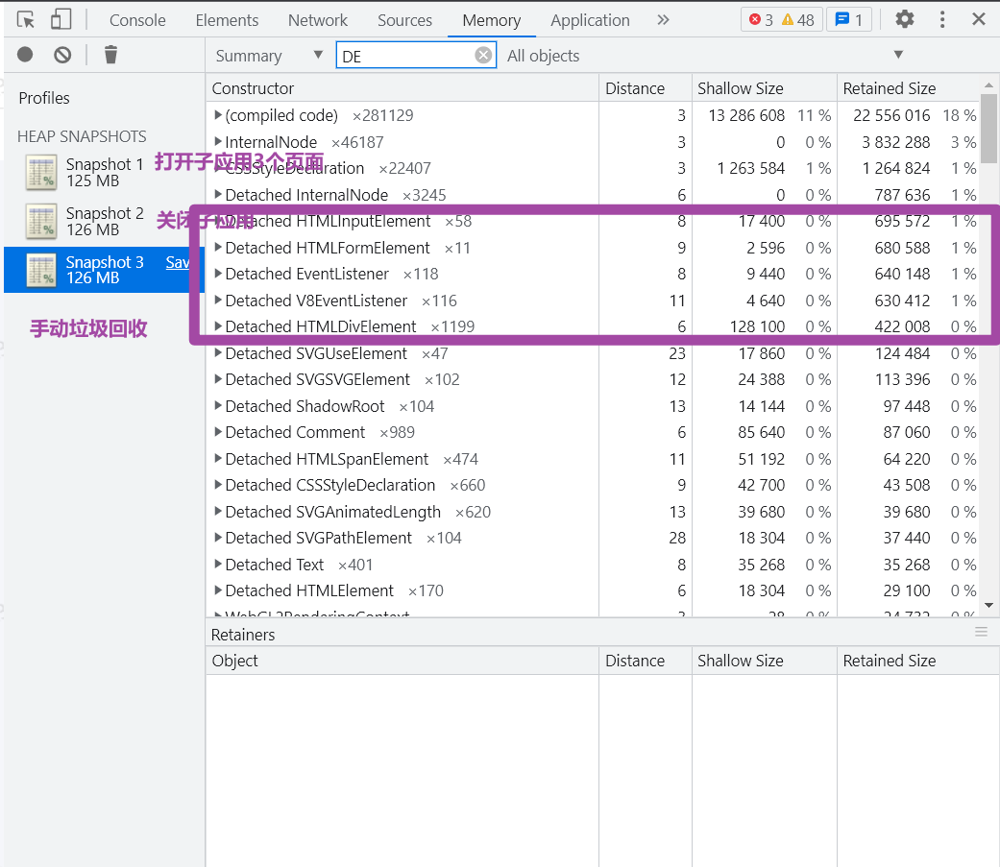
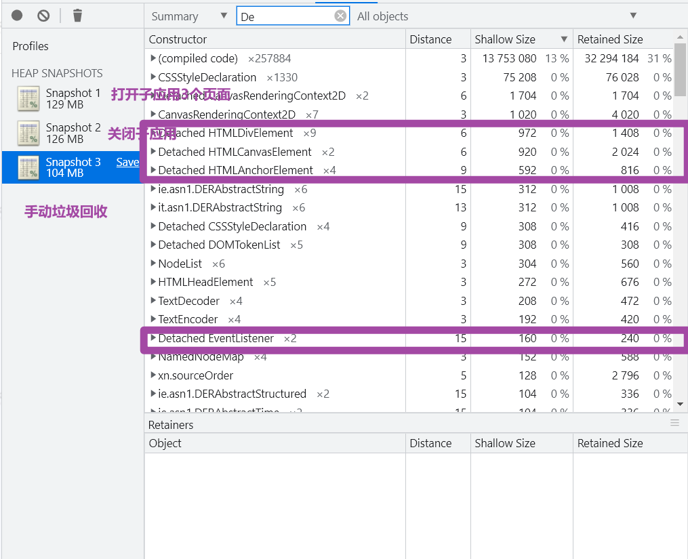
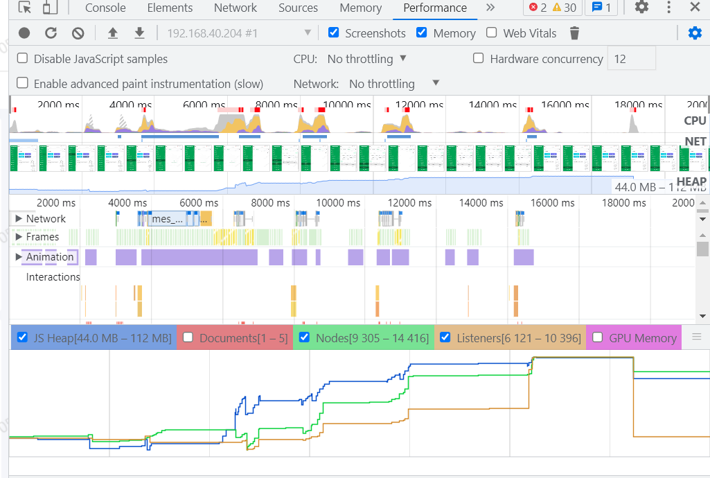
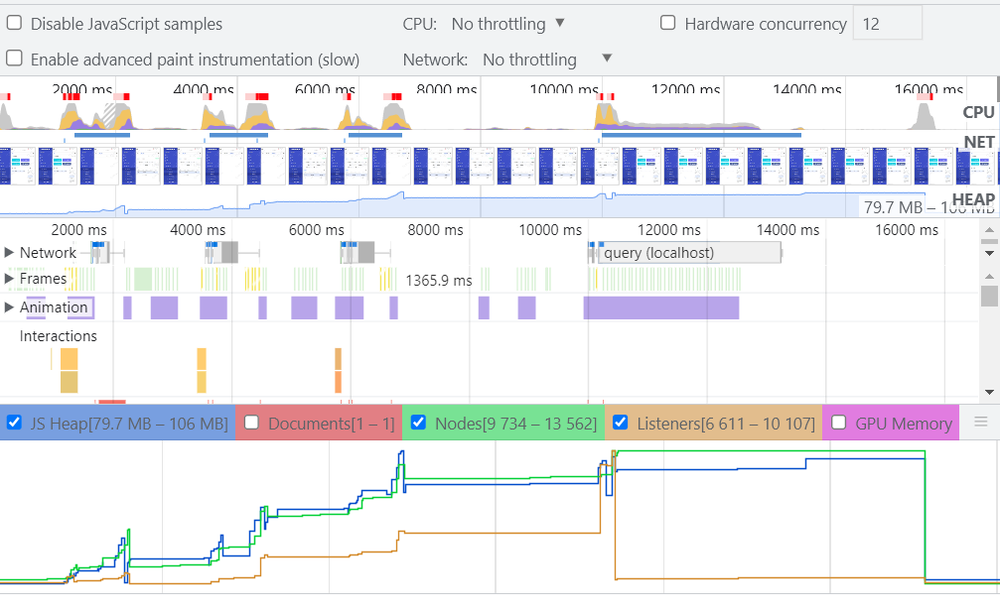

## 专业名词概念

### 快照里有一些“Detached DOM tree”，是什么意思？

一个 `DOM` 节点只有在没有被页面的 `DOM` 树或者 `Javascript` 引用时，才会被垃圾回收。当一个节点处于`“detached”` 状态，表示它已经不在 `DOM` 树上了，但 `Javascript` 仍旧对它有引用，所以暂时没有被回收。通常，`Detached DOM tree` 往往会造成内存泄漏，我们可以重点分析这部分的数据。

::: tip
只有 `Distance` 大于 `0` 的时候才不会被**垃圾回收器回收**，如果是 `-` 的话将会在下一次垃圾回收时清楚。
:::

### 快照中的 Detached Listener 是什么？

如果 `Dom` 中添加了 `addEventListener` 而在卸载的时候没有 `removeEventListener` 的时候, 这个 `Dom` 就会存在内存中，无法被垃圾回收。

### Shallow size 和 Retained size，它们有什么不同？

- Shallow size: 这是对象自身占用内存的大小。通常只有数组和字符串的 `shallow size` 比较大。
- Retain size: 这是将对象本身连同其无法从 `GC` 根到达的相关对象一起删除后释放的内存大小。 因此，如果 `Shallow Size = Retained Size`，说明基本没怎么泄漏。而如果 `Retained Size > Shallow Size`，就需要多加注意了。

## 内存溢出

### 脚本占用内存大且存在重复脚本

比如每个子应用中都有本身的 `Vue` 在执行的时候也会重新开辟内存存储。<br />


### 游离的监听、以及 Dom 节点较多

游离的意思就是 应用销毁了但是一些 dom 节点或者事件监听还存在引用，没有被垃圾回收掉。<br />

#### 游离的监听

<br />没有移除的事件监听甚至还会产生游离的`DOM`元素，这个为什么还没有了解。

这部分主要从 `组件库` 中下手，将 `EventBus`的匿名监听函数改成命名函数并将在组件 `beforeDestory`生命周期内 `销毁`

```diff
mounted(){
- EventBus.$on('on-stop-resize', () => {
-    //监听到tab的切换并改变高度
-   this.refreshHeight = Math.ceil(Math.random() * 10);
- });
+  EventBus.$on('on-stop-resize', this.onStopResize);
},
+ methods:{
+  onStopResize(){
+    this.refreshHeight = Math.ceil(Math.random() * 10);
+  }
+ },
+ beforeDestroy() {
+    EventBus.$off('on-stop-resize', this.onStopResize);
+ },
```

### 游离的 dom

```diff
router.beforeEach((to, from, next) => {
  // 切换路时候 删除tooltips .vxe-table--tooltip-wrapper
-  const vuxeToolTipsList = document.querySelectorAll('.vxe-table--tooltip-wrapper');
+  let vuxeToolTipsList = document.querySelectorAll('.vxe-table--tooltip-wrapper');
  removeElement(vuxeToolTipsList);

-  const elToolTipsList = document.querySelectorAll('.el-tooltip__popper');
+  let elToolTipsList = document.querySelectorAll('.el-tooltip__popper');
   removeElement(elToolTipsList);

    ...
+   // 释放掉引用
+   vuxeToolTipsList = null;
+   elToolTipsList = null;
});
```

### 指令

```javascript
// 之前
Vue.directive("submit", {
  inserted(el, binding, vnode) {
    let val = binding.value;
    if (!val) return;
    // #缺少解绑事件
    el.addEventListener("keyup", (event) => {
      if (event.keyCode === 13) {
        val(event);
      }
    });
  },
});

// 改造后
Vue.directive("submit", {
  inserted(el, binding, vnode) {
    let val = binding.value;
    if (!val) return;
    el.__custom_directive_submit = (event) => {
      if (event.keyCode === 13) {
        val(event);
      }
    };
    el.addEventListener("keyup", el.__custom_directive_submit);
  },
  // 指令与元素解绑的时候，移除事件绑定
  unbind(el) {
    el.removeEventListener("keyup", el.__custom_directive_submit);
    el.__custom_directive_submit = null;
  },
});
```

## 效果

<br />





### 子应用中需要改造部分

```diff
export async function mount(props) {
  console.log("VueMicroApp mount", props);
  Vue.prototype.parentProps = props;
  render(props);
}

export async function unmount() {
  instance.$destroy();
+ instance.$el.innerHTML = "";
  instance = null;
  router = null;
+ Vue.prototype.parentProps.container = null
+ Vue.prototype.parentProps = null;
}
```
