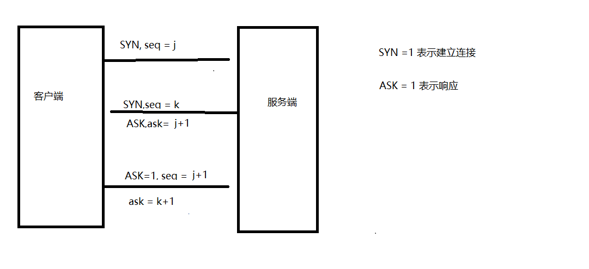
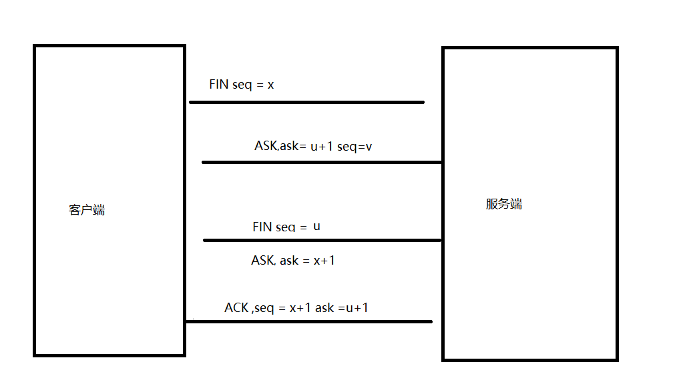

# TCP

## 三次握手

一开始客户端处于`close`状态。服务端处于`listening`状态。

- 客户端发送服务端 客户端发送`SYN=1 seq=x` 报文给服务端，客户端进入`SYN-SEND`状态
- 服务端发送客户端 服务端接收到客户端的报文后,也发送报文`SYN=1 seq=y ASK=1 ask=x+1`报文给客户端。并进入 `SYN-RESV`状态。其中`seq`是服务端的随机数，`ask`则是客户端发送的`seq`随机数+1
- 客户端发送服务端 客户端收到服务端的报文后,说明服务端知道要跟自己通信了。这时候客户端也进入了`ESTABLISHED(建立)`状态但是`服务端不能确定这个报文是否到客户端中`。所以客户端还需要发送一次报文。`seq=x+1 ask=y+1 ASK=1`。服务端接收到这个报文也进入`ESTABLISHED`状态。 

## 为什么需要三次握手，两次四次不行吗？

因为三次握手刚好能让服务端和客户端都确认双方都有`收发`的能力。

客户端在发送一个连接建立请求之后进入等待状态，等到服务端确认之后就进入`established`状态。服务端在发送一个确认连接建立请求报文之后(不管客户端是否有回应)也进入`established`状态。

这就好比这样一个场景 A 给 B 打电话， A:你听得到我说话吗？ B:我听得到啊 A 和 B 就都以为对方都能听得到自己了。 但有一种情况是，B 的麦是坏的，A 根本就听不到 B 说话，结果 A 没收到 B 的回应，但 B 却以为 A 能听得到他，B 就一直等着 A 说点什么...这样让 B 身心俱疲。

而四次握手的话,就是浪费资源了。因为我三次握手就已经知道双方具备了通信的能力了。在发送一次报文就浪费了。

## 四次挥手

- 客户端发送服务端 客户端发送报文`FIN seq = x`给服务端。这时候客户端进入`FIN-WAIT-1状态`
- 服务端发送客户端 服务端发送报文`ASK=1 seq = v ask= x+1`给客户端，服务端进入`CLOSED-WAIT状态`。客户端接收到了服务端的确认，变成了`FIN-WAIT2状态`。
- 服务端发送客户端 服务端发送报文`FIN =1 seq = c ask = x+1`给客户端。服务端进入`LAST-ACK状态`
- 客户端发送服务端 客户端等待`2MSL`时间后,自己变成了`TIME-WAIT状态`发送报文`ASK ask=c+1 seq=x+1` 

## 为什么要等待 2MSL 的时间

`MSL(Maximum Segment Lifetime，报文最大生存时间)`

如果不等待，客户端直接跑路，当服务端还有很多数据包要给客户端发，且还在路上的时候，若客户端的端口此时刚好被新的应用占用，那么就接收到了无用数据包，造成数据包混乱。所以，最保险的做法是等服务器发来的数据包都死翘翘再启动新的应用。

那，照这样说一个 MSL 不就不够了吗，为什么要等待 2 MSL?

1 个 MSL 确保四次挥手中主动关闭方最后的 ACK 报文最终能达到对端 1 个 MSL 确保对端没有收到 ACK 重传的 FIN 报文可以到达

## 为什么不是三次挥手

四次挥手是为了等待服务端完全处理完这次`TCP`的请求。 比如一个这样场景 A 我请求一个文件 C A 我想要关闭连接了 B 接收到你关闭请求 B 关闭了 ???? 那我文件 C 该怎么办,是返回给客户端还是不返回？ 正确的应该是 A 我请求一个文件 C A 我想要关闭连接了 B 接收到你关闭请求 B 先把你文件发给你 B 关闭了
