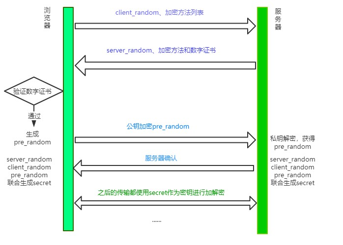

上一节中知道大概 `HTTPS` 是怎么构成的。 `SSL` (安全套接层)和 `TLS`(传输层安全) 加上 `HTTP`。然后也大概演示了 对称加密和非对称加密的优缺点。

其实在服务端和客户端交换秘钥的过程中，也在 `握手`。所以就不单单只有 `TCP` 的三次握手。

`TLS` 中有三个版本的握手分别是 `TLS1.0` , `TLS1.1`, `TLS1.2` ,`TLS1.3`但是由于 `TLS1.0` 在提案阶段就暴露出一些问题。所以就直接没有继续下去。现在我们常用的是 `TLS1.2`

### TLS1.1(RSA 握手)

`TLS1.1` 也就是以前说的 `RSA`握手。首先得明确的是不管是 `TSL 1.X`除了 `TLS 1.0` 之外。他们之间的握手全部都是 `混合加密`的方式。

- 客户端会 发送 `client-random`(随机数) 和 加密方法列表去服务端请求
- 服务端也会随机一个 `server-random` 和 加密方法 以及 `CA证书` 至客户端
- 客户端会根据服务端传递过来的 `CA证书` 去验证。通过则用`RSA算法`生成一个 `pre_random`。
- 客户端通过 `client-random`,`server-random`,`pre_random` 通过伪随机函数函数得到 `secret`
- 再将这个`pre_random`随机数通过证书的公钥发送给服务端.
- 服务端通过 证书的私钥解密 获得一个 `pre_random`。 然后通过用`client-random`,`server-random`,`pre_random`得到一个 `secret`.
- 发送一个 `确认信号后` 开始用 以 `secret`作为`对称加密`的秘钥

### TLS1.2(ECDHE 握手)

`ECDHE握手`在`RSA握手`的基础上前两个环节都不变

1. 客户端会 发送 `client-random`(随机数) 和 加密方法列表去服务端请求
2. 服务端也会随机一个 `server-random` 和 加密方法 以及 `CA证书` 至客户端
3. 客户端会根据服务端传递过来的 `CA证书` 去验证。通过则用`ECDHE算法`生成一个 `pre_random`。 `ECDHE(client_random, server_random) = per_random)`
4. 客户端通过 `client-random`,`server-random`,`pre_random` 通过伪随机函数函数得到 `secret`
5. 再将这个`pre_random`随机数通过证书的公钥发送给服务端.
6. 服务端通过 证书的私钥解密 获得一个 `pre_random`。 然后通过用`client-random`,`server-random`,`pre_random`得到一个 `secret`.
7. 发送一个 `确认信号后` 开始用 以 `secret`作为`对称加密`的秘钥

### 两者区别

`RSA握手` 通过 `RSA算法` 得到 `pre_random`

`ECDHE握手` 通过 `ECDHE算法` 加上 `client-random`,`server-random`,得到 `pre_random`

`ECDHE握手`客户端生成秘钥后，在发送确认消息后，可以直接发送 `HTTP报文`。而`RSA握手`需要等待 服务端的确认消息后才可以开始。

最主要的：RSA 不具备向前安全性，ECDHE 有

#### 向前安全性

一句话概括：一次破解并不影响历史信息的性质就是向前安全性。

比如在`RSA握手`的过程中，客户端拿到了服务端的公钥，然后用此公钥加密`pre_random`给服务端。如果此时有第三方有服务端的私钥，并且截获了之前所有报文的时候，那么它就可以破解这段密文并拿到`pre_random、client_random、server_random`并根据对应的伪随机函数生成`secret`，即拿到了最终通信的对称密钥，每一个历史报文都能通过这样的方式进行破解。它就不具有向前安全性。

但是`ECDHE在每次握手`的时候都会产生一个零时的密钥对(也就是`client_params、server_params`)，即使第三方有了私钥能破解，但是对之前的历史报文并没有影响。它就具有向前安全性。

### TSL1.3

- 废除了很多加密算法。其中就包括`RSA算法`
- 通过利用会话复用节省了重新生成秘钥的时间
