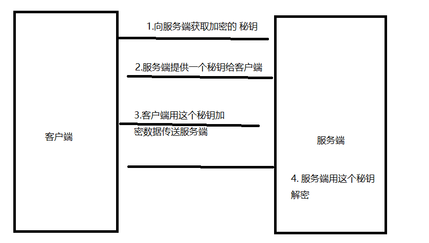
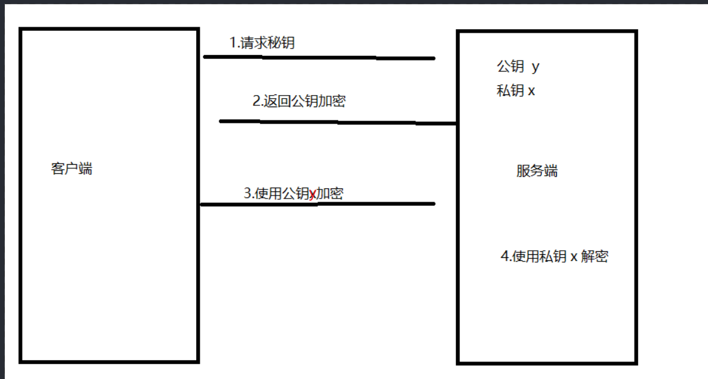
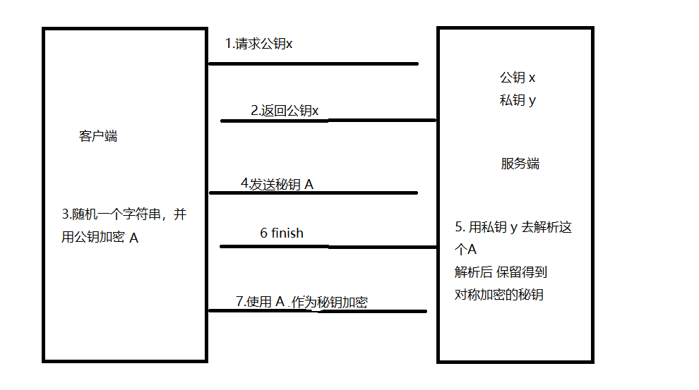
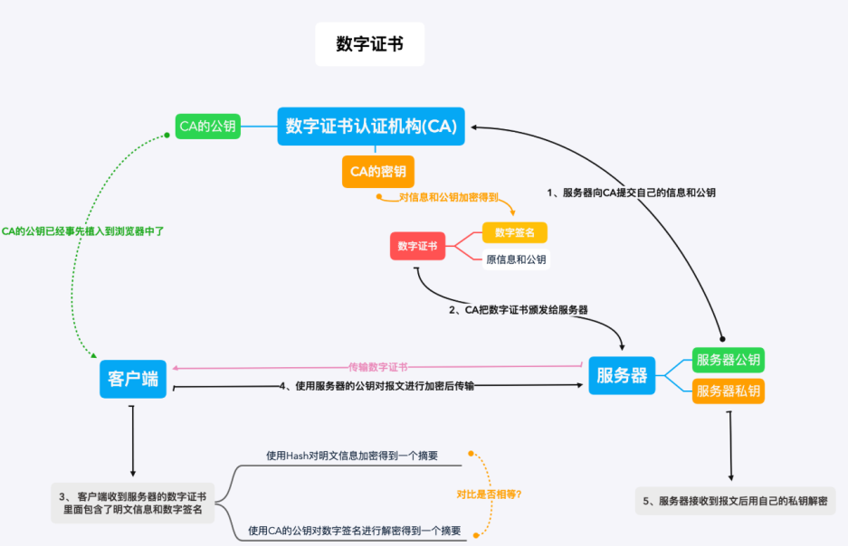

因为 `http` 是明文传输的缘故,这方面在现如今非常容易被黑客所利用。所以就出了`HTTPS`这玩意。默认的端口是 `443`。

`https`在一定程度上解决了明文传输数据这一诟病。但是对于传输速度来说它可能还没有 `http` 快。对于传输速度、队头阻塞这些是 `http2.0` `http3.0`这两兄弟干的。(小声嘀咕 `http2.0` 都还没有普及。`http3.0` 就来了....)。而 `https`来说只负责数据传输间的安全性。 所以 `HTTPS = HTTP+SSL+TLS`

#### 对称加密

对称加密说起来就跟字面意思一样。所谓对称就是使用相同的秘钥来进行加密数据。 

这里问题就很大了,如果我是黑客，我通过抓包工具,一样可以拿到他们传输的秘钥。这样其实加不加密都没有什么效果。

优点：因为是对称加密,使用相同的秘钥所以加密的速度就会快

#### 非对称加密

非对称加密这里呢，服务器会有一套秘钥，他们有公钥和私钥之分。公钥提供给客户端。私钥只留在客户端中。

我敲这套理论好像真的可以。理论上是可以的，但实际上非对称加密需要的计算量非常大，对于稍微大一点的数据即使用最快的处理器也非常耗时。

#### 混合加密

前面说了对称加密这个速度快，但是安全性不高。而非对称加密安全性高，但是速度可能会很慢。那不如把它两给结合起来？

这样就天衣无缝了哈哈哈哈哈,但是聪明的中间人如果在你第一次请求公钥的时候就把错误的公钥传给你。（也就是说而他拿到了真正的公钥）。 你拿着他的公钥去加密，这个中间人一样可以用他自己的私钥解密。这样还是无法保证安全性。

#### CA 证书

上面混合加密的缺点就是没办法确定,与客户端通信的服务端是不是自己信任的服务端。那这样就找一个双方都信任的方式。`CA证书`它通过确认服务端的真实身份后。将他的签名加入到 `公钥和私钥之中`。这样只有 `客户端公钥+签名` 更够被 `服务器中的私钥+签名`所解析。那就是找对人了。

这样的话就算这个中间人拿到了这个公钥想要去伪造,也会因为这个`CA签名`不一样。解析不了数据。

缺点:贵贵贵！！

### 中间人有可能篡改证书吗

假如中间人获取到了 CA 证书，并修改了证书中的域名，但是此时它没有 CA 机构的私钥，所以它无法得到一个新的签名，然后客户端收到

该篡改的证书后，通过私钥解密出来一个原证书信息的摘要，并且客户端对收到的证书内容生成信息摘要，发现两个信息不一致，就会

终止通信，防止信息泄露。

### 中间人有可能替换证书吗

假如中间人也有一个 CA 机构颁发的合法的证书，中间人拦截到服务端发送的证书，并将自己的证书发送给客户端，此时客户端就会使用

中间人证书的公钥进行通信。

其实该情况是不会发生的，因为在验证的过程中会验证域名，如果访问的域名与证书中的域名不一致就会提示不安全的链接。但是如果

中间人可以使用你的域名去申请到证书，那就另当别论了，但是这也不会发生，因为证书申请是需要进行信息核实的，并不是可以随意申请的。

### 数字签名为什么是对 hash 值进行签名

其实这只是一个性能问题，因为 hash 值相对于 CA 证书的信息来说是比较短的值，对该值进行加密和解密都会比较快。通常在生成证书的时候也不会在乎这些时间，但是在浏览器进行解密时，如果时间过长，用户可就等不了那么长的时间了。

### HTTPS 必须在每次请求中都要先在 SSL/TLS 层进行握手传输密钥吗

如果每一次 https 的请求都需要进行 TLS 的握手，TLS 的握手那么复杂，势必会对通信带来较大的延时，这对注重用户体验的网站来说，是不可接受的。那么有什么办法可以避免这种情况吗？

其实是通过一个 Session Identifier（会话标识符），该 Session ID 是 TLS 握手中生成的 Session ID。服务端可以将 Session ID 协商后的信息存起来，浏览器也可以保存 Session ID，并在后续的 Client Hello 握手中带上它，如果服务端能找到与之匹配的信息，就可以完成一次快速握手。

#### 总结

`HTTPS` 在 交换出 `对称加密` 的秘钥之前用 `非对称加密`

得到 `对称加密的秘钥后` 使用 `对称加密`
