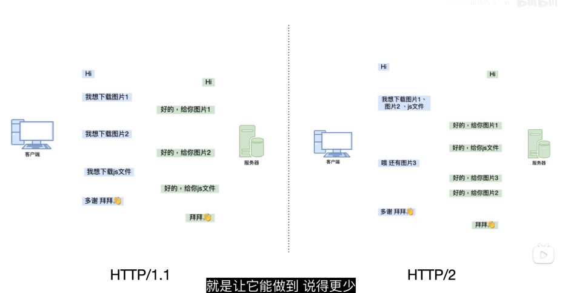

# http1.1

`http1.1`为了解决`http1.0`中每一次请求都需要重新握手和挥手的问题，加入了`connection:keep-alive`字段。表示为长连接。多个请求可以不必再次握手，只需要延续第一次握手的信息。这有效解决了`http1.0`中的问题。但是由于各个浏览器出于对服务器的保护吧。例如`chrome`只允许同一时间同一个域名最多建立`6`个`TCP`连接。

## 队头阻塞

一个`tcp`连接中里面可能有`10`个请求。但是由于`http1.1`中请求时对应的。也就是说前一个请求没有完成。后面的请求必须等待前一个请求完成才会开始请求。这就是`队头阻塞`。

# http2.0

## 头部压缩

在`http1.1中`尽管在同一个`tcp`连接中。每一个请求都会在请求带入一定的请求头信息。这其实很多就是一样的。这也大大增加的请求的大小。在`http2.0`中采用`HPACK`算法，服务端和客户端共同维护一张索引表。这样在剩下的请求中就可以直接使用`key`即可。减少了请求头中的大小。

## 二进制传输

在`http1.x`中，http 协议都是用文本传输，双方还需要花时间去解析。在`http2.x`中开始启用二进制传输，增加其扩展性。也为多路复用提供基础。

## 多路复用

在`http1.x`中，我们经常会使用雪碧图或者多个域名的方式来进行优化。都是因为浏览器限制了同一个域名下的请求的数量。也就是`队头阻塞`

在`HTTP2.0`中基于`二进制分帧层`。`http`被分为独立的帧，而不破坏语义。并用流标识标记。交错发出。在另一端根据流标识和手部将他们组装起来。可以避免 HTTP 旧版本的队头阻塞问题，极大提高传输性能。

通俗的讲 就是 `HTTP2.X`中，是以流的形式传输。而请求又被分割成各个 `帧`（最下单位）。

## 服务端主动推送

比如我请求一个 html 文件，在 http2.0 中会把 html 引入的`JS/CSS`文件也一起发给你，就不用再次请求了

