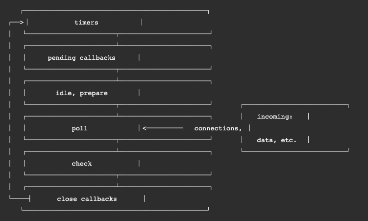
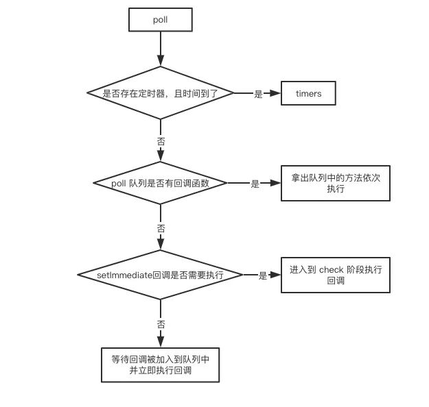

## 简述

nodejs 也有它自己的事件环，和浏览器事件环的机制并非都一样的，我们写的应用代码一般是运行在 V8 引起里面，它里面并非仅仅是 V8 引擎里面的东西，比如 setTimeout，比如 eval 都是 V8 引擎提供的，我们写代码还会基于一些 node api，也就是 node.js bindings，比如 node 的 fs 模块，可以发一些异步的 io 操作，但是 node 里面的异步和浏览器的不一样，它是自己有一套 LIBUV 库，专门处理异步的 io 操作的，它靠的是多线程实现的（worker threads），它用多线程模拟了异步的机制，我们每次调用 node api 的时候，它里面会进入 LIBUV 调用多个线程执行，同步堵塞调用，模拟了异步的机制，成功以后，通过 callback 执行放到一个队列里，然后返回给我们的客户端。

## eventLoop



这个就是 node 的事件环核心图核心在 `libuv` 中，没一个方块则是没一个阶段。

每个阶段中都有一个队列来执行回调,执行完队列中的回调或者达到系统最大调用数后才会进入下一个阶段。

从上面这个图我们可以大概得到下面这个一个顺序

数据输入阶段(script 执行) -> 进入 poll 阶段(当前没有 timers 和 pending callbacks,后面会重点介绍 ) -> check 阶段 -> close callbacks 阶段 ->定时器阶段(timers) -> I/O 事件回调阶段(I/O callbacks) -> 闲置阶段(idle, prepare) -> poll 阶段

### timers

定时器阶段包括 `setInterval`,`setTimeout` 两个定时器 API。并且是由 `poll` 阶段控制的。同样，在 `Node` 中定时器指定的时间也不是准确时间，只能是尽快执行。

### pending

主要是 `I/O` 操作比如 `(require('fs').read())`

### idea

闲置阶段(idle, prepare)：仅系统内部使用

### poll

这个是最重要的阶段-轮询阶段



它在此阶段会去检查 **是否有定时器，且定时器到时间** 有的话则执行且事件回到 **timers** 阶段

如果没有定时器则会去检查 pending **是否有 I/O 回调** 有就执行并回到 **pending** 阶段

如果没有那则会检查 check **是否有 setImmediate 回调** 有就执行并进入 **check** 阶段

如果这些检查都没有，那 `node` 则会停留在 `poll` 阶段等待重复上述检查。这里会有一个超时时间放置一直等待下去，如果超过这个事件则会自动进入 **check** 阶段

### check

这个阶段主要存放 `setImmediate` 回调

### close

这个阶段主要存放一些关闭回调 `socket.close()`

## process.nextTick()

这个是 `node` 特有的 API。他的优先级比微任务还要高也就是说在执行每个微任务之前会清空 `nextTick` 队列

```js
let p = Promise.resolve(11);

const p1 = p.then(() => {
  console.log("p1");
});
process.nextTick(() => {
  console.log("p1 nextTick");
});

setTimeout(() => {
  console.log("settimeout");
});

// p1 nextTick
// p1
// settimeout
```

## 不同 node 版本之间差别

主要差别就是在 `node 11` 之前,执行 **宏任务** 的过程中遇到 **微任务** 在执行下一个 宏任务 之前 并不会清空微任务队列

```js
setImmediate(() => {
  console.log("timeout1");
  Promise.resolve().then(() => console.log("promise resolve"));
  process.nextTick(() => console.log("next tick1"));
});
setImmediate(() => {
  console.log("timeout2");
  process.nextTick(() => console.log("next tick2"));
});
setImmediate(() => console.log("timeout3"));
setImmediate(() => console.log("timeout4"));

// node 11 之前 打印
// timeout1 -> timeout2 -> timeout3 -> timeout4 -> next tick1 -> next tick2 -> promise resolve
```

在 node11 之后抹平了这种差异，与浏览器的行为一致

```js
// timeout1 -> next tick1 ->  promise resolve -> timeout2 -> next tick2 -> timeout3 -> timeout4
```
