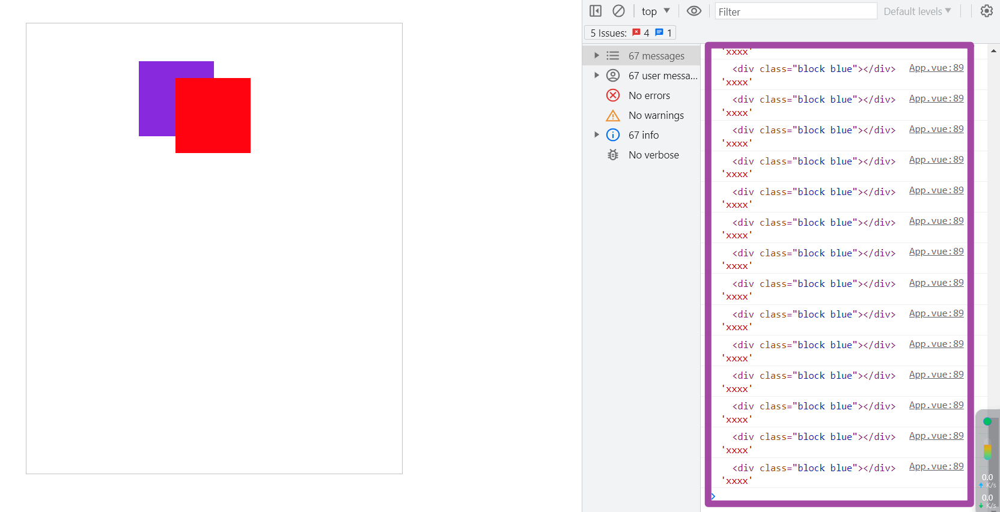

## 概况

近来公司的低代码平台需要支持 **自由定位布局** 而且还需要支持自由定位嵌套式布局。效果就类似下面这个图


自由定位还好说那就是 **绝对定位** 就完事了。 但是绝对定位还要嵌套那就难搞了,查阅各种资料后也是顺利解决了这个问题(在社区里就没见过哪个低代码平台是用绝对定位的，大多数都是用栅格或者 `grid` 来做)

嵌套大概有两种方式

1. 从左边拖拽直接拖拽到容器内
2. 组件在画布中移动至容器内

第一种很简单只需要判断 `drag` 事件中判断 `e.target === 画布` 如果不等于那就说明可能是拖入容器中。在通过 `e.target` 向上寻找找到渲染组件判断是否为容器组件

```ts
function drop(e: DragEvent) {
  const canvas = document.querySelector(".position-render-container");
  const dragIntoContainer_: Element | undefined =
    e.target !== canvas ? getDragContainerByClass(e, "custom-item") : canvas;

  // 执行其他逻辑
}
```

难的是第二种操作方式,因为移动我们使用 `Mouse` 事件做处理。而这个事件一般情况下 `e.target` 永远是鼠标拖动的元素，再加上是 绝对定位 的元素那就更没办法做这件事了。

## 思路

### 判断容器边界

如果一个组件从容器进入但是没有离开，那就说明这个容器包含了这个组件

说干就干需要一个地方存储组件在拖动是是否有进入和出去

```ts
export function useMouseEventStore() {
  const MouseEventStore = reactive({
    /** 当前激活模块在哪个容器的ID ,如果是顶层则是 空字符串 */
    current: "",
    /** 当前激活模块实在哪个容器中,当 mouseup 的时候需要根据这个来变化数据位置 */
    through: "",
  });

  function setThroughContainerId(containerId: string, mode: "enter" | "leave") {
    // 在离开当前容器时,已经进入了别的容器
    // 需要记录组件移动的过程中最终进入哪个容器
  }
}
```

这样子只要在 `mouseup` 的时候 `through` 有值那就说明是进入了这个容器，否则就是在画布中

但是在测试过成功发现这个 `mouseMove` 事件所触发的 `e.target` 并不准确,特别是在两个容器紧挨着有边界的时候会来回横跳

这就导致这个过程十分怪异，所以这个思路放弃掉。。。

没有什么新的思路，我就开始在 `xiaopiao` 和 `figma` 上妥妥拽拽寻找灵感，后来发现 `figma` 也有这个问题但是他的解决思路是当前 **鼠标点在哪个容器内，那就认为这个就是组件最终停放的目标**

### 依靠鼠标点找元素

在 `MouseMove` 事件中是有关于当前鼠标点 x y 的信息。那怎么找到对应元素呢？

去问了下 `GPT` 没想到还真有一个 api `document.elementFromPoint` ,看看 `mdn` 上面的介绍


再看看兼容性


发现这个虽然是实验性的`api` 但是浏览器基本上都兼容那就看开搞

::: details

```vue
<template>
  <div class="play-container">
    <div class="drop-container">
      <div
        :class="['block', 'red']"
        ref="moveBlock"
        :style="{
          left: BlockStyle.left + 'px',
          top: BlockStyle.top + 'px',
        }"
      ></div>
      <div class="block blue"></div>
    </div>
  </div>
</template>

<script lang="ts" setup>
import { onMounted, ref } from "vue";

const moveBlock = ref<HTMLDivElement>();

const BlockStyle = ref<Record<"left" | "top", number>>({ left: 0, top: 0 });

onMounted(() => {
  const block = {
    x: 0,
    y: 0,
  };

  function mouseMove(e: MouseEvent) {
    e.stopPropagation();
    const { clientX, clientY } = e;

    const target = document.elementFromPoint(clientX, clientY);

    console.log(target, "xxxx");
    BlockStyle.value = {
      left: BlockStyle.value.left + clientX - block.x,
      top: BlockStyle.value.top + clientY - block.y,
    };
    block.x = clientX;
    block.y = clientY;
  }

  function mouseUp(e: MouseEvent) {
    document?.removeEventListener("mousemove", mouseMove);
    document?.removeEventListener("mouseup", mouseUp);
  }

  moveBlock.value?.addEventListener("mousedown", (e) => {
    block.x = e.clientX;
    block.y = e.clientY;

    document?.addEventListener("mousemove", mouseMove);

    document?.addEventListener("mouseup", mouseUp);
  });
});
</script>

<style lang="scss">
html,
body {
  width: 100vw;
  height: 100vh;
  margin: 0;
  #play {
    height: 100%;
    width: 100%;
    .play-container {
      height: 100%;
      width: 100%;
      display: flex;
      align-items: center;
      justify-content: center;
    }
  }
}

.drop-container {
  width: 500px;
  height: 600px;
  border: 1px solid #c3c3c3;
  margin: 0 auto;
  position: relative;
  .block {
    position: absolute;
    width: 100px;
    height: 100px;
  }
  .red {
    background-color: aquamarine;
  }
  .blue {
    background-color: blueviolet;
    left: 150px;
    top: 50px;
  }
}
</style>
```

:::


看上面的结果好像是成了但是移动的过程中发现 **红色背景的盒子** 在紫色的下面，按理来说我正在移动的盒子应该是永远在最上方的。 那就加上 `z-index` 看看，其中初始化 `z-index` 都为 1 ，当在移动的时候 `z-index` 调整至 999 让其在上面。

结果发现获取到的最上层元素还是拖拽元素自身


那有什么办法不让 当前元素触发 Mouse 事件呢？

这里也有个问题

如果一开始就不触发那不就不能触发 `mouseDown` 事件了吗? 这个事件都不能触发那还怎么拖动... 好像陷入死循环

好巧不巧这时候又让我想起一个`css`属性 `pointer-event:none;` 平时不想让某个元素点击又不想写 `disabled` 样式的时候就会用这个属性,现在好像也可以。


只需要在触发 `mousemove` 事件的时候加上这个属性,在 `mouseup` 的时候取消掉这个属性不就好了吗？

```vue
<template>
  <div class="drop-container">
    <div :class="['block', 'red',]">  // [!code --]
    <div :class="['block', 'red', isMove ? 'custom-mouseDown' : '']">   // [!code ++]
    </div>
  </div>
</template>

<script>

const isMove = ref(false) // [!code ++]

function mouseMove(e: MouseEvent) {
    isMove.value = true // [!code ++]
}

function mouseUp(e: MouseEvent) {
    isMove.value = false // [!code ++]
 }
</script>
<style>
.custom-mouseDown {
  pointer-events: none;
}
</style>
```



成了!!!
