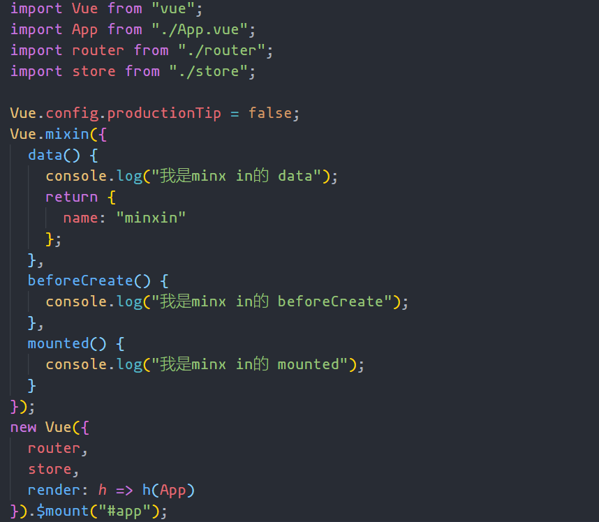
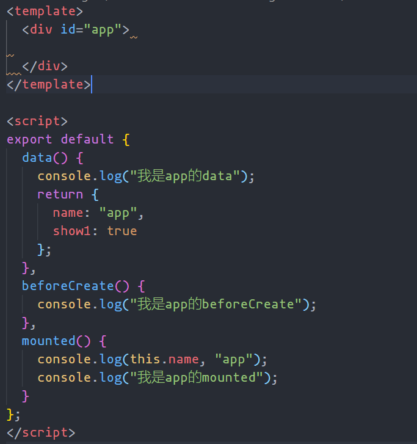
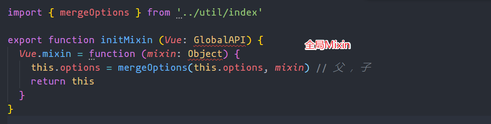
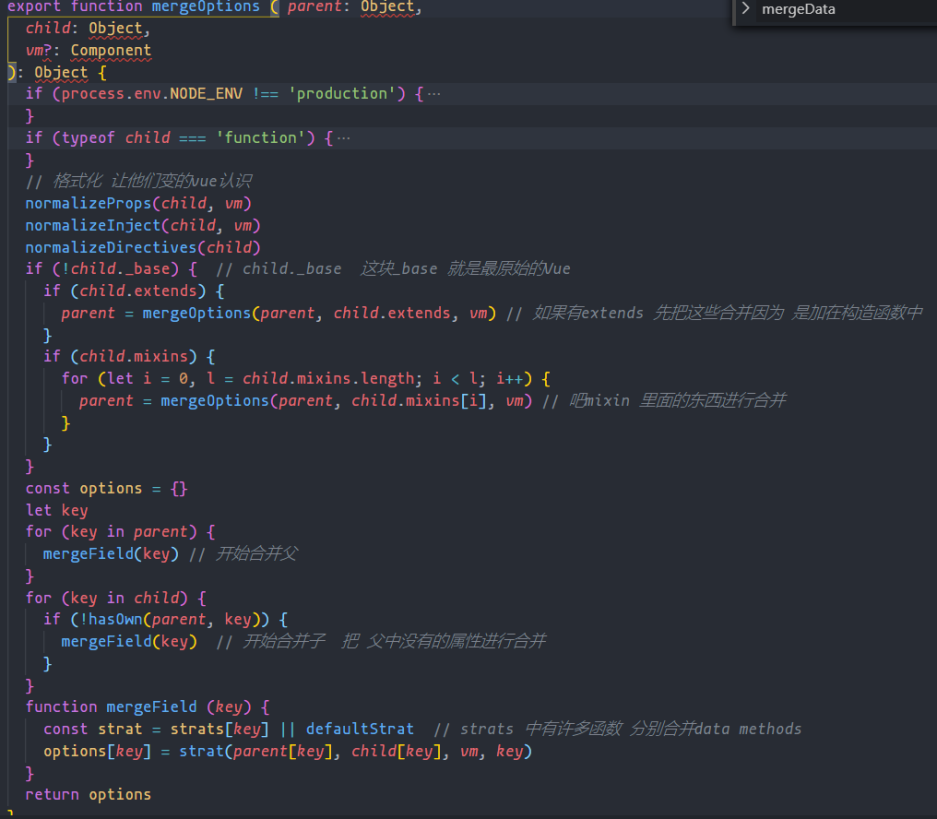
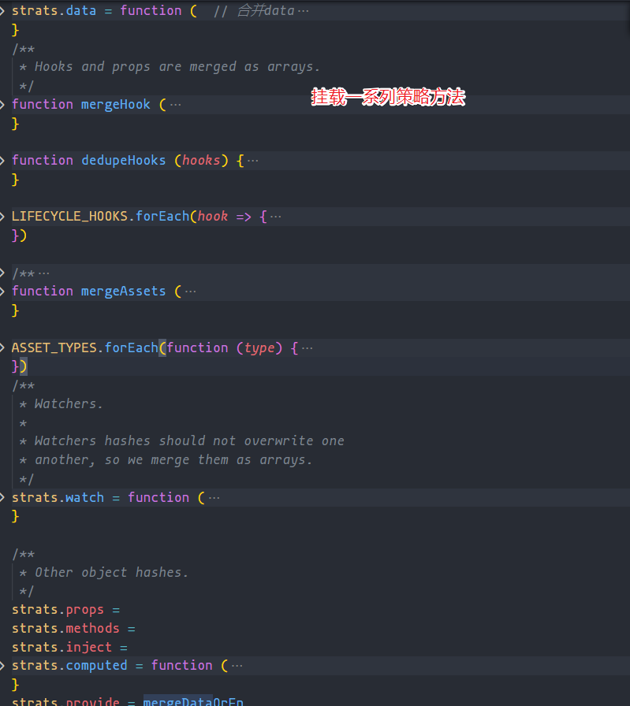
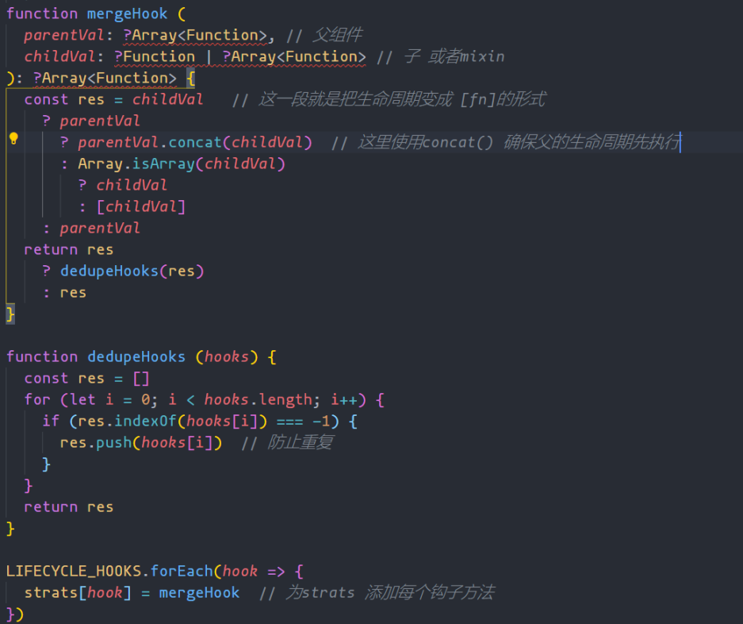
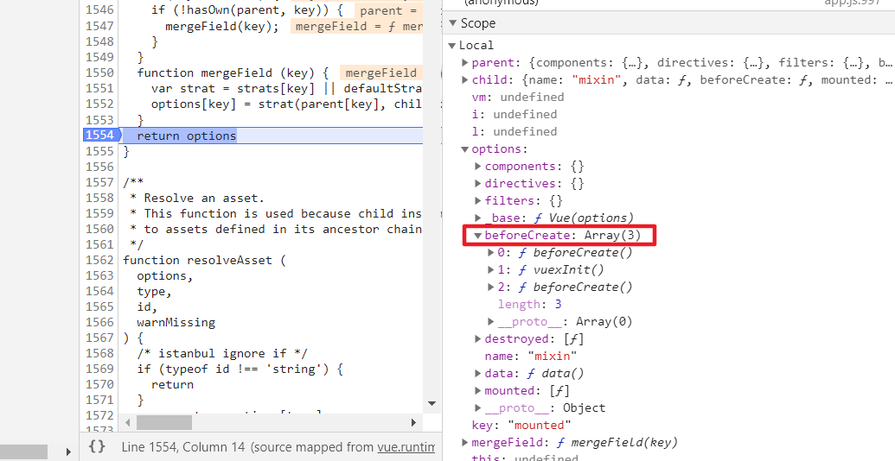

### 前言

这个 API 在`vue`官方文档的解释是`混入`,字面意思就是合并对吧!!!昨天笔试了一道题,就是关于`mixin`的一些理解。这个 API 在一般情况下我都没用用到...如果是重复的逻辑都是单独抽取当组件使用...所以昨天那道题简直就是`灵魂拷问`当时的我就是一脸懵逼。笔试完抓紧重新翻了下`vue`文档,重新拾起这部分知识记录一下

### 分析





就是根据上图写出输出结果。当时看了就一脸懵逼。我先还原下我当时的想法首先它在入口处添加了一个全局的`mixin`。紧接着又重新`new Vue()`实例里面也有相同的逻辑,也渲染了`app`这个组件。因为看过部分的`源码`,所以知道`Vue`内部初始化的时候是先初始化`mixin`,调用`beforeCreate`,最后在初始化一些`props、data、methods`等东西。在初始化的时候如果它有`mixin`就会合并这些内容。那问题来了既然要合并如何合并?

- 钩子是否会合并
- data 中怎么合并
- components/methods/directives...等的合并策略
- 组件和 Mixin 的优先级

#### 关于数据对象(data)

> 当组件和混入对象含有同名选项时，这些选项将以恰当的方式进行“合并”。
> 比如，数据对象在内部会进行递归合并，并在发生冲突时以组件数据优先。

```javascript
// mixin
data(){
     return {
          name:'mixin'
     }
}
// app.js
data(){
     return {
          name:'app'
     }
},
mixin:['mixin']
{{ name }}  // => app
```

#### 钩子函数

> 钩子函数也就是生命周期,这时候 Vue 在处理的时候会将他们合并成一个数组,并且 mixin 中的钩子会比组件中的 mixin 优先执行

```javascript
// mixin
created(){
     console.log('mixin created')
}
// app.js
created(){
     console.log('app created')
}
// 执行后  mixin created -  app created
```

#### components/methods/directives...等的合并策略

> 值为对象的选项，例如 methods、components 和 directives，将被合并为同一个对象。两个对象键名冲突时，取组件对象的键值对。

```javascript
// mixin
methods:{
   click(){
        console.log('mixin click')
   }
}
// app
mixin:['mixin'],
methods:{
    click(){
        console.log('app click')
   }
}
this.click() //=> app click
```

#### 答案

有了这些储备知识,开始尝试重新做那道题

```javascript
"我是mixin 的beforeCreate";
"我是mixin 的data";
"我是mixin 的beforeCreate";
"我是app 的beforeCreate";
"我是app 的data";
"我是mixin 的data";
"我是mixin 的mounted";
"我是app 的mounted";
"我是mixin 的mounted";
```

首先是全局的`mixin`在`new Vue()`的时候会执行一次,控制台输出

```javascript
// '我是mixin 的beforeCreate'
// '我是mixin 的data'
```

然后在`new Vue()`的时候有一个`render()函数`,根据创建周期`父created->子created->子mounted->父mounted`的流程所以会进入到`APP`组件打印`

```javascript
// '我是mixin 的beforeCreate'
// '我是app 的beforeCreate'
```

这是因为`引入的是全局Mixin`这就相当于每个组件都会加载这个`Mixin`。紧接着就是

```javascript
// '我是app 的data'
// '我是mixin 的data'
```

下面就会进入正常的子组件挂载

```javascript
// '我是mixin 的mounted'
// '我是app 的mounted'
```

最后打印,这个别忘了!!! 这是在初始化的时候也就是在`new Vue()`的时期还未执行的钩子函数

```javascript
// '我是mixin 的mounted'
```

其实在这里就可以得出`Mixin`在挂载在全局上的副作用有多大！

### 源码学习

我认为遇到一个问题不能单单只是表面上解决就完事了,还要深入源码中学习是如何判断这些优先级以及合并操作的。这样才能够提高自身。而不是单纯的做一个码农...毕竟咱是以进`大厂`为目标的。

首先找到全局定义的`Mixin`,文件位置在`vue/src/core/global-api/mixin.js`


这里很明显首先`this.options`就是`Vue`上面的`options`也就是`new Vue({})`传递的参数,先吧这个先合并是为了在`new Vue()`的时候就执行`Mixin里面的钩子`。这里就一个合并函数路径在`vue/src/core/util/options.js`


重点的地方已经加上注释,其中`strats`这个对象设置的是非常的妙从`传递的key`去执行不同的策略



#### 合并生命周期

`Mixin`中并不会覆盖组件的钩子,并且`Mixin`中的钩子会比组件中的优先执行



Chrome 的 debugger 结果示意图


