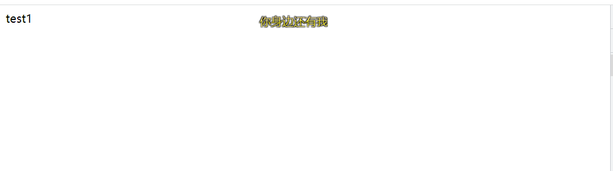
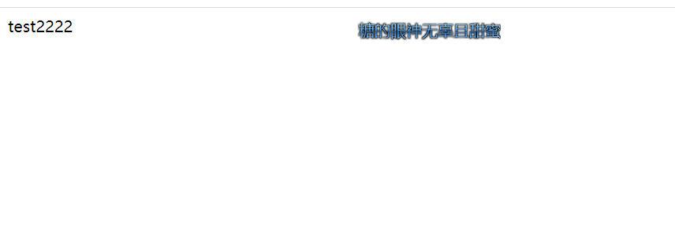

对比`Vue2`来说`Vue3`的响应式简直简单太多太多，而且还做到了各种优化。
比如对于层次深的对象,在`vue2`它会一次性将所有的属性都添加上`__observe__`也就是**递归的劫持每一个属性。**而`Vue3`却做到了`**懒劫持**`的方式优化运行效率。

首先响应式的最大特点是**改变值能够改变试图**。今天我们的目标也是这个,我们可以简化简化不考虑`SFC`的方式我们只需要有一个这样的渲染函数

```javascript
const obj1 = reactive({
  msg: "test1",
});

function render() {
  console.log("test1", obj1);
  const app = document.querySelector("#app");
  app.innerHTML = obj1.msg;
}

render();
```

不出意外只要`render`函数执行界面上会显示`test1`的文字。
思考下以下几点

1. `vue`响应式怎么知道我想要执行哪个函数？
2. 如何通知页面更新

---

### Vue 怎么知道我想执行哪个函数,或者说对哪个函数进行响应式

其实对于`Vue`来说它也不知道你会执行哪个函数,毕竟命名是你来决定的。但是想想我们的`Vue compoent`最终都会被编译成`render`函数，对于`Vue`来说只要数据更新，我重新执行一次`render`函数，那不就完事了吗。事实上也是如此。

在`Vue2`中我们给每个组件挂载一个渲染`watcher`,当数据发生变更通过劫持得到的`dep`依赖关系，让这个属性所依赖的`watcher`都调用`update`，页面开始更新 。

在`Vue3`中舍弃了`watcher`的概念,而是采用一个叫`effect`的函数被称之为**副作用。**简单来说就是这个函数可能会影响页面。那值更新我只需要重新执行这个`effect`函数就行。

```javascript
function effect(fn) {
  fn();
}
```

紧跟着我们将代码改造成这样

```javascript
const obj1 = reactive({
  msg: "test1",
});

function render() {
  console.log("test1", obj1);
  const app = document.querySelector("#app");
  app.innerHTML = obj1.msg;
}

effect(render);
```

页面也能正确显示**test1。**

### 如何通知页面更新

确实单靠`effect`并不能知道如何做更新，`effect`的作用更多只是缓存这个**副作用函数。**要想做到更新页面我们还要介绍下`reactive`。我们都知道 `Vue3`中使用`Proxy`代替`Obejct.defineProperty`来实现响应式,这有优点亦有缺点，这里就不展开。

```javascript
function reative(obj) {
  const proxy = new Proxy(obj, {
    get(target, key, receiver) {
      return Reflect.get(target, key, receiver);
    },
    set(target, key, newV, receiver) {
      return Reflect.set(target, key, newV, receiver);
    },
  });
  return proxy;
}
```

在这里，我们也需要建立**数据与副作用函数**的依赖关系，那如何建立呢？
我们先回想下`Vue2`是怎么建立的。
首先执行组件的初始化的时候会建立一个`watcher`作为渲染`watcher`，并将它**放入栈中。**然后执行`render`函数，这时候如果对`data`中定义的数据进行取值,就会触发对应数据的`get`,而`get`中有一个判断如果当前环境中有`watcher`的话,那就将这个`watcher`放入这个`key`的`Dep`中。至此数据与页面的关系建立完毕！

那我们也可以用这个思路，将代码改造成以下这样

```javascript
let activeEffect = null;

let proxyMap = new WeakMap();

// 存放effect与 key的关系
let targetMap = new WeakMap();

export function effect(fn) {
  // 核心就是当数据改变的时候让这个函数重新执行
  activeEffect = fn;
  fn();
  // 执行要重置
  activeEffect = null;
}

function createDep() {
  return new Set();
}

function track(target, key) {
  // 建立关系,当key重新赋值的时候需要重新执行key依赖的函数
  if (!activeEffect) return;
  let depMap = targetMap.get(target);
  if (!depMap) {
    targetMap.set(target, (depMap = new Map()));
  }

  let deps = depMap.get(key);

  if (!deps) {
    depMap.set(key, (deps = createDep()));
  }
  // 建立关系
  deps.add(activeEffect);
}
function trigger(target, key) {
  // 根据key触发对应的函数实现更新
  const depsMap = targetMap.get(target);

  if (!depsMap) return;

  const effects = depsMap.get(key);

  // 视图更新
  Array.from(effects).forEach((effect) => {
    effect();
  });
}

export function reactive(obj) {
  if (proxyMap.has(obj)) return proxyMap.get(obj);
  const proxy = new Proxy(obj, {
    get(target, key, receiver) {
      track(target, key, "get");
      return Reflect.get(target, key, receiver);
    },
    set(target, key, newVal, receiver) {
      const old = target[key];
      if (old === newVal) return;
      // 需要更新
      const res = Reflect.set(target, key, newVal, receiver);
      trigger(target, key);
      return res;
    },
  });

  proxyMap.set(obj, proxy);

  return proxy;
}
```

测试一下

```javascript
const obj1 = reactive({
  msg: "test1",
});

function render() {
  console.log("test1", obj1);
  const app = document.querySelector("#app");
  app.innerHTML = obj1.msg;
}

effect(render);

setTimeout(() => {
  obj1.msg = "test2222";
}, 4000);
```


4 秒后页面变成

