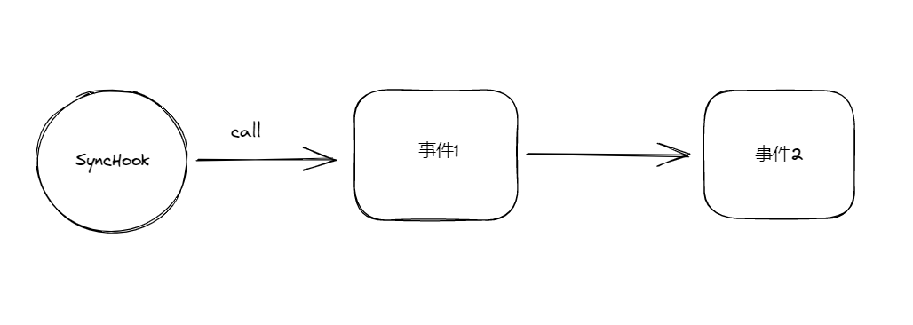
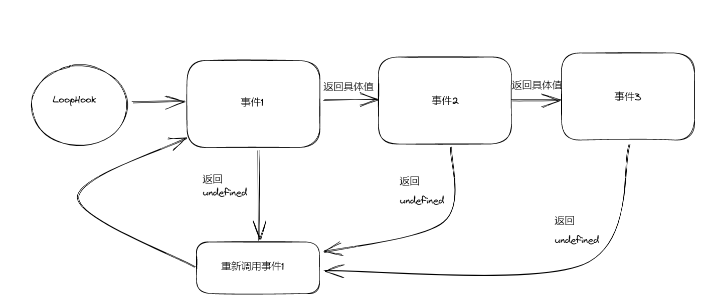
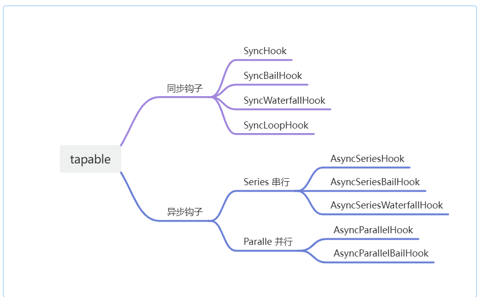

低代码平台中 `Core`作为插拔式的核心，需要发布出各种事件来让用户在 `plugin`的基础上实现监听以及拓展。 `Core`中发布的事件大概可以分为一下几类

- 需要根据事件的返回值来决定后面逻辑是否执行
- 异步串行且需要上一个返回值作为下一个参数的入参

# Tapable

`tapable` 是一个类似于 `Node.js` 中的 `EventEmitter`的库，但更专注于自定义事件的触发和处理。`webpack` 通过 `tapable` 将实现与流程解耦，所有具体实现通过插件的形式存在。

其中基本用法这里不赘述，大部分文章都有介绍。下面介绍下各类钩子的特点

## 按照执行机制分类

### Basic hook

这一类钩子仅仅只是注册然后执行，并不关心每个事件里面的返回值等等。就像简单的**发布订阅** 

### Bail hook

这类钩子会根据事件的返回值如果不为`**undefined**`来决定下一个事件是否执行 

### WaterFallHook

这类钩子会根据事件返回值如果不为`undefined`来作为下一个事件的第一个参数值。**它只能将上一事件的返回值传递给下一个事件第一个参数**

### LoopHook

这类钩子会根据任意一个事件返回值如果是`undefined`则回到第一个事件中 

## 按照同步/异步分类

- 同步钩子

只能使用 `tap`注册，使用 `call`调用

- 异步钩子

可以使用 `tap` /`tapAsync`/ `tapPromise`来注册，对应`callAsync`/`promise`来调用.

### 【注意】

1.  `callAsync`/ `promise`调用会执行 `tap` /`tapAsync`/ `tapPromise` 注册的事件  2. 使用`tap`注册的事件没有回调参数 `callback`  3. 异步钩子注册事件会有而外参数 `callback`且固定为`callback(错误信息,返回值)`

---

# 拦截器

# 源码分析
