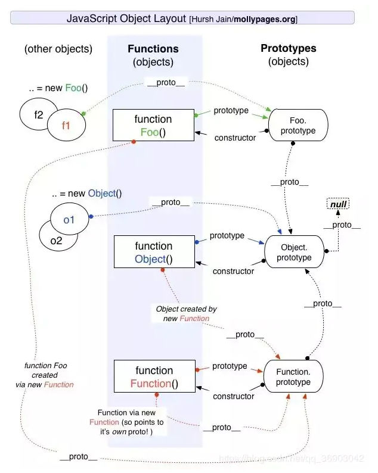
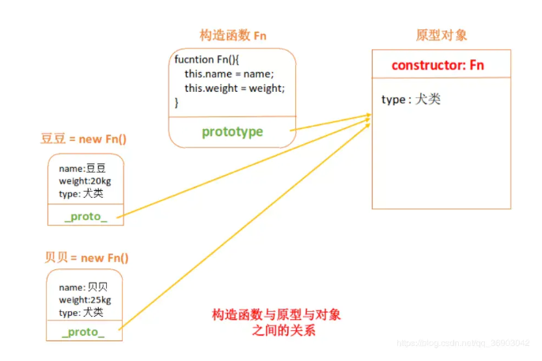
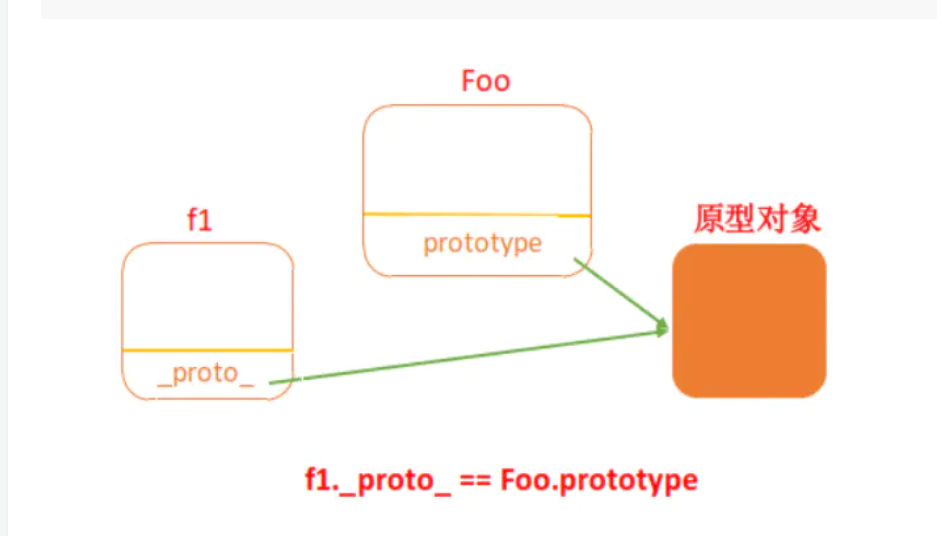
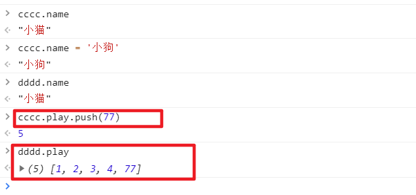
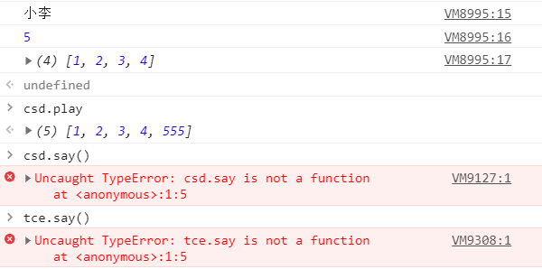
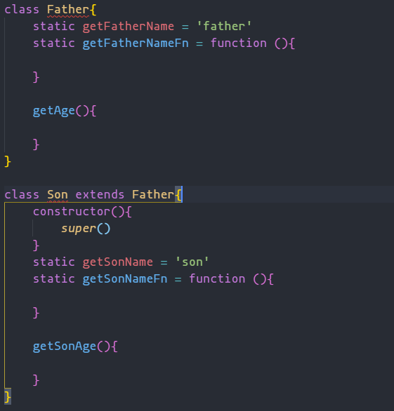
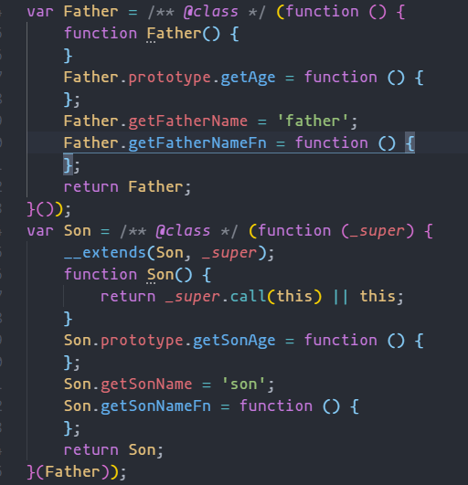
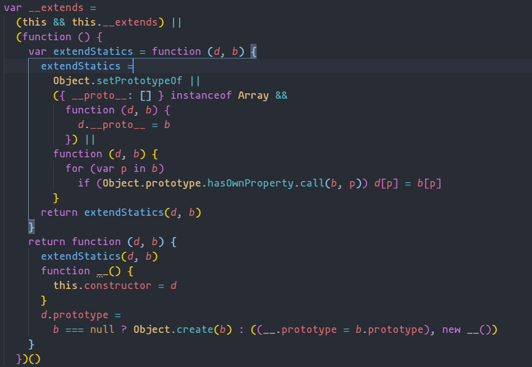

### 概述

> 面试官：说一说 JS 中的继承方式有哪些？以及各个继承方式的优缺点。<br />首先先来分析下这道面试题的考点有什么？首先是继承,继承有很多种方式基本上都离不开两个概念`原型`和`原型链`。然后就是这种继承的优缺点

### 课前知识

#### 原型

首先每个 JS 对象都会有一个`__proto__`对象,而如果是一个函数的话的它的原型则是`prototype`

#### 原型链

对象中的每一个`__proto__`和`prototype`都指向原型的`__proto__`,这样一来就形成了一条原型链

#### 两者间的联系

<br />这张图看上去第一眼就跟清明上河图一般都没有哈哈哈哈,反正我第一次看这张图是不懂。一坨一坨的很难懂。<br />那我们就来将它拆解分析。首先我们需要知道的是

```javascript
var obj = {};
obj.__proto__ === Object.prototype; // true
obj.__proto__ === Object.__proto__; // false
Object.prototype.__proto__ === null; // true
```

由上面可以得出一个结论

1. 每一个对象都有一个`__proto__`属性,而这个属性指向`JS`全局函数`Object`的`prototype`。
2. 全局函数`Object`的`prototype`上面的`__proto__`指向原型链的终点`null`

```javascript
function foo(name, age) {
  this.name = name;
  this.age = age;
}
let f1 = new foo("小王", 2);
let f2 = new foo("小绿", 5);
f1.__proto__ === foo.prototype; // true
f2.__proto__ === foo.prototype; // true
f1.__proto__ === f1.constructor; // false
f1 === f2; // false
f1.__proto__ === f2.__proto__; // true
f1 instanceof foo; // true
```

上面的代码可能你一时间还看不懂。那我就上另一张神图<br /><br />这样是不是就清楚多了呀。那我们来整理一下结论

- 通过函数`new`出来的实例,它的`__proto__`指向构造函数的`prototype`
- `prototype`指向的就是原型对象，原型对象放的就是对象共享的属性
- 原型对象里有一个`constructor`属性，这个属性又指回了构造函数。<br />总结出来一句话就是

> 构造函数的 prototype 指向原型对象，原型对象有一个 constructor 属性指回构造函数，每个构造函数生成的实例对象都有一个 proto 属性，这个属性指向原型对象。

### 

### 继承

#### 原型链继承

```javascript
function foo(name, age) {
  this.name = name;
  this.age = age;
  this.play = [1, 2, 3, 4];
}
function dog(type) {
  this.type = type;
}
dog.prototype = new foo("小猫", 2);
let ccc = new dog(3);
let ddd = new dog(5);
```

<br />由图上的结果,我只对`ccc`实例上的`play`数组但是`ddd`实例上`play`也跟着改变了。因为两个实例使用的是同一个原型对象。

#### 最经典的 call()方式

```javascript
function foo(name, age) {
  this.name = name;
  this.age = age;
  this.play = [1, 2, 3, 4];
}
foo.prototype.say = function () {
  console.log("你要我说什么");
};
function dog(type, name, age) {
  foo.call(this, name, age);
  this.type = type;
}
let csd = new dog(5, "小李", 32);
let tce = new dog(6, "小王", 2);
console.log(csd.name);
console.log(csd.play.push(555));
console.log(tce.play);
csd.say();
tce.say();
```

<br />上图的结果很明显,虽然解决了使用同一个原型对象的问题。但是我们却没法调用原本加在`foo.prototype`的方法

#### 组合式

```javascript
function foo(name, age) {
  this.name = name;
  this.age = age;
  this.play = [1, 2, 3, 4];
}
function dog(type) {
  foo.call(this);
  this.type = type;
}
dog.prototype = new foo("小猫", 2);
```

这个组合的方式很明显就是吧上面两个的方式组合起来了。但是这样相当于调用了两次`foo`造成了不必要的新能浪费

#### 组合式优化（寄生继承）

```javascript
function foo(name, age) {
  this.name = name;
  this.age = age;
  this.play = [1, 2, 3, 4];
}
function dog(type, name, age) {
  foo.call(this, name, age);
  this.type = type;
}
dog.prototype = Object.create(foo.prototype);
dog.prototype.constructor = dog; // 重新吧constructor 指向原来的dog
```

## ES6 继承

```javascript
class Son extends Father {
  constructor() {
    super(this);
  }
}
```

在`ES6`中使用`extends`和`super`实现继承。那他的底层是怎么实现的呢。我们将`TS`编译后的代码来分析。<br />在`ts`中代码<br /><br />`TS`编译成`JS`<br /><br />

```javascript
// 在上面中，TS将class 关键字编译成 一个立即执行函数。并用一个变量保存
// constructor 则是 函数实体
// 方法则定义在 prototype 中
// 静态方法则定义在实例上
class Father {
  static getFatherName = "father";
  static getFatherNameFn = function () {};
}
var Father = (function () {
  function Father() {}
  Father.prototype.getAge = function () {};
  Father.getFatherName = "father";
  Father.getFatherNameFn = function () {};
  return Father;
})();
```

```javascript
class Child extends Father {
  static getSonName = "son";
  static getSonNameFn = function () {};
  constructor() {
    super();
  }
  getSonAge() {}
}

var Child = (function (_super) {
  _extend(Child, _super); // 这里继承Father的公共方法和实例属性
  function Child() {
    // call 继承Father私有方法
    return _super.call(this);
  }
  Son.prototype.getSonAge = function () {};
  Son.getSonName = "son";
  Son.getSonNameFn = function () {};
  return Son;
})(Father);
```

再来看看`_extend()`方法

```javascript
// 简化版
function _extend(Child, super) {
  // 继承父类实例上的属性
  F.__proto__ = super
  function F() {}
  F.prototype = Object.create(super.prototype)
  F.prototype.constructor = Child
  Child.prototype = new F()
  // 这不就是 原型链继承吗
}
```

在对比`TS`编码的

```javascript
var __extends =
  (this && this.__extends) ||
  (function () {
    var extendStatics = function (d, b) {
      extendStatics =
        Object.setPrototypeOf ||
        ({ __proto__: [] } instanceof Array &&
          function (d, b) {
            d.__proto__ = b;
          }) ||
        function (d, b) {
          for (var p in b)
            if (Object.prototype.hasOwnProperty.call(b, p)) d[p] = b[p];
        };
      return extendStatics(d, b);
    };
    return function (d, b) {
      extendStatics(d, b); // 可以简化自 => d.__proto__ = b
      // 原型链继承
      function __() {
        this.constructor = d;
      }
      d.prototype =
        b === null
          ? Object.create(b)
          : ((__.prototype = b.prototype), new __());
    };
  })();
```

## 总结

`ES6`中的继承实际上就是我们所说的`寄生式继承`
