# 前言

**git 项目地址**

> [https://github.com/ianstormtaylor/slate](https://github.com/ianstormtaylor/slate)

**官网的中文文档的版本有点旧，可以看看 `git`上的**

> [https://rain120.github.io/athena/zh/slate/Introduction.html#why](https://rain120.github.io/athena/zh/slate/Introduction.html#why)

# 基本使用

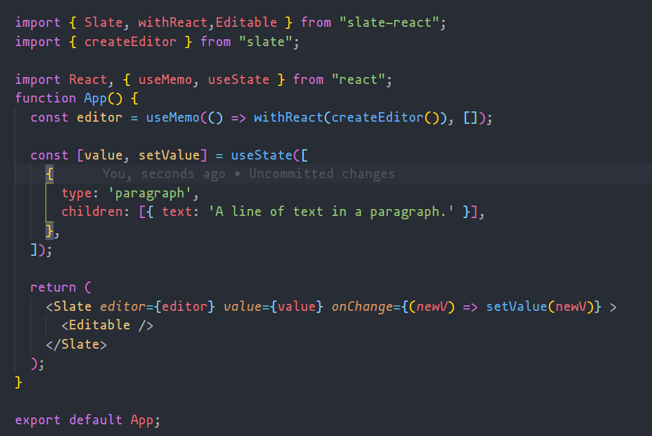<br />这样就能创建出一个编辑器，但它却是这样的。<br />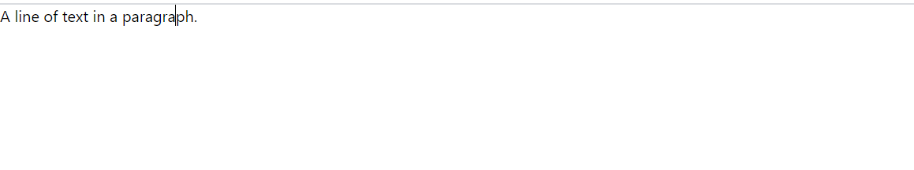<br />我擦嘞，怎么跟我平时看到的编辑器不一样。好歹工具栏得有一个吧！！！。但是看他的 `dom`  结构，<br />也只是增加了一个 `contenteditable`  而已。<br />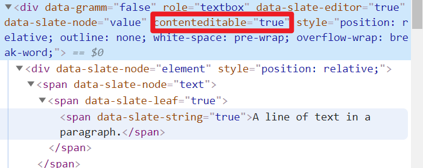

别着急，这就是 `slateJS`  的理念，它并不是一个**开箱即用的工具**，你可以去调用它暴露出来的 `API`  来实现你所需要东西。那接下来实现一个工具栏，并且具有加粗

## 工具栏

### 加粗

```jsx
import { Slate, withReact, Editable } from "slate-react";
import { createEditor, Editor, Transforms, Text } from "slate";
import React, { useMemo, useState, useCallback } from "react";
import { Button } from "antd";

// default Elements
const DefaultElements = (props) => (
  <p {...props.attributes}>{props.children}</p>
);

const Element = (props) => {
  const { element } = props;
  switch (element.type) {
    case "heading-one":
      return <RenderH1 {...props.attributes}>{props.children}</RenderH1>;
    default:
      return <DefaultElements {...props} />;
  }
};

const renderLeaf = useCallback((props) => {
  return <Leaf {...props}></Leaf>;
}, []);

const renderElement = useCallback(
  (props) => <Element {...props}></Element>,
  []
);
return (
  <Slate editor={editor} value={value} onChange={(newV) => setValue(newV)}>
    <TabBar editor={editor} />
    <Editable renderLeaf={renderLeaf} renderElement={renderElement} />
  </Slate>
);
```

```jsx
function TabBar({ editor }) {
  return (
    <div
      style={{
        width: "100%",
        height: "60px;",
        padding: "5px",
        border: "1px solid #ccc",
      }}
    >
      <Button type="primary" onClick={(e) => toggleFormat(e, editor, "bold")}>
        加粗
      </Button>
    </div>
  );
}
```

```javascript
// 命令事件
// 判断节点的属性值是否为真
const isFormatActive = (editor, format) => {
  const [match] = Editor.nodes(editor, {
    match: (n) => n[format],
    universal: true,
  });
  return !!match;
};

// 根据样式切换属性值
const toggleFormat = (e, editor, format) => {
  e.preventDefault();
  const isActive = isFormatActive(editor, format);
  Transforms.setNodes(
    editor,
    { [format]: isActive ? false : true },
    { match: (n) => Text.isText(n), split: true }
  );
};
```

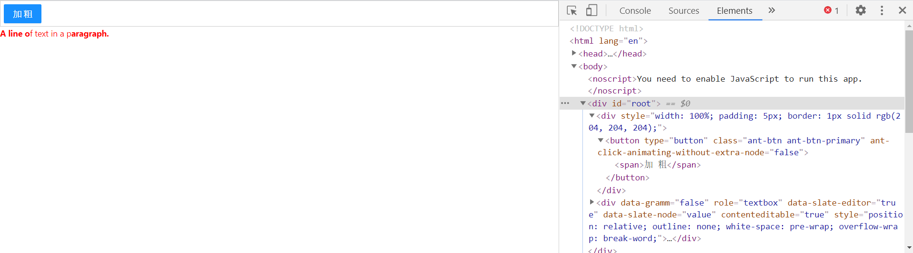

### 设置标题

```jsx
// 下拉列表
const DropMenu = (props) => (
  <Menu onClick={(e) => toggleFormat(e.domEvent, props.editor, e.key)}>
    <Menu.Item key="p">
      <p>正文</p>
    </Menu.Item>
    <Menu.Item key="heading-one">
      <p>H1</p>
    </Menu.Item>
    <Menu.Item disabled key="heading-two">
      <p>H2</p>
    </Menu.Item>
    <Menu.Item danger key="h3">
      <p>H3</p>
    </Menu.Item>
  </Menu>
);

function TabBar({ editor }) {
  return (
    <div
      style={{
        width: "100%",
        height: "60px;",
        padding: "5px",
        border: "1px solid #ccc",
      }}
    >
      <Button type="primary" onClick={(e) => toggleFormat(e, editor, "bold")}>
        加粗
      </Button>

      <Dropdown overlay={<DropMenu editor={editor}></DropMenu>}>
        <Button type="primary">标题</Button>
      </Dropdown>
    </div>
  );
}
```

#### 采坑

大概就长这样,通过 `Ant Design`  的下拉列表实现。但这样我们会发现，这样是没有效果的，但是像加粗、下划线这些又是可以的。脑壳痛！！<br />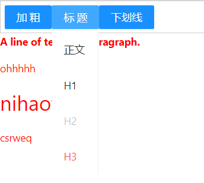

#### 分析

`slateJS`  的渲染逻辑已经被重写，也就是 `renderElement`  这个方法，通过不同的**type**来渲染不同的标签内容。那问题来了。没生效，也就是说这个 `type`  没有设置成功。

```jsx
Transforms.setNodes(
  editor,
  { [format]: isActive ? false : true },
  { match: (n) => Text.isText(n), split: true }
);
```

看上去好像也没有问题。那再来看看文档。<br />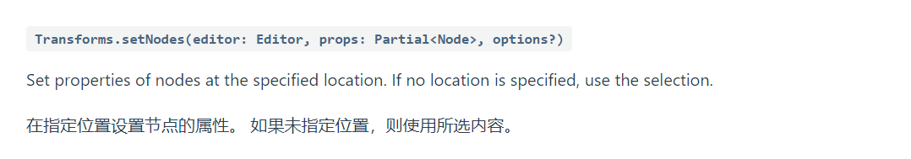<br />我敲，所选内容那也就是说 `Selection的Range` ，难道这个值没有了？？？

```jsx
// 标题
console.log(editor.selection, format, "当前选区"); // App.js:60 null "heading-one" "当前选区"

// 加粗
console.log(editor.selection, format, "当前选区"); // App.js:60 {anchor:{xx},focus:{xx}} 'bold'
```

一打印还真是这么回事，**因为设置具体标题前，我们已经点击了一次标题按钮。这时候 window.selection 就属于这个标题按钮了，所以这个属性就是 null**<br />\*\*

#### 解决

既然知道了问题的始因，那解决起来就好办了。

```jsx
<Editable
  renderLeaf={renderLeaf}
  renderElement={renderElement}
  onMouseLeave={(e) => saveCurrentRange(e, editor)}
/>;

function saveCurrentRange(e, editor) {
  e.preventDefault();
  selectionRange = editor.selection;
}

// 在 toggleFormat 方法中增加
if (format === "heading-one") {
  // 重新设置选区
  Transforms.select(editor, selectionRange);

  Transforms.setNodes(
    editor,
    { type: isActive ? "paragraph" : format },
    { match: (n) => Editor.isBlock(editor, n) }
  );
  return;
}
```

### 上传图片

按照前面的思路,我们在 `model`  中添加一组数据

```javascript
 { type: 'image', url: 'https://ww2.sinaimg.cn/bmiddle/8082a612gy1gqmf4ytu6dj20n0183aez.jpg', children: [{ text: '' }] },
```

```jsx
const Element = (props) => {
  const { element } = props;
  switch (element.type) {
    case "heading-one":
      return <RenderH1 {...props.attributes}>{props.children}</RenderH1>;
    case "image":
      return (
        <p>
          <div
            contentEditable={false}
            style={{ width: 150 + "px", height: 150 + "px" }}
          >
            
            {props.children}
          </div>
        </p>
      );

    default:
      return <DefaultElements {...props} />;
  }
};
```

#### 坑(待解决)

这样好像就实现了,但是会有一个问题，这个插入图片后同行就不能输入其他,甚至乎光标都没有,一开始我以为是 `contentEditable={false}`  的原因。但是设置成 `true`  后虽然光标有了，但是依然不能编辑插入元素。

---

对于 Slate 的基本使用就介绍到这里，感兴趣可以自行去 Slate 官网了解更多：[Slate](https://docs.slatejs.org/walkthroughs/01-installing-slate)。

在前面的代码示例中，我们知道了如果需要使用 Slate，我们需要分别从 `slate` 和 `slate-react` 包中引入不同的核心依赖，`slate` 包是 `Slate` 框架的核心设计部分，而 `slate-react` 则是其渲染部分的封装，主要用来提供创建编辑器的 `React` 组件。当然除了这两个包，其仓库里还有 `slate-history`，用于实现编辑器的撤销和重做功能。`salte-hyperscript`, 提供 Slate 创建编辑器的 `jsx` 帮助函数。

在本文中，我们主要关注 `slate` 和 `slate-react`。

# 核心分析

先来看看 `Slate`  的代码结构图<br />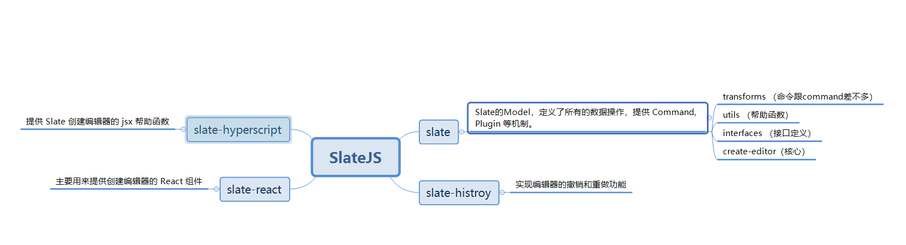

可以看到除了 `slate`  核心包之外，其他的包大多数都算是它的**拓展（插件）。**

## slate

### 文档数据结构

slate 文档中的节点分为 2 类：Element 和 Text，其中 Element 可以在 children 中包含 Elment 和 Text，类似 dom 树；<br />可以在 Element 和 Text 上扩展属性，提供渲染节点所需要的数据。

```typescript
export type Descendant = Element | Text;

export interface BaseText {
  text: string;
}

export interface BaseElement {
  children: Descendant[];
}
```

就比如你可以这样

```javascript
const paragraph = {
  type: 'paragraph',
  children: [...],
}

const link = {
  type: 'link',
  url: 'https://example.com',
  children: [...]
}
```

`slate`  知道你有 `type/link`  属性，但是不知道他们是干嘛的，它只关心你是否有 `children` /`text`  这个字段。然而你却可以用 `type/link`  字段借助**renderElement**来渲染出不同的元素。

### 结构规范

虽然看上去我们定义一个数据结构是很自由，但是 `slate`  为了确保内容比  `contenteditable`  的标准内容更具有可预测性。所以它指定了一系列规范

`Slate` 所有内置的逻辑依靠这些约束，所以很可惜，你不能忽略它们。它们是(👇👇👇)

1. **所有 `Element` 节点最后必须包含至少一个 `Text` 节点。** 如果一个元素节点不包含任何子节点，那么会添加一个空的文本节点作为它的唯一子节点。这个约束确保选择范围 (`selection`)的锚点 (`anchor`)和焦点 (`focus`) 总是指向任意节点内部 (通过依赖文本节点的引用)。这样，空元素（或者 `void` 类型对象）就无法被选择。
2. **两个相邻的有同样属性的文本会被合并。** 如果两个相邻的文本节点有相同的格式，它们会被合并到一个文本节点中。这样会避免文本节点无限制扩展数量，因为添加和删除格式都会分割文本节点。
3. **块节点要么只能包含其他块节点，要么包含内联节点和文本节点。** 比如，一个 `paragraph` 块节点不能同时包含另一个 `paragraph` 块节点及一个 `link` 内联元素。允许包含的子节点由第一个子节点所决定，任何其他不被允许的子节点会被移除。这确保了常见的富文本行为（比如“把一个块元素分割成两个”）始终如一。
4. **行内节点既不能是父块节点的第一个或最后一个子块，也不能挨着子数组中的另一个行内节点。** 如果是这种情况，将添加一个空文本节点来满足当前的约束条件。
5. **顶级的编辑器节点只能包含块节点。** 如果任何顶级子级是内联节点或文本节点，它们将被删除。这样可以确保编辑器中始终存在块节点，从而使诸如「将块分成两个」之类的行为按预期工作。

这些默认约束都是强制性的，因为它们保证 `Slate` 文档有 _更好的_ 可预测性。

### 路径模块

#### key：节点索引

当节点被创建后，Slate.js 会为其分配一个 key 作为唯一索引，默认是一个单调自增数：

```
1
2
3
```

每次生成的节点，都会拥有一个在文档中唯一存在的 `key` ，只在部分情况下，会需要重新为节点生成 `key` ，例如一个 ` Text`  节点分裂后，为了避免分裂后的两个 `Text`  节点共享分裂前的 `key` ，需要为分裂后节点重新生成 `key ` 。<br />Slate.js 提供了一系列基于 key 的 API 给开发者，去访问或者操作节点：

```
editor.moveNodeByKey(key)
editor.removeNodeByKey(key)
editor.replaceNodeByKey(key)
```

**但是问题来了，如何去或者到这个 `key`  喃？**

```typescript
// slate-main\packages\slate-react\src\plugin
//  react-editor.ts

findKey(editor: ReactEditor, node: Node): Key {
    let key = NODE_TO_KEY.get(node)
     // 没有就创建一个新的key
    if (!key) {
      key = new Key()
      NODE_TO_KEY.set(node, key)
    }

    return key
}
```

#### path：节点在文档中的位置

上面我们说了 `slate`  在它的 `schame`  只关心有没有 `children`  而 `children`  可以嵌套。

```javascript
[
  {
    type: "paragraph",
    children: [
      {
        type: "paragraph",
        children: [{ type: "paragraph", children: [{ text: "3层" }] }],
      },
    ],
  },
  { type: "paragraph", children: [{ text: "ohhhhh" }] },
  { type: "heading-one", children: [{ text: "nihaofan" }] },
  { type: "paragraph", children: [{ text: "csrweq" }] },
];
```

这样的数据结构就类似一颗树,而尽管有了 `key`  可以查找某一颗树，但是这样需要**遍历直到 key 是这个节点位置。**对于富文本来说嵌套不深，但是它的 `length`  却可以很大。每次都要去遍历会造成不必要的性能浪费。为了解决这种问题， `slate`  引入 `path`  的概念。

给定一个节点的路径 `[i, j]` ，从根节点开始，先到达根节点子孙中的第 `i` 个节点 `Node_i`，再到达 `Node_i` 的第 `j` 个节点 `Node_i_j` ，我们就找到了这个节点。<br />例如，沿着路径`[0,1]`，在下面这个节点树种，我们就能找到节点 D：

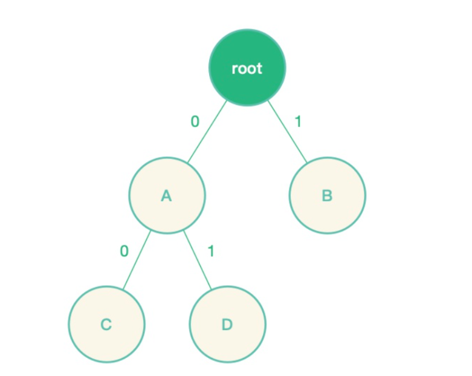<br />我们甚至可以引出

> 当给定一个节点的路径 [i, j, k] 后，我们很容易就能获得他的祖先和兄弟路径：
> 祖先: `[], [i], [i,j]`
> 兄弟：`[i, j, x] where x is not k`

**问题又来了，在什么时候创建了 path 呢**<br />\*\*<br />回答这个问题之前，我们先来看看怎么寻找 `PATH`

```typescript
// slate-main\packages\slate-react\src\plugin
//  react-editor.ts

findPath(editor: ReactEditor, node: Node): Path {
    const path: Path = []
    let child = node
    while (true) {
      const parent = NODE_TO_PARENT.get(child) // 找到这个node的父亲
      if (parent == null) {
        if (Editor.isEditor(child)) {
          return path
        } else {
          break
        }
      }
      const i = NODE_TO_INDEX.get(child)  // 这个就是他父亲所在节点的位置
      if (i == null) {
        break
      }
      path.unshift(i) // 把他的父亲的路径节点记录下来
      child = parent  // 循环找到它的父级 直至没有
    }
    throw new Error(
      `Unable to find the path for Slate node: ${JSON.stringify(node)}`
    )
  },
```

**我们的元素的 **`**path**`  是**[ 父亲父亲节点的位置，父亲节点的位置]**组成。<br />接下来看看 `NODE_TO_INDEX`  是什么玩意

```typescript
// slate-main\packages\slate-react\src\utils

export const NODE_TO_INDEX: WeakMap<Node, number> = new WeakMap();
```

这里是一个 `WeakMap`  构建 的**缓存优化 至于为什么用 **`**WeakMap**`  这里不做过多解释。

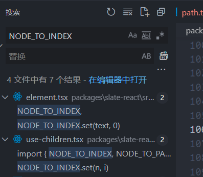<br />这样就可以明确这个 `path`  是如何实现的啦。

#### point：点

`point`  比 `path`  更加细腻。或者说是 `path`  的一种延伸。先来看下他的定义

```typescript
export interface BasePoint {
  path: Path;
  offset: number;
}
```

没错它还增加了一个 `offset`  属性。记录了当前的具体位置。

### Immutable Data

`JavaScript`  中的对象一般是可变的（Mutable），因为使用了引用赋值，新的对象简单的**引用**了原始对象，改变新的对象将影响到原始对象。如 `foo={a: 1}; bar=foo; bar.a=2`  你会发现此时 `foo.a`  也被改成了 ` 2` 。虽然这样做可以节约内存，但当应用复杂后，这就造成了非常大的隐患，Mutable 带来的优点变得得不偿失。为了解决这个问题，一般的做法是使用 **shallowCopy（浅拷贝）**或 **deepCopy（深拷贝）**来避免被修改，但这样做造成了 **CPU 和内存的浪费。**

#### 什么是 IMMUTABLE DATA

`Immutable Data `  就是一旦创建，就不能再被更改的数据。对 `Immutable`  对象的任何修改或添加删除操作都会返回一个新的 Immutable 对象。Immutable 实现的原理是 Persistent Data Structure（持久化数据结构），也就是使用旧数据创建新数据时，要保证旧数据同时可用且不变。同时为了避免 deepCopy 把所有节点都复制一遍带来的性能损耗，Immutable 使用了 Structural Sharing（结构共享），即如果对象树中一个节点发生变化，只修改这个节点和受它影响的父节点，其它节点则进行共享。请看下面神图。


**这方面的库有 Immutable.js 和 immer.js 。 **`**slate**`  在 0.5 版本后舍弃 `Immutable.js`  拥抱 `immer.js` 。原因就是因为 `immutableJS` 的 API 太多，这无疑增加了学习压力。。。毕竟要学的已经够多了....。

**immerJS 的优势**

- JS 原生数据结构实现的 immutable （主要使用 Proxy，defineProperty 作为 fallback）
- 结构共享

性能方面与 facebook 的 immutable-js 做对比，在 immutable 数据的操作过程中确实 immutable 数据效率更高一些，但是因为 immutable-js 数据无法序列化，所以后期必须得有 toJS 操作，再加上前期的 fromJS 成本，immer 直接操作原生数据结构可以说略强一些。

```javascript
// 来事例看看
let obj = { a: 1 };
let c = obj;
obj.a = 2;
obj.c = 5;
console.log(c); // {a:2,c:5}

import { produce } from "immer";
let obj = { a: 1 };

let nextState = produce(currentState, (draft) => {});

nextState === obj; // true

let changeState = produce(currentState, (draft) => {
  return (draft.c = 2);
});

console.log(obj); // {a:1}
console.log(changeState); // {a:1,c:2}
```

### commands

当编辑富文本的时候，用户可能会插入文本，删除文本，分隔段落，添加格式等等。这些编辑行为都可以用两个概念来说明：命令和操作。<br />命令(`Commands`)是代表用户特定意图的高级操作。它们是 `Editor` 接口的辅助函数。辅助函数包含了一些富文本常用的核心行为，但是建议你编写针对自己特定模型的命令。

```typescript
interface Editor {
    ...
    // 这一些都是内置命令
    addMark: (key: string, value: any) => void;
    apply: (operation: Operation) => void;
    deleteBackward: (unit: 'character' | 'word' | 'line' | 'block') => void;
    deleteForward: (unit: 'character' | 'word' | 'line' | 'block') => void;
    deleteFragment: () => void;
    insertBreak: () => void;
    insertFragment: (fragment: Node[]) => void;
    insertNode: (node: Node) => void;
    insertText: (text: string) => void;
    removeMark: (key: string) => void;
}
```

在之前我们是这样来实现加粗的效果

```javascript
const toggleFormat = (e, editor, format) => {
  e.preventDefault();
  const isActive = isFormatActive(editor, format);
  Transforms.setNodes(
    editor,
    { [format]: isActive ? false : true },
    { match: (n) => Text.isText(n), split: true }
  );
};
```

在 `slate`  中 `CreateEditor`  方法中只是返回了一个 `editor`  对象。我们甚至可以重写或者是扩展里面的方法。

```javascript
import { createEditor } from "slate";

const editor = createEditor();

const newEditor = {
  ...editor,
  toggleBold(editor) {},
};
```

### Transforms

既然 Slate 拥抱了 `React`，我们知道 `React` 状态更新的核心思想是 `immutable` ，所以你不能直接修改或者删除节点。因此，Slate 提供了一组转换函数，让你能直接修改编辑器的节点，这部分 API 在 Slate 中封装在 **Transforms** 对象中。

> `Transforms`  是对文档进行操作的辅助函数。 它们可用于定义自己的命令。

#### Selection transforms

顾明思意这一类的方法都是基于 `Selection` 。也就是说执行这类方法前，你必须得有合法的选区。这也是上面采坑的解决方案也得以证实。

#### Text transforms

这类的方法是对文本的增删改查。包括移动文本的位置等

#### General transform

#### `Transforms.transform(editor: Editor, transform: Transform)`

Transform the `editor` by an `operation`.<br />将一个操作 `operation` 转换成 `Editor`

### Operations

`Operation`  对象定义了  `Slate`  编辑器用来将更改应用于其内部状态的低级指令。 通过将所有变更表示为操作，这使得  `Slate`  编辑器可以轻松实现历史记录，协作和其他功能。

不是，既然有了 `transforms`  了为什么要 `operations`  这玩意？？？。

让我们来看看之前用的 `Transforms.setNodes`  方法的实现

```typescript
setNodes<T extends Node>(
    editor: Editor,
    props: Partial<Node>,
    options: {
      at?: Location
      match?: NodeMatch<T>
      mode?: 'all' | 'highest' | 'lowest'
      hanging?: boolean
      split?: boolean
      voids?: boolean
    } = {}
  ): void {
   if (split && Range.isRange(at)) {
   Transforms.splitNodes(editor, {
          at: end,
          match,
          mode: splitMode,
          voids,
          always: !endAtEndOfNode,
    })
  }
  ...
 if (Object.keys(newProperties).length !== 0) {
          editor.apply({
            type: 'set_node',
            path,
            properties,
            newProperties,
          })
        }
  }
```

嗯哼，好像看到了 `operations`  的身影 `editor.apply(...)` 。这不会是凑巧吧，那再来看看 `Transforms.splitNodes`  的实现

```typescript
splitNodes<T extends Node>(
    editor: Editor,
    options: {
      at?: Location
      match?: NodeMatch<T>
      mode?: 'highest' | 'lowest'
      always?: boolean
      height?: number
      voids?: boolean
    } = {}
  ): void {
   ...
    if (always || !beforeRef || !Editor.isEdge(editor, point, path)) {
          split = true
          const properties = Node.extractProps(node)
          editor.apply({
            type: 'split_node',
            path,
            position,
            properties,
          })
        }
  }
```

哦豁哦豁，原来 `Transforms`  的最终会转化成一次次颗粒度更细的 `operations`  来实现。

**和命令不同的地方是，操作是不可扩展的。`Slate`  核心定义了所有在富文本文档上可能用到的操作。**<br />\*\*<br />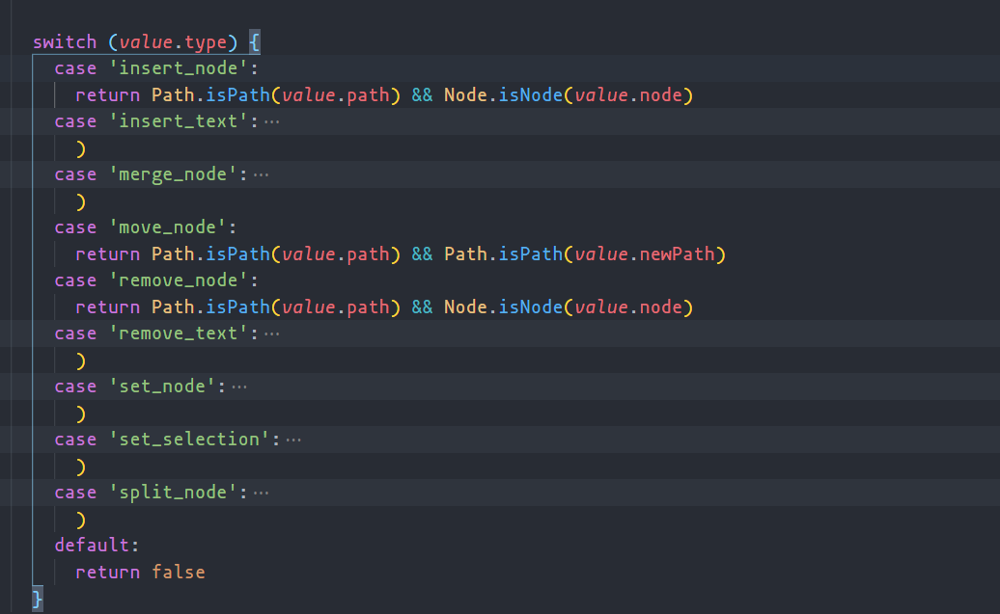

---

# Question

## slate 针对中文、数字、英文的处理逻辑

一般来说对于 `input`  的监听，我们一般都是监听他的 `Input`  或者 `Change`  事件，**一个是输入完,一个是输入完失去焦点**。但是<br />对于富文本来说我更像在你输入前我就要知道，你想干什么东西，我好去帮你准备好一些预备工作。

> 路径 -> slate-main\packages\slate-react\src\components\editable.tsx

```typescript
export const Editable = (props: EditableProps) => {
  // ....

  return (
    <Component
      onBeforeInput={useCallback(
        (event: React.FormEvent<HTMLDivElement>) => {
          // COMPAT: Certain browsers don't support the `beforeinput` event, so we
          // fall back to React's leaky polyfill instead just for it. It
          // only works for the `insertText` input type.
          if (
            !HAS_BEFORE_INPUT_SUPPORT &&
            !readOnly &&
            !isEventHandled(event, attributes.onBeforeInput) &&
            hasEditableTarget(editor, event.target)
          ) {
            event.preventDefault();
            if (!state.isComposing) {
              const text = (event as any).data as string;
              Editor.insertText(editor, text);
            }
          }
        },
        [readOnly]
      )}
    ></Component>
  );
};
```

很有意思, `Slate`  为了实现用户输入前,用到了 `beforeInput`  事件。来看看 `MDN`  的介绍,这是一个实验性功能，但是却很符合我们的要求。

> DOM 事件  **`beforeinput`**  在[`<input>`](https://developer.mozilla.org/zh-CN/docs/Web/HTML/Element/Input), [`<select>`](https://developer.mozilla.org/zh-CN/docs/Web/HTML/Element/select)  或  [`<textarea>`](https://developer.mozilla.org/zh-CN/docs/Web/HTML/Element/textarea)  的值即将被修改前触发。这个事件也可以在  [`contenteditable`](https://developer.mozilla.org/zh-CN/docs/Web/API/HTMLElement/contentEditable)  被设置为  `true`  的元素和打开  [`designMode`](https://developer.mozilla.org/zh-CN/docs/Web/API/Document/designMode)  后的任何元素上被触发。

有意思的是， `React`  也不支持这个事件,所以作者又补上这一段代码。也就是对 `dom`  进行一次手动监听。

```typescript
// Attach a native DOM event handler for `beforeinput` events, because React's
// built-in `onBeforeInput` is actually a leaky polyfill that doesn't expose
// real `beforeinput` events sadly... (2019/11/04)
// https://github.com/facebook/react/issues/11211
useIsomorphicLayoutEffect(() => {
  if (ref.current && HAS_BEFORE_INPUT_SUPPORT) {
    // @ts-ignore The `beforeinput` event isn't recognized.
    ref.current.addEventListener("beforeinput", onDOMBeforeInput);
  }

  return () => {
    if (ref.current && HAS_BEFORE_INPUT_SUPPORT) {
      // @ts-ignore The `beforeinput` event isn't recognized.
      ref.current.removeEventListener("beforeinput", onDOMBeforeInput);
    }
  };
}, [onDOMBeforeInput]);
```

再来看看这个 `onDOMBeforeInput`  最多的变量又是个啥大宝贝。在这之前先眼熟一个东西， `InputType`  返回一个字符串,表示已完成的操作类型。

> [https://www.jc2182.com/javascript/javascript-html-dom-inputtype-event-attr.html](https://www.jc2182.com/javascript/javascript-html-dom-inputtype-event-attr.html)

- insertCompositionText ，使用输入法的插入文本
- historyUndo， 历史返回
- insertText ， 不用输入法的插入文本
- deleteContentBackward， 删除前一个 backspace 删除
- deleteContentForward， 删除后一个 delete 删除
- deleteByCut， 剪切删除
- insertFromPaste， 粘贴插入

```jsx
const onDOMBeforeInput = useCallback(
    (event: InputEvent) => {
      if (
        !readOnly &&
        hasEditableTarget(editor, event.target) &&
        !isDOMEventHandled(event, propsOnDOMBeforeInput)
      ) {
        const { selection } = editor
        const { inputType: type } = event
        const data = (event as any).dataTransfer || event.data || undefined

        // These two types occur while a user is composing text and can't be
        // cancelled. Let them through and wait for the composition to end.
        if (
          type === 'insertCompositionText' ||
          type === 'deleteCompositionText'
        ) {
          return
        }

        event.preventDefault()
        ...
        switch (type) {
            ...
         // 针对不同的type 做不同的处理
          case 'insertFromComposition':
          case 'insertFromDrop':
          case 'insertFromPaste':
          case 'insertFromYank':
          case 'insertReplacementText':
          case 'insertText': {
            if (type === 'insertFromComposition') {
              // COMPAT: in Safari, `compositionend` is dispatched after the
              // `beforeinput` for "insertFromComposition". But if we wait for it
              // then we will abort because we're still composing and the selection
              // won't be updated properly.
              // https://www.w3.org/TR/input-events-2/
              state.isComposing = false
            }

            const window = ReactEditor.getWindow(editor)
            if (data instanceof window.DataTransfer) {
              ReactEditor.insertData(editor, data as DataTransfer)
            } else if (typeof data === 'string') {
              Editor.insertText(editor, data)
            }

            break
          }
        }
      }
    },
    [readOnly, propsOnDOMBeforeInput] insertCompositionText
  )
```

**由上面可知,如果是非复杂输入类型的，就直接调用 `Editor.insertText`  来新增文本，而用输入法输入却复杂了一丢丢。**<br />**在输入中文的时候就会触发这一个方法。输入中文肯定它的 `InputType`   是 `insertCompositionText` 。这是由于输入法输入中文时当我们打啊它接收到的却是这样的**

**为了何时知道我们是输入完的 `slate` 又监听了一系列事件 `onCompositionUpdate` 、 `onCompositionStart` 、 `onCompositionEnd`  **

```jsx
onCompositionStart={useCallback(
            (event: React.CompositionEvent<HTMLDivElement>) => {
              if (
                hasEditableTarget(editor, event.target) &&
                !isEventHandled(event, attributes.onCompositionStart)
              ) {
                const { selection } = editor
                if (selection && Range.isExpanded(selection)) {
                  Editor.deleteFragment(editor)
                }
              }
            },
            [attributes.onCompositionStart]
          )}


 onCompositionUpdate={useCallback(
            (event: React.CompositionEvent<HTMLDivElement>) => {
              if (
                hasEditableTarget(editor, event.target) &&
                !isEventHandled(event, attributes.onCompositionUpdate)
              ) {
                state.isComposing = true
              }
            },
            [attributes.onCompositionUpdate]
          )}

 onCompositionEnd={useCallback(
            (event: React.CompositionEvent<HTMLDivElement>) => {
              if (
                hasEditableTarget(editor, event.target) &&
                !isEventHandled(event, attributes.onCompositionEnd)
              ) {
                state.isComposing = false

                // COMPAT: In Chrome, `beforeinput` events for compositions
                // aren't correct and never fire the "insertFromComposition"
                // type that we need. So instead, insert whenever a composition
                // ends since it will already have been committed to the DOM.
                if (!IS_SAFARI && !IS_FIREFOX && event.data) {
                  Editor.insertText(editor, event.data)
                }
              }
            },
            [attributes.onCompositionEnd]
          )}
```

在这张图我们知道了监听事件的执行顺序。<br />**_输入法输入 a onCompositionStart->\_dom2 事件的回调->\_onCompositionUpdate_->React 的合成事件**<br />**按下空格后 啊 dom2 事件的回调->_onCompositionUpdate_->React 的合成事件->_onCompositionEnd_**<br />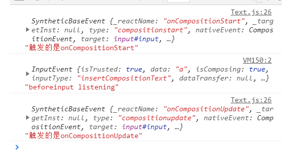

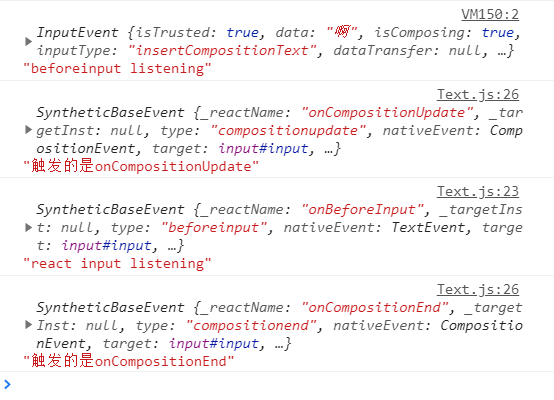<br />**由于各浏览器对事件的兼容性不同，所以在以上都做了处理。但是最终都是要执行 insetText() 方法。**

## void 元素是如何设计的

类似于块元素和行内元素，另一个你可以定义的特殊元素为空元素：它们的 `void` 性：

**元素默认是非空元素，意味着它的子元素是完全可以像文本一样编辑。但是有时候，比如图像， 你可能想要确保 `Slate` 不会将元素的内容作为可编辑的文本，而是看做一个黑箱。**<br />\*\*

> 🤖 这个概念是从 `HTML` 借用的，请查看 [空元素 (opens new window)](https://www.w3.org/TR/2011/WD-html-markup-20110405/syntax.html#void-element)。

可以通过定义 `editor.isVoid` 函数来定义哪些元素被视为 `void`。(默认情况下，它总是返回 `false`。

```javascript
路径  slate-main\packages\slate\src\interfaces\editor
/**
   * Check if a value is a void `Element` object.
   */

  isVoid(editor: Editor, value: any): value is Element {
    return Element.isElement(value) && editor.isVoid(value)
  }

路径   slate-main\packages\slate\src\create-editor

export const createEditor = (): Editor => {
  const editor: Editor = {
    children: [],
    operations: [],
    selection: null,
    marks: null,
    isInline: () => false,
    isVoid: () => false,
    onChange: () => {},
    ...
  }
 return editor
}

```

实际上你可以扩展这个 `isVoid`  函数，类似这样

```javascript
const editor = useMemo(() => withImg(withReact(createEditor())), []);

const withImg = (editor) => {
  const { isVoid } = editor;

  editor.isVoid = (element) => {
    return element.type === "image" ? true : isVoid(element);
  };

  return editor;
};
```

## 为何 void 元素必须要有一个空的 text 作为 child

上面我们知道了 `void`  元素的定义,接下来我们看看为什么要有 `viod`  呢？

首先我们先把数据改成这样。

```jsx
const [value, setValue] = useState([
  {
    type: "paragraph",
    children: [
      {
        type: "paragraph",
        children: [
          { type: "paragraph", children: [{ text: "3层" }] },
          { text: "3-3层" },
        ],
      },
    ],
  },
  {
    type: "image",
    url: "https://ww2.sinaimg.cn/bmiddle/8082a612gy1gqmf4ytu6dj20n0183aez.jpg",
    // children: [{ text: '' }]
  },
  { type: "paragraph", children: [{ text: "图片后面得动i" }] },
]);
```

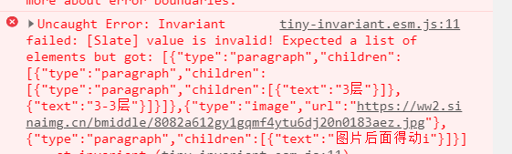

不出意外就会有一个这样的报错，我们跟着报错的堆栈信息找到报错的源头。

```jsx
 路径  slate-main\packages\slate-react\src\components\slate.tsx

 const context: [ReactEditor] = useMemo(() => {
    invariant(
      Node.isNodeList(value),
      `[Slate] value is invalid! Expected a list of elements but got: ${JSON.stringify(
        value
      )}`
    )
    invariant(
      Editor.isEditor(editor),
      `[Slate] editor is invalid! you passed: ${JSON.stringify(editor)}`
    )

    editor.children = value
    Object.assign(editor, rest)
    return [editor]
  }, [key, value, ...Object.values(rest)])
```

其中 `invariant`  是一个包 **tiny-invariant，**大概用法第一个参数表达式,或者函数等如果为 `false`  就会抛出一个 `第二个参数msg`  的错误。

```jsx
路径 slate-main\packages\slate\src\interfaces\node.ts

isNodeList(value: any): value is Node[] {
    if (!Array.isArray(value)) {
      return false
    }
    const cachedResult = IS_NODE_LIST_CACHE.get(value)
    if (cachedResult !== undefined) {
      return cachedResult
    }
    const isNodeList = value.every(val => Node.isNode(val))
    IS_NODE_LIST_CACHE.set(value, isNodeList)
    return isNodeList
  },

 /**
   * Check if a value implements the `Node` interface.
   */

  isNode(value: any): value is Node {
    return (
      Text.isText(value) || Element.isElement(value) || Editor.isEditor(value)
    )
  },

     /**
   * Check if a value implements the `Text` interface.
   */

 isText(value: any): value is Text {
    return isPlainObject(value) && typeof value.text === 'string'
  },
```
