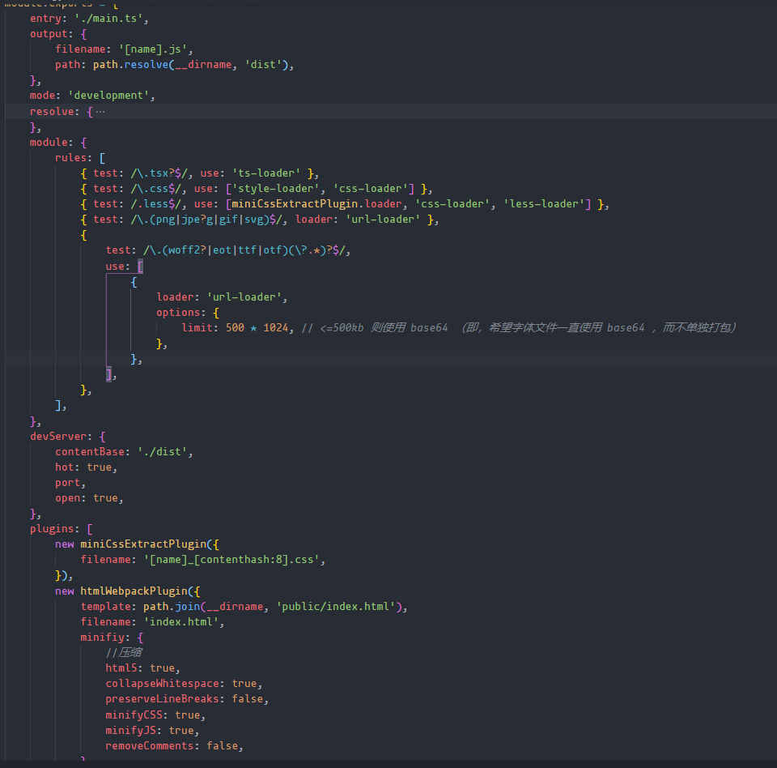
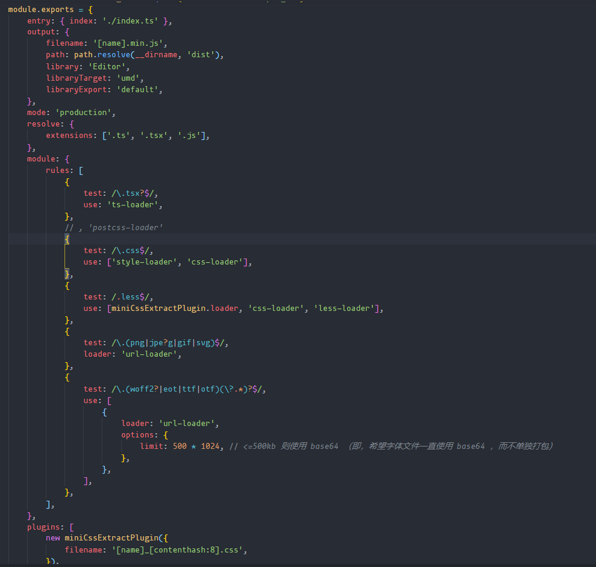
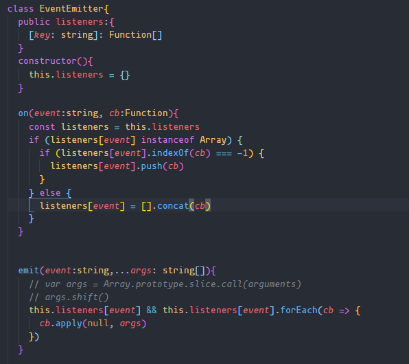
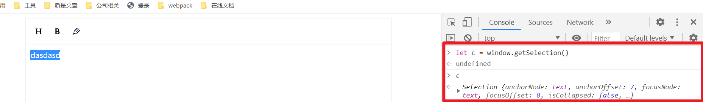
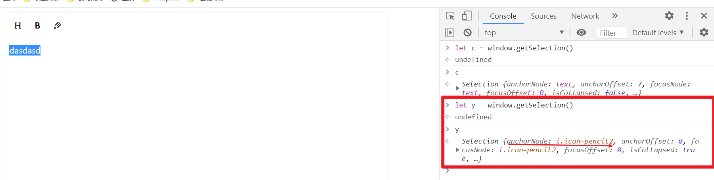
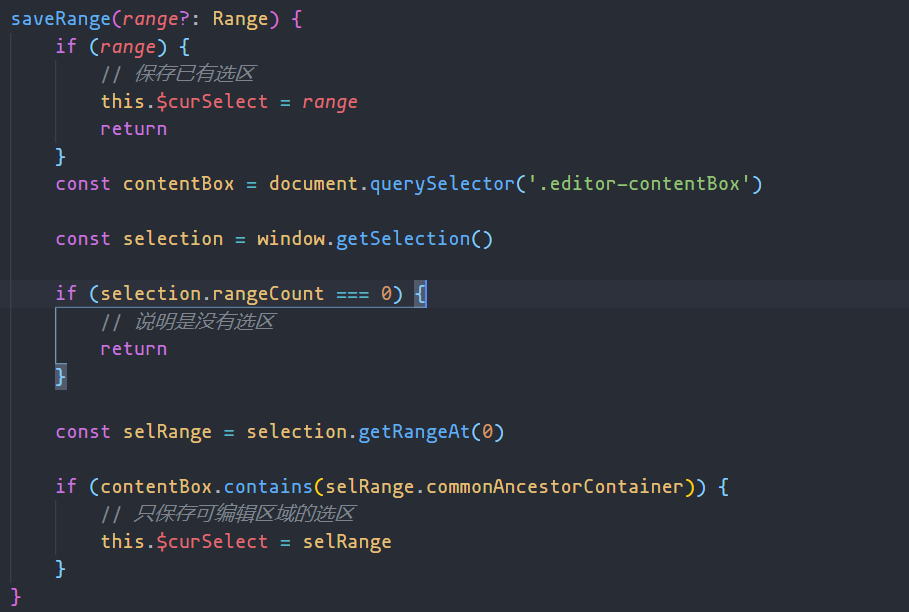

# 可编辑区域

## contenteditable

[全局属性](https://developer.mozilla.org/zh-CN/docs/Web/HTML/Global_attributes) **contenteditable**   是一个枚举属性，表示元素是否可被用户编辑。  如果可以，浏览器会修改元素的部件以允许编辑。

```html
<div contenteditable="true"></div>
```

## document.execCommand

> #### 已废弃
>
> This feature is obsolete. Although it may still work in some browsers, its use is discouraged since it could be removed at any time. Try to avoid using it.

当一个 HTML 文档切换到设计模式时，`document`暴露 `**execCommand**`\*\* \*\*方法，该方法允许运行命令来操纵[可编辑内容区域](https://developer.mozilla.org/zh-CN/docs/Web/HTML/Global_attributes/contenteditable)的元素。

大多数命令影响`document`的 [selection](https://developer.mozilla.org/en-US/docs/Web/API/Selection)（粗体，斜体等），当其他命令插入新元素（添加链接）或影响整行（缩进）。当使用`contentEditable`时，调用 `execCommand()` 将影响当前活动的可编辑元素。

```javascript
bool = document.execCommand(aCommandName, aShowDefaultUI, aValueArgument);
```

# 获取光标选择区域

## window.getSelection()

**该函数返回一个 **`**Selection**`  对象，表示用户所选择的文本对象或者当前光标的位置。

## Selection.getRangeAt()

**返回选区包含的指定区域（**`**Range**`**）的引用。**

# webpack 配置

## 安装依赖

在 `Ts` 项目中要安装

- @babel/core @babel/preset-env 将 JS 语法转化成 ES5 或者其他版本
- webpack webpack-cli webpack-dev-server
- typescript ts-loader 将 Ts 转化成 JS 语法
- url-loader 解析图片，字体等文件
- less less-loader 解析 less 语法
- css-loader style-loader 解析 css 采用行内引入
- mini-css-extract-plugin 将 css 抽离成公共文件 与 style-loader 不能共用
- html-webpack-plugin 通过网页模板动态引入打包的文件

## dev 环境

为了方便调试，所以加入 `html-webpack-plugin` <br />

## build

这里不需要调试，可以采用库的形式输出



# 功能实现

```javascript
// 加粗
document.execCommand("bold", false);

// 改变字体颜色
document.execCommand("fontColor", false, "#xxxx");

// 设置标题
document.execCommand("formatBlock", false, "<h1>");
```

浮动列表的事件传递可以采用一个发布订阅模式来解决！<br />

## 采坑记录

**因为通过  **`**document.execCommand**`**  可以对标签 **`**contenteditable=true**` ** 的区域的选区产生影响。所以点击对应的按钮时执行相应的命令就可以对选中文字进行编辑。 这个 api 只对当前 **`**Selection**` **对象中的** `Range` **范围产生负影响。**

然而如果你在之前选择过一次可编辑区域的内容，在点击按钮栏时。这个 `Selection`指向的是你这个按钮栏



**点击了这个按钮后,当前的选择区域就变成了这个按钮栏。这时候就会出现 `**`**document.execCommand()**`**` 没有效果的现象**



因为这个 `document.execCommand()`  只针对可编辑区域,所以需要保存上一次用户选中的范围，并且这个区域在可编辑区域内


