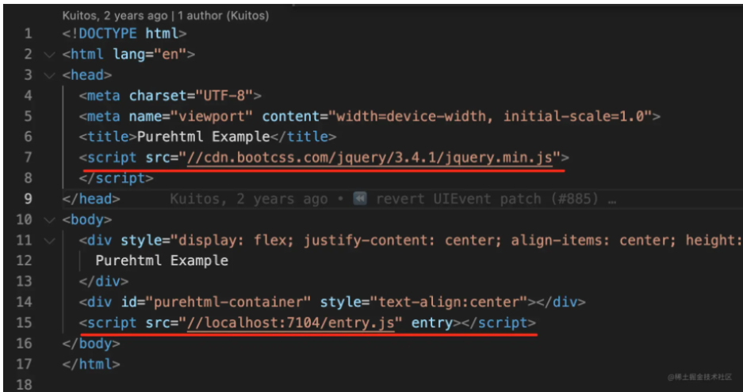
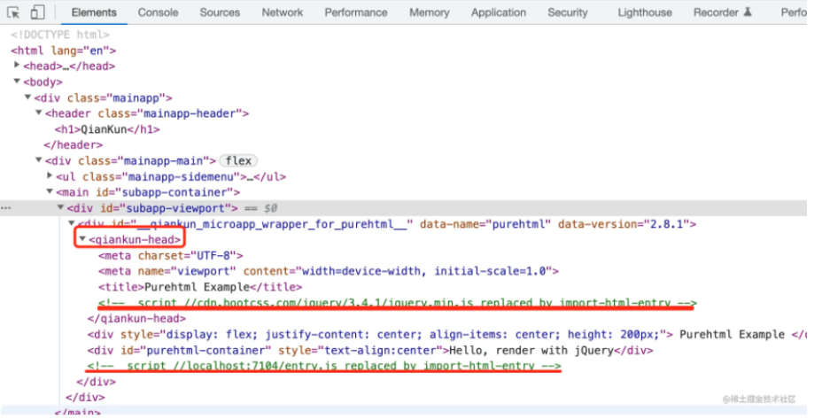
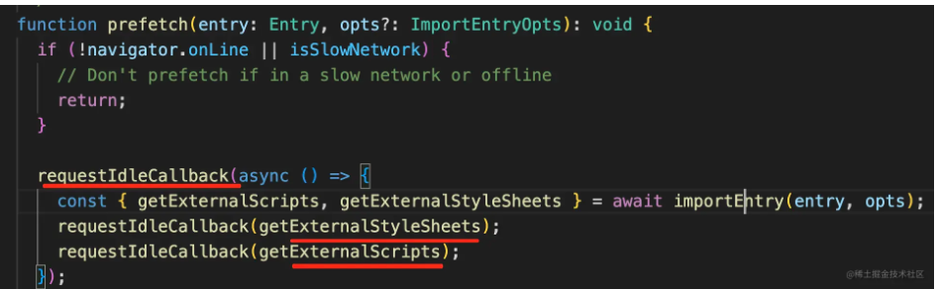

上一篇文章分析 `single-spa`它的入口只能是`JS`。但是在我们现在开发的更多是单页应用。这种应用的入口大部分都是 `html`，在 `html `的`script`中有这个应用的入口。

## single-spa 的缺陷

1. 入口只能是`JS`,现在应用大多数以`html`为入口
2. 只维护应用切换的状态、没有提供沙箱隔离
3. 应用之间无法通信,传递数据

## 入口

---

我们知道 `single-spa`的入口是`JS`，但我们现在打包的时候都会带上`hash`<br />那就意味着我们每打包一次，就要去更改一次入口的配置这也太麻烦了！！！

能不能从我们生成的单页面`html`中去提取`script`标签地址来获取入口文件,再加上 `single-spa`的能力完成应用加载。

实际上`qiankun`就是利用这个思路来实现的

比如下面这段 `html`【借用光哥的图】<br />

qiankun 会把 head 部分转换成 qiankun-head，把 script 部分提取出来自己加载，其余部分放到 html 里：



这样也就不再需要开发者指定怎么去加载子应用了，只需要去配置`html`的地址即可，实现了解析 `html `自动加载的功能。

这个过程在 `import-html-entry` 中实现。

另外`qiankun`还依靠 `requestIdleCallback`来实现预加载功能<br />

## 沙箱

---

为什么要有沙箱，这个问题其实很容易想到<br />比如在 A 应用中 定义了 window.a = APath<br />切换到 B 应用后 B 也定义了 window.a = BPath<br />然后关闭 B 应用，在 A 应用中访问 window.a 发现是 BPath 这不`bug`就来了

### JS 沙箱

在 `qiankun`中实现了 三种沙箱

- 快照, 加载子应用前记录下 window 的属性，卸载之后恢复到之前的快照，核心就是 diff
- LegacySandbox，加载子应用之后记录对 window 属性的增删改，卸载之后恢复回去
- Proxy，创建一个代理对象，每个子应用访问到的都是这个代理对象

其中`diff/快照`都不支持同时存在多个子应用。

#### 快照沙箱

```typescript
// src\sandbox\snapshotSandbox.ts

export default class SnapshotSandbox implements SandBox {
  proxy: WindowProxy;
  sandboxRunning = true;
  private windowSnapshot!: Window;
  private modifyPropsMap: Record<any, any> = {};

  constructor(name: string) {
    this.proxy = window;
  }

  active() {
    // 记录当前快照
    this.windowSnapshot = {} as Window;
    iter(window, (prop) => {
      this.windowSnapshot[prop] = window[prop];
    });

    // 恢复之前的变更
    Object.keys(this.modifyPropsMap).forEach((p: any) => {
      window[p] = this.modifyPropsMap[p];
    });

    this.sandboxRunning = true;
  }

  inactive() {
    this.modifyPropsMap = {};
    iter(window, (prop) => {
      if (window[prop] !== this.windowSnapshot[prop]) {
        // 记录变更，恢复环境
        this.modifyPropsMap[prop] = window[prop];
        window[prop] = this.windowSnapshot[prop];
      }
    });

    this.sandboxRunning = false;
  }
}
```

#### LegacySandbox

```typescript
//   src\sandbox\legacy\sandbox.ts

class LegacySandbox implements SandBox {
  /** 沙箱期间新增的全局变量 */
  private addedPropsMapInSandbox = new Map<PropertyKey, any>();

  /** 沙箱期间更新的全局变量 */
  private modifiedPropsOriginalValueMapInSandbox = new Map<PropertyKey, any>();

  /** 持续记录更新的(新增和修改的)全局变量的 map，用于在任意时刻做 snapshot */
  private currentUpdatedPropsValueMap = new Map<PropertyKey, any>();

  name: string;

  proxy: WindowProxy;

  globalContext: typeof window;

  type: SandBoxType;

  sandboxRunning = true;

  latestSetProp: PropertyKey | null = null;

  private setWindowProp(prop: PropertyKey, value: any, toDelete?: boolean) {
    if (value === undefined && toDelete) {
      delete (this.globalContext as any)[prop];
    } else if (
      isPropConfigurable(this.globalContext, prop) &&
      typeof prop !== "symbol"
    ) {
      Object.defineProperty(this.globalContext, prop, {
        writable: true,
        configurable: true,
      });
      (this.globalContext as any)[prop] = value;
    }
  }

  active() {
    // 激活的时候将这个应用卸载前的状态还原
    if (!this.sandboxRunning) {
      // 记录所有新增或者修改
      this.currentUpdatedPropsValueMap.forEach((v, p) =>
        this.setWindowProp(p, v)
      );
    }

    this.sandboxRunning = true;
  }

  inactive() {
    // 卸载将 新增属性变成undefined  并把修改的属性还原
    this.modifiedPropsOriginalValueMapInSandbox.forEach((v, p) =>
      this.setWindowProp(p, v)
    );
    this.addedPropsMapInSandbox.forEach((_, p) =>
      this.setWindowProp(p, undefined, true)
    );

    this.sandboxRunning = false;
  }

  constructor(name: string, globalContext = window) {
    this.name = name;
    this.globalContext = globalContext;
    this.type = SandBoxType.LegacyProxy;
    const {
      addedPropsMapInSandbox,
      modifiedPropsOriginalValueMapInSandbox,
      currentUpdatedPropsValueMap,
    } = this;

    const rawWindow = globalContext;
    const fakeWindow = Object.create(null) as Window;

    const setTrap = (
      p: PropertyKey,
      value: any,
      originalValue: any,
      sync2Window = true
    ) => {
      if (this.sandboxRunning) {
        if (!rawWindow.hasOwnProperty(p)) {
          addedPropsMapInSandbox.set(p, value);
        } else if (!modifiedPropsOriginalValueMapInSandbox.has(p)) {
          // 如果当前 window 对象存在该属性，且 record map 中未记录过，则记录该属性初始值
          modifiedPropsOriginalValueMapInSandbox.set(p, originalValue);
        }
        currentUpdatedPropsValueMap.set(p, value);

        if (sync2Window) {
          // 必须重新设置 window 对象保证下次 get 时能拿到已更新的数据
          (rawWindow as any)[p] = value;
        }
        this.latestSetProp = p;

        return true;
      }
      // 在 strict-mode 下，Proxy 的 handler.set 返回 false 会抛出 TypeError，在沙箱卸载的情况下应该忽略错误
      return true;
    };

    const proxy = new Proxy(fakeWindow, {
      set: (_: Window, p: PropertyKey, value: any): boolean => {
        const originalValue = (rawWindow as any)[p];
        return setTrap(p, value, originalValue, true);
      },

      get(_: Window, p: PropertyKey): any {
        if (p === "top" || p === "parent" || p === "window" || p === "self") {
          return proxy;
        }

        const value = (rawWindow as any)[p];
        return getTargetValue(rawWindow, value);
      },
      has(_: Window, p: string | number | symbol): boolean {
        return p in rawWindow;
      },
    });

    this.proxy = proxy;
  }
}
```

`LegacySandbox`对比`快照沙箱`有几个不同点

- 前者使用 Proxy 代理` get``set `
- 前者维护了两个`Map`来存储，这个应用的 新增的属性/修改的属性

在当前应用卸载的时候只需要吧 新增的属性变成 `undefined`再把 修改的属性 恢复成**原来的值**即可。不需要遍历整个 `window`对象。

```typescript
inactive() {
    this.modifiedPropsOriginalValueMapInSandbox.forEach((v, p) => this.setWindowProp(p, v));
    this.addedPropsMapInSandbox.forEach((_, p) => this.setWindowProp(p, undefined, true));

    this.sandboxRunning = false;
}
```

`LegacySandbox` 对比`快照沙箱`的优势就在于 **不需要遍历整个 **`**window**`**对象**

#### Proxy 沙箱

以上的沙箱是直接操作 `window`对象，但是单个应用上这个方案是可以行得通的。但是如果同事打开多个微应用那还是会造成环境污染。<br />试想如何做到每个微应用都有一个全局自我隔离的上下文同时又拥有`window`的能力呢？<br />很简单

```javascript
function createContentext() {
  let obj = {};
  for (let key in window) {
    obj[key] = window;
  }
  return obj;
}

let ctx1 = createContentext();
let ctx2 = createContentext();

ctx1.a = "1";
ctx2.a; // undefined
```

利用这个就能创建**每个应用自己的上下文环境,且不受其他应用的影响,**实际上 `qiankun`也是利用这种思想来创造出第三种 **沙箱**<br />不同点就是`qiankun`中做来大量的边界处理

```typescript
// src\sandbox\proxySandbox.ts

export default class ProxySandbox implements SandBox {
  /** window 值变更记录 */
  private updatedValueSet = new Set<PropertyKey>();
  name: string;
  type: SandBoxType;
  proxy: WindowProxy;
  sandboxRunning = true;
  latestSetProp: PropertyKey | null = null;

  active() {
    if (!this.sandboxRunning) activeSandboxCount++;
    this.sandboxRunning = true;
  }

  inactive() {
    if (process.env.NODE_ENV === "development") {
      console.info(
        `[qiankun:sandbox] ${this.name} modified global properties restore...`,
        [...this.updatedValueSet.keys()]
      );
    }

    if (process.env.NODE_ENV === "test" || --activeSandboxCount === 0) {
      // reset the global value to the prev value
      Object.keys(this.globalWhitelistPrevDescriptor).forEach((p) => {
        const descriptor = this.globalWhitelistPrevDescriptor[p];
        if (descriptor) {
          Object.defineProperty(this.globalContext, p, descriptor);
        } else {
          // @ts-ignore
          delete this.globalContext[p];
        }
      });
    }

    this.sandboxRunning = false;
  }

  // the descriptor of global variables in whitelist before it been modified
  globalWhitelistPrevDescriptor: {
    [p in (typeof globalVariableWhiteList)[number]]:
      | PropertyDescriptor
      | undefined;
  } = {};
  globalContext: typeof window;

  constructor(name: string, globalContext = window) {
    this.name = name;
    this.globalContext = globalContext;
    this.type = SandBoxType.Proxy;
    const { updatedValueSet } = this;

    // 从 window上拷贝一份 属性作为独立的上下文环境
    const { fakeWindow, propertiesWithGetter } =
      createFakeWindow(globalContext);

    const descriptorTargetMap = new Map<PropertyKey, SymbolTarget>();
    const hasOwnProperty = (key: PropertyKey) =>
      fakeWindow.hasOwnProperty(key) || globalContext.hasOwnProperty(key);

    const proxy = new Proxy(fakeWindow, {
      set: (target: FakeWindow, p: PropertyKey, value: any): boolean => {
        if (this.sandboxRunning) {
          this.registerRunningApp(name, proxy);
          // We must keep its description while the property existed in globalContext before
          if (!target.hasOwnProperty(p) && globalContext.hasOwnProperty(p)) {
            const descriptor = Object.getOwnPropertyDescriptor(
              globalContext,
              p
            );
            const { writable, configurable, enumerable, set } = descriptor!;
            // 设置值得时候如果原生属性没有,但是window上是有的
            // 并且他是可以修改的
            // 那就在在隔离的上下文中设置这个值并定义他的 getter 和 setter
            if (writable || set) {
              Object.defineProperty(target, p, {
                configurable,
                enumerable,
                writable: true,
                value,
              });
            }
          } else {
            // 本身隔离上下文的值  那就直接设置值
            target[p] = value;
          }

          // sync the property to globalContext
          if (
            typeof p === "string" &&
            globalVariableWhiteList.indexOf(p) !== -1
          ) {
            this.globalWhitelistPrevDescriptor[p] =
              Object.getOwnPropertyDescriptor(globalContext, p);
            // @ts-ignore
            globalContext[p] = value;
          }

          updatedValueSet.add(p);

          this.latestSetProp = p;

          return true;
        }
        // 在 strict-mode 下，Proxy 的 handler.set 返回 false 会抛出 TypeError，在沙箱卸载的情况下应该忽略错误
        return true;
      },

      get: (target: FakeWindow, p: PropertyKey): any => {
        this.registerRunningApp(name, proxy);

        if (p === Symbol.unscopables) return unscopables;
        // avoid who using window.window or window.self to escape the sandbox environment to touch the really window
        // see https://github.com/eligrey/FileSaver.js/blob/master/src/FileSaver.js#L13
        if (p === "window" || p === "self") {
          return proxy;
        }

        // hijack globalWindow accessing with globalThis keyword
        if (p === "globalThis") {
          return proxy;
        }

        if (
          p === "top" ||
          p === "parent" ||
          (process.env.NODE_ENV === "test" &&
            (p === "mockTop" || p === "mockSafariTop"))
        ) {
          // if your master app in an iframe context, allow these props escape the sandbox
          if (globalContext === globalContext.parent) {
            return proxy;
          }
          return (globalContext as any)[p];
        }

        // proxy.hasOwnProperty would invoke getter firstly, then its value represented as globalContext.hasOwnProperty
        if (p === "hasOwnProperty") {
          return hasOwnProperty;
        }

        if (p === "document") {
          return document;
        }

        if (p === "eval") {
          return eval;
        }

        const actualTarget = propertiesWithGetter.has(p)
          ? globalContext
          : p in target
          ? target
          : globalContext;
        const value = actualTarget[p];

        // frozen value should return directly, see https://github.com/umijs/qiankun/issues/2015
        if (isPropertyFrozen(actualTarget, p)) {
          return value;
        }

        /* Some dom api must be bound to native window, otherwise it would cause exception like 'TypeError: Failed to execute 'fetch' on 'Window': Illegal invocation'
           See this code:
             const proxy = new Proxy(window, {});
             const proxyFetch = fetch.bind(proxy);
             proxyFetch('https://qiankun.com');
        */
        const boundTarget = useNativeWindowForBindingsProps.get(p)
          ? nativeGlobal
          : globalContext;
        return getTargetValue(boundTarget, value);
      },

      // trap in operator
      // see https://github.com/styled-components/styled-components/blob/master/packages/styled-components/src/constants.js#L12
      has(target: FakeWindow, p: string | number | symbol): boolean {
        return p in unscopables || p in target || p in globalContext;
      },
    });
    this.proxy = proxy;

    activeSandboxCount++;
  }
}
```

代码中可以看到实现的思路跟上面提到的差不都,只是增加了许多边界情况的处理。跟**另外两个沙箱不同的地方在于**

1. 卸载的不必再去恢复旧`window`的值
2. 激活的时候也不需要恢复子应用的状态

---

### CSS 沙箱

上面解释了`qiankun`如何提供一个沙箱让`JS`执行。那对于 `CSS`又是怎么处理的呢？<br />`qiankun`内部提供两种方式来尝试解决这种问题。<br /> 在启动微应用的配置中有一个 `configuration.sandbox`选项，类型为

```typescript
sandbox: boolean |
  { strictStyleIsolation: boolean, experimentalStyleIsolation: boolean };
```

1.  strictStyleIsolation

这种模式下 qiankun 会为每个微应用的容器包裹上一个 [shadow dom](https://developer.mozilla.org/zh-CN/docs/Web/Web_Components/Using_shadow_DOM) 节点，从而确保微应用的样式不会对 全局造成影响。

> 基于 ShadowDOM 的严格样式隔离并不是一个可以无脑使用的方案，大部分情况下都需要接入应用做一些适配后才能正常在 ShadowDOM 中运行起来（比如 react 场景下需要解决这些 [问题](https://github.com/facebook/react/issues/10422)，使用者需要清楚开启了 strictStyleIsolation 意味着什么。后续 qiankun 会提供更多官方实践文档帮助用户能快速的将应用改造成可以运行在 ShadowDOM 环境的微应用。

2.  experimentalStyleIsolation

这是乾坤一个实验性的 API，`qiankun` 会改写子应用所添加的样式为所有样式规则增加一个特殊的选择器 规则来限定其影响范围，因此改写后的代码会表达类似为如下结构：

```css
// 假设应用名是 react16
.app-main {
  font-size: 14px;
}

div[data-qiankun-react16] .app-main {
  font-size: 14px;
}
```

上面效果类似于`vue-loader`编译`template`中的添加`scoped`所带来的的效果。<br /> 其中 `scoped`的生成原理是`文件内容`+`文件路径`通过`hash`得到的一个摘要

```javascript
const moduleId =
  "data-v-" +
  hash(isProduction ? shortFilePath + "\n" + content : shortFilePath);
```

### qiankun 中如何应用这些沙箱

在接入`qiankun`之前，`qiankun`要求我们的应用打包格式为 `umd`

文件

```javascript
// \src\sandbox\patchers\dynamicAppend\common.ts
function getOverwrittenAppendChildOrInsertBefore(opts: {}) {}
```

## 通信

---
