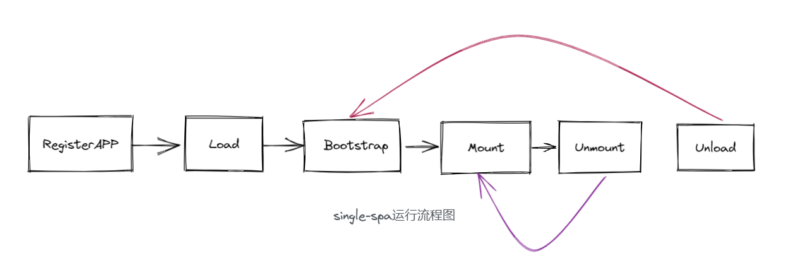

> ## A javascript framework for front-end microservices
>
> Build micro frontends that coexist and can ([but don't need to](https://single-spa.js.org/docs/faq.html#can-i-use-more-than-one-framework)) be written with their own framework. This allows you to:
>
> - [Use multiple frameworks](https://github.com/single-spa/single-spa/blob/master/docs/single-spa-ecosystem.md#help-for-frameworks) on the same page [without refreshing the page](https://github.com/single-spa/single-spa/blob/master/docs/applications.md) ([React](https://github.com/single-spa/single-spa-react), [AngularJS](https://github.com/single-spa/single-spa-angularjs), [Angular](https://github.com/single-spa/single-spa-angular), [Ember](https://github.com/single-spa/single-spa-ember), or whatever you're using)
> - Write new code, possibly with a new framework, without rewriting your existing app
> - Lazy load code for improved initial load time.

`single-spa`可能大部分人没有听过，但是你可能听过阿里的`qiankun`以及京东的`micor-app`。殊不知最早提出微前端概念的就是`single-spa`。本文从 `Why`和 `How`两个方面来讲这个库为什么会诞生以及它是怎么实现所谓微前端的。

---

## 公司目前现状

在去年刚入职的时候公司只有一个产品使用`Nuxt`搭起来的服务端渲染工程。这个项目中没有任何地方用到服务端渲染基本上都是按照中规中矩的前端写法来定义页面内容（咋也不知道为什么要这样）。然后改一个地方代码，就要前端热更新，然后重启`node`非常耗时。这是一方面后面总监说这个产品的功能要拆分并且要能够自由搭配(这个系统可以分为数十个大模块)、并且打包后不能将没有权限的代码打包进去。但是在不刷新页面的前提下能够在一个入口中打开其他模块的内容。首先想到的就是 `**iframe**`**。**首先 `Nuxt`肯定是要拆分，现在是怎么去承载**各个模块的页面以及页面之间的通信问题。**

## 为什么不是 iframe

随着进行技术预演之后发现与目标大部分冲突, `iframe` 就相当于页面里再开个窗口加载别的页面，但是它有很多弊端：

- 每次进来都要加载，状态不能保留
- DOM 结构不共享。比如子应用里有一个 Modal，显示的时候只能在那一小块地方展示，不能全屏展示
- 无法跟随浏览器前进后退
- 天生的硬隔离，无法与主应用进行资源共享，交流也很困难

在翻看参考资料的时候出现了**微前端**字样，然后深入查找发现了`single-spa`

## single-spa 到底干嘛的

等查看`single-spa` 文档后，你就会发现它除了帮你加载管理资源之外，啥也没干成。它将应用分成如下这些状态，代表着应用在某个时期的状态,然后触发对应的生命周期比如`bootstrap/mounted`等等;

```javascript
// src/applications/app.helpers.js
// App statuses
export const NOT_LOADED = "NOT_LOADED";
export const LOADING_SOURCE_CODE = "LOADING_SOURCE_CODE";
export const NOT_BOOTSTRAPPED = "NOT_BOOTSTRAPPED";
export const BOOTSTRAPPING = "BOOTSTRAPPING";
export const NOT_MOUNTED = "NOT_MOUNTED";
export const MOUNTING = "MOUNTING";
export const MOUNTED = "MOUNTED";
export const UPDATING = "UPDATING";
export const UNMOUNTING = "UNMOUNTING";
export const UNLOADING = "UNLOADING";
export const LOAD_ERROR = "LOAD_ERROR";
export const SKIP_BECAUSE_BROKEN = "SKIP_BECAUSE_BROKEN";
```

**single-spa 仅仅是一个子应用生命周期的调度者。**`single-spa`为应用定义了 `boostrap, load, mount, unmount` 四个生命周期回调<br /><br />`single-spa`延续了`spa`的运行理念,也是按照**生老病死**这个几个时机做对应的操作，不过值得注意的是

- Register 不是生命周期，指的是调用 registerApplication 函数这一步
- Load 是开始加载子应用，怎么加载由开发者自己实现（等会会说到）
- Unload 钩子只能通过调用 unloadApplication 函数才会被调用

其他调用生命周期都是`single-spa`内部进行调用，那问题就来了** single-spa 是什么时候来走这一套生命周期的呢？**

## ** single-spa 是什么时候来走这一套生命周期的呢？**

答案就是靠**页面路由**,在 `registerApplication`这个 `api`注册应用的时候就需要指定挂载应用的路由。我们先来看看这个 `api`的函数。

```javascript
registerApplication(
  "app2",
  () => import("src/app2/main.js"), // 加载应用的入口
  (location) => location.pathname.startsWith("/app2"), // 触发时机
  { some: "value" }
);
```

所以 `single-spa`要监听 `url` 的变化，来匹配加载对应子应用。

## single-spa 怎么监听 url

监听可以用 `window.addEventListener`来监听`hashchange`和 `popstate` 的变化来做相应处理。

```javascript
window.addEventListener('hashchange',funtion(){})

window.addEventListener('popstate',funtion(){})
```

诶诶诶有没有一种熟悉的感觉，`VueRouter`不也是通过监听这两个方法来渲染不同的组件形成不同的页面吗？如果都监听是不是有所冲突，正常我们的逻辑应该是 **先执行 single-spa 的监听，触发子应用激活然后在由用户路由去改变页面视图。**<br /><br />但是 `webpack` 打包后,这个执行顺序我们是无法确定的，如何来达到预想的这个效果呢？

答案就是 **劫持 。**

```javascript
const originalAddEventListener = window.addEventListener;

window.addEventListener = function (eventName, fn) {
  // 这里去查抄注册的应用表,先把这个应用激活后在执行，原来事件想做的事情
  return originalAddEventListener.apply(this, arguments);
};
```

熟悉 `Vue` 响应式处理中对数组处理的你一定不陌生这种写法吧。<br />知道 `single-spa` 是如何触发应用生命周期之后，我们再来捋捋整体的流程

## 应用加载基本流程

加载应用之前，再来回顾下怎么注册一个应用

```javascript
registerApplication(
  "app2",
  () => import("src/app2/main.js"), // 加载应用的入口
  (location) => location.pathname.startsWith("/app2"), // 触发时机
  { some: "value" }
);
```

甚至入口函数中可还可以有多个

```javascript
registerApplication(
  "app2",
  () => [import("src/app2/main.js"), import("src/app2/chunk.js")], // 加载应用的入口
  (location) => location.pathname.startsWith("/app2"), // 触发时机
  { some: "value" }
);
```

注册完成后,在 `single-spa`通过路由劫持的方式匹配到合适子应用加载规则时,就会调用我们的注册时的入口函数方法，完成子应用挂载等。

```javascript
// 路由变化后会执行这个方法
export function reroute(pendingPromises = [], eventArguments) {
  // 找到需要加载的应用
  const {
    appsToUnload,
    appsToUnmount, // 需要卸载的应用
    appsToLoad, // 加载失败的或者是没有加载过的
    appsToMount, // 加载过但是没有挂载的
  } = getAppChanges();

  return loadApps(appsToLoad);
}

function loadApps(appsToLoad) {
  const loadPromises = appsToLoad.map(toLoadPromise);
  return Promise.all(loadPromises).then(callAllEventListeners); // 添加事件
}
```

可以看到主要还是在`toLoadPromise`中进行的

```javascript
function toLoadPromise(app) {
  return Promise.resolve().then(() => {
    app.status = NOT_BOOTSTRAPPED;
    app.bootstrap = flattenFnArray(appOpts, "bootstrap");
    app.mount = flattenFnArray(appOpts, "mount");
    app.unmount = flattenFnArray(appOpts, "unmount");
    app.unload = flattenFnArray(appOpts, "unload");
    app.timeouts = ensureValidAppTimeouts(appOpts.timeouts);
    return app;
  });
}
```

之前提到我们生命周期里面会有多个异步函数组成的数组,在调用对应生命周期生命周期的时候实际上就是要遍历一遍这些异步函数

```javascript
function flattenFnArray(app, lifecycle) {
  let fns = appOrParcel[lifecycle] || [];
  fns = Array.isArray(fns) ? fns : [fns];
  if (fns.length === 0) {
    fns = [() => Promise.resolve()];
  }
  return function (props) {
    return fns.reduce((resultPromise, fn, index) => {
      return resultPromise.then(() => {
        const thisPromise = fn(props);
        console.log(thisPromise, "ccccc");
        return thisPromise;
      });
    }, Promise.resolve());
  };
}
```
