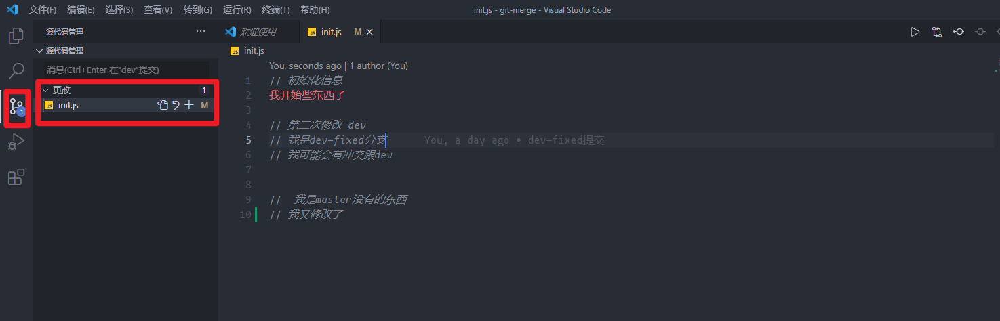
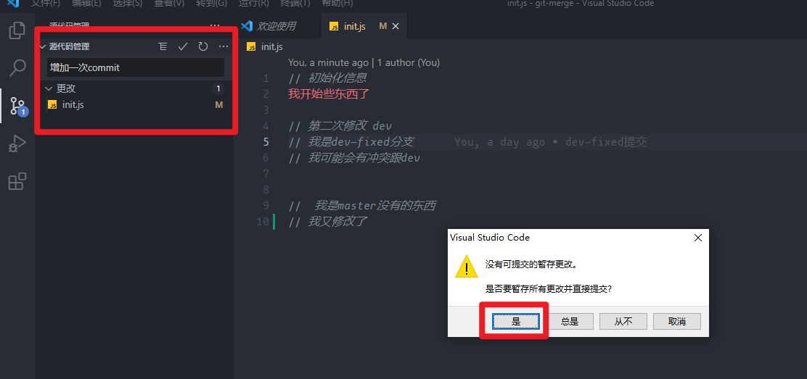
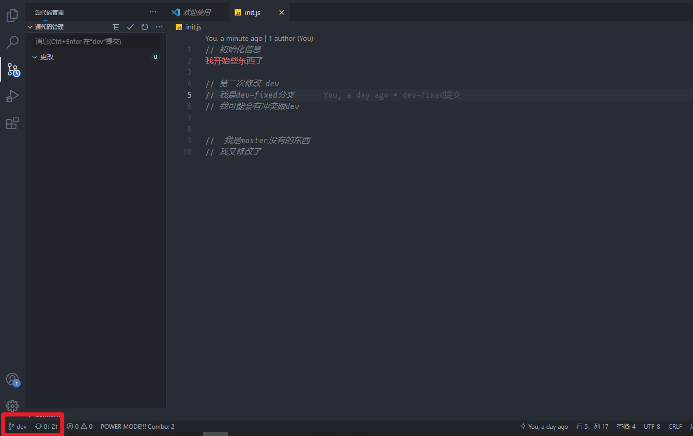
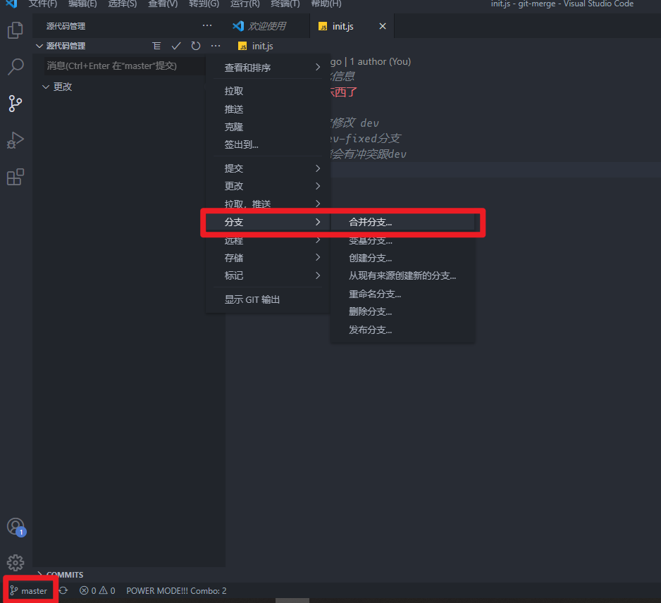
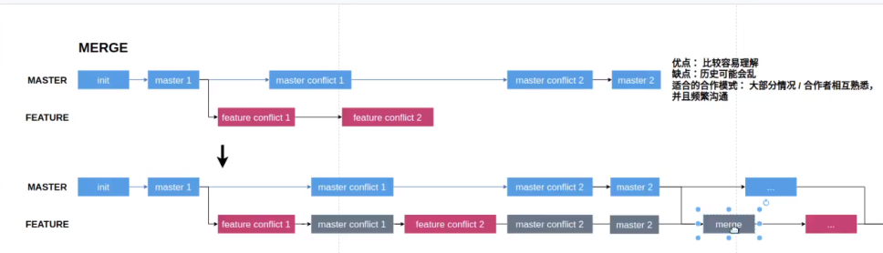
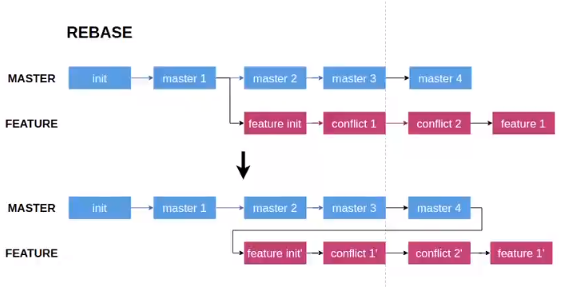
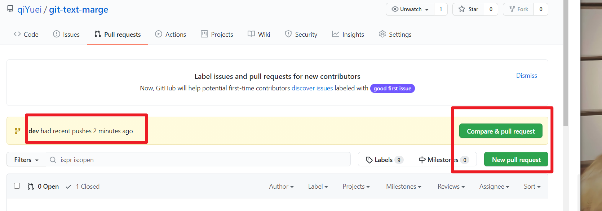
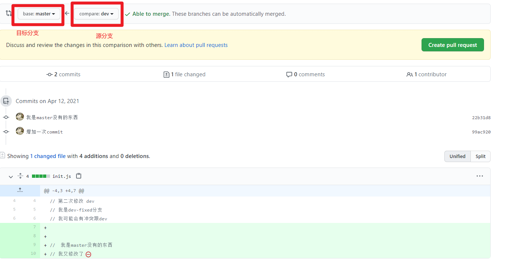
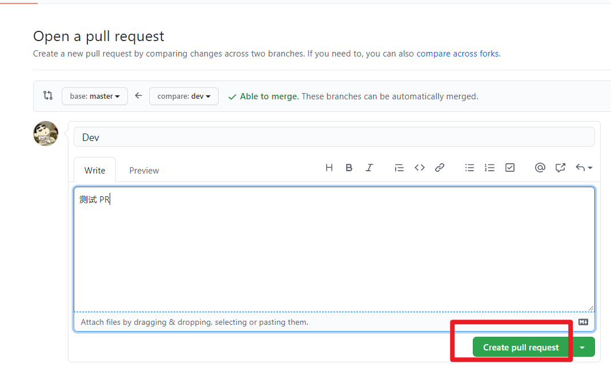
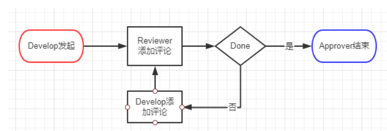

# 合并分支

## git merge

多人协作开发不可避免的要进行合并分支，接下来简单说下分支的基本操作。`git checkout -b A` ，创建并切换到 `A` 分支。假如我们在 `A` 分支完成代码了。`git  checkout master` 切回主分支，使用 `git pull origin master` 拉取最新代码。使用 `git  merge A` 命令把 `A` 分支的代码合并到 `master` 上 ，`git push origin master` 提交到远程仓库中。

在 `VSCode`  中这个操作更为简单

这里就是没有被 git 追踪到的文件 

1. 再输入框中添加 `commit`  信息后 `ctrl+enter`  后提交

3. `↓`  表示远程分支比本地分支领先多少个 `commit` ， `↑`  表示本地分支还未提交到远程的 `commit`

4.  切换到需要合并的目标分支，并选择合并源分支即可

## git rebase

`rebase`  提供了一种在你合并代码到主干时一种有别于 `merge`  的方式。我们都知道我们在直接使用`git merge`合并代码时会出现多个分叉，并且有可能再你落后他人分支时会保留一个无意义的合并记录，这使得代码记录很乱， `git`  图表则会杂乱无章。而正好`git rebase`则可提供一条完美的线性提交记录。

## git merge 和 git Rebase 区别

- merge

       记录下合并动作，很多时候这种合并动作是垃圾信息       不会修改原 `commit ID`       冲突只解决一次

- rebase

      得到更简洁的项目历史       每个 `commit` 都需要解决冲突       修改所有 `commit ID`

## pull Request

`pull Request`  就是我们经常听到的 `pr` 。`Pull Request`  是一种通知机制。你修改了他人的代码，将你的修改通知原来的作者，希望他合并你的修改，这就是  `Pull Request`。

一般我们 `fork`  其他人项目后，想提交自己的代码给**这个项目时,就会用到这个功能。**

  **最后代码的管理者可以通过你的 **`**pr**` **合进目标分支，也可以关闭你的 **`**pr**`\*\* \*\*

# code Review

按项目组分成若干小组。以小组为单位，2 个小组之间相互进行代码`Review`。假设有 A、B 两个小组，其中 A 组发起，B 组进行评论。 角色分：A 组成员为`Develop`， A 组组长为`Approver`，B 组成员为`Reviewer`。

参考链接

[https://www.bilibili.com/video/BV1854y1v7aA?t=944](https://www.bilibili.com/video/BV1854y1v7aA?t=944)

[https://www.bilibili.com/video/BV13k4y1m7QJ?t=1097](https://www.bilibili.com/video/BV13k4y1m7QJ?t=1097)
