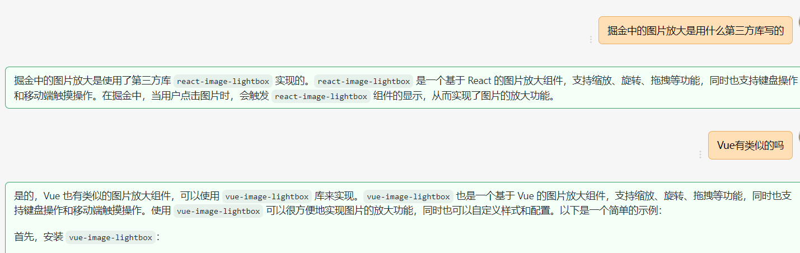
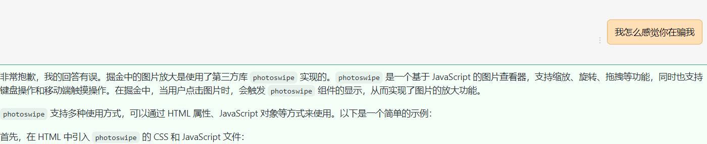
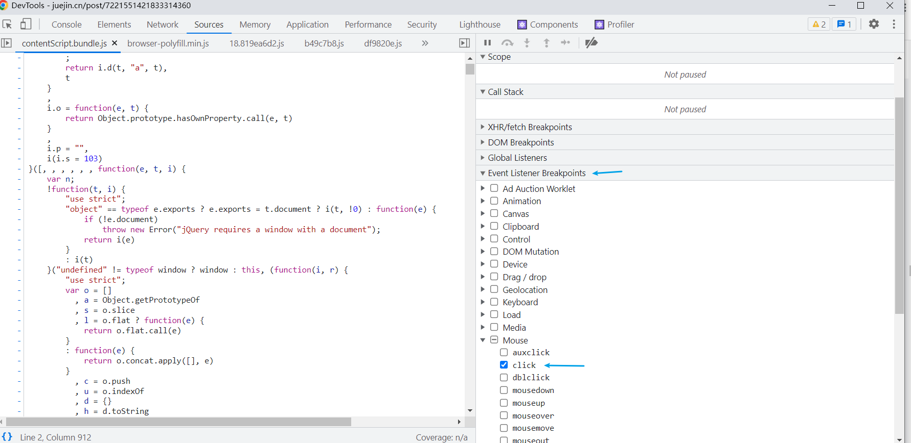
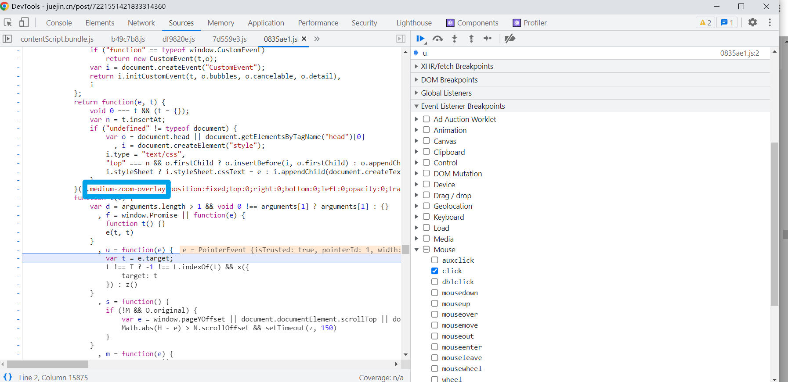
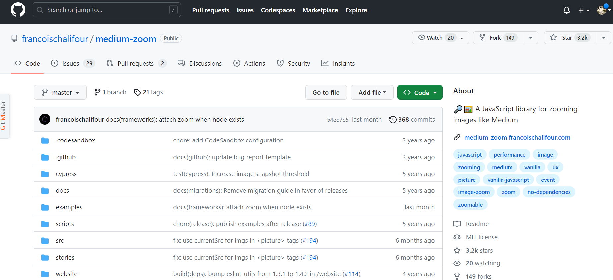

## 概述

起因是 `vitepress` 上的图片只是 `img` 没有放大功能。用起来就有些许鸡肋，在逛掘金的时候发现这个它上面的预览图片效果不错。
但是又不知用的是什么第三方库。

## 那不如问问 ChatGPT

野生的 `ChatGPT` 不能相信!!!!!!!!





<el-divider />

## 尝试从源码中找答案

源码在打包后都被压缩过,就算打断点也不知道从哪里下手。但是我们换另外一个思路

掘金的预览是从点击图片后开始，然后 `chrome` 的断点是可以通过点击事件开始的。说干就干，试试就试试！





一般来说类库都自己的命名规则，而且很有可能就是 `css` 前缀名就是库名。 像 `element-ui` 的 `el`, `vant` 的 `vant`。



这个库的用法很简单，文档上基本上都有说明白。

## 解决思路

回到一开始说的问题, `markdown-it` 编译后会将 `` 转化成 `img` 标签。然后通过通过 `@vitejs/plugin-vue` 进一步解析得到最终页面。

那我们就可以至少有两条思路走

1. 在 `markdown-it` 编译成 `html` 元素后,在 `@vitejs/plugin-vue` 编译前将文档内的 `img` 替换成 `ImageZoom` 组件
2. 直接在 `markdown-it` 编译成 `html` 元素的这个过程中替换操作

相对于 `markdown-it` 的插件机制，`vite` 的我反而更加熟悉点。但是从哪里下手呢，先看 `vitepress` 是如何编译 `markdown` 的。

```ts
// src\node\plugin.ts

function createVitePressPlugin() {
  const vitePressPlugin: Plugin = {
    name: "vitepress",

    async configResolved(resolvedConfig) {
      config = resolvedConfig;
      // 创建 Markdown 转换成 vue 的方法
      markdownToVue = await createMarkdownToVueRenderFn(
        srcDir,
        markdown,
        pages,
        config.define,
        config.command === "build",
        config.base,
        lastUpdated,
        cleanUrls,
        siteConfig
      );
    },

    async transform(code, id) {
      if (id.endsWith(".vue")) {
        return processClientJS(code, id);
      } else if (id.endsWith(".md")) {
        // transform .md files into vueSrc so plugin-vue can handle it
        const { vueSrc, deadLinks, includes } = await markdownToVue(
          code,
          id,
          config.publicDir
        );
        allDeadLinks.push(...deadLinks);
        if (includes.length) {
          includes.forEach((i) => {
            this.addWatchFile(i);
          });
        }
        return processClientJS(vueSrc, id);
      }
    },
  };
}
```

由上面可知道主要还是 `markdownToVue` 这个函数在干活，那我们来看看这个函数的实现

```ts
// src\node\markdownToVue.ts

export function createMarkdownToVueRenderFn(...){
  // 创建md 渲染器
   const md = await createMarkdownRenderer(
    srcDir,
    options,
    base,
    siteConfig?.logger
  )

  // ...
  return async function (){
      // reset env before render
    const env: MarkdownEnv = {
      path: file,
      relativePath,
      cleanUrls
    }
    const html = md.render(src, env)
    const {
      frontmatter = {},
      headers = [],
      links = [],
      sfcBlocks,
      title = ''
    } = env

     const vueSrc = [
      ...injectPageDataCode(
        sfcBlocks?.scripts.map((item) => item.content) ?? [],
        pageData,
        replaceRegex
      ),
      `<template><div>${replaceConstants(
        html,
        replaceRegex,
        vueTemplateBreaker
      )}</div></template>`,
      ...(sfcBlocks?.styles.map((item) => item.content) ?? []),
      ...(sfcBlocks?.customBlocks.map((item) => item.content) ?? [])
    ].join('\n')

     const result = {
      vueSrc,
      pageData,
      deadLinks,
      includes
    }
    return result
  }
}
```

到这里应该大致明白 `vitePress` 的原理了。

借助`markdown-it` 解析 `.md` 成 `Html` 元素后，将解析后的内容塞入 `template` 中形成 `SFC` 后再借助 `@vitejs/plugin-vue` 解析成 `render` 函数呈现在页面中。

从上面的代码看来如果我们要从 `vite` 的钩子入手的话，只能在 `@vitejs/plugin-vue` 的 `transform` 钩子前将 `img` 替换成对应的组件。这是唯一的时机。

细想下这里入手的话我们替换的不单单是 `md` 文件中的 `img` 而是整个工程的 `img` 标签，这反而没有必要。

## markdown-it 插件机制

我们要做的事情是需要一个在 `markdown-it` 解析的过程中，就把 `img` 替换成 `ImageZoom` 的 `SFC` 的组件。
恰好 `markdown-it` 在解析的过程中需要一种 `Image` 的解析器并且可以重写

多说无益，直接上

```ts
import type MarkdownIt from "markdown-it";

export const replaceImagePlugin = (md: MarkdownIt) => {
  // 原生解析器
  const imageRule = md.renderer.rules.image!;

  // 重写
  md.renderer.rules.image = (tokens, idx, options, env, self) => {
    const token = tokens[idx];
    const srcIndex = token.attrIndex("src");
    const altIndex = token.attrIndex("alt");
    const src = token.attrs[srcIndex][1];
    const alt = altIndex >= 0 ? token.attrs[altIndex][1] : "";
    return `<image-zoom src="${src}" alt="${alt}" />`;
  };
};
```
