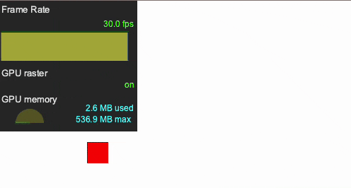
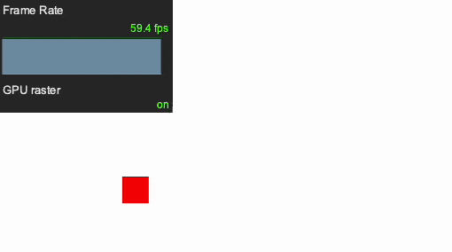
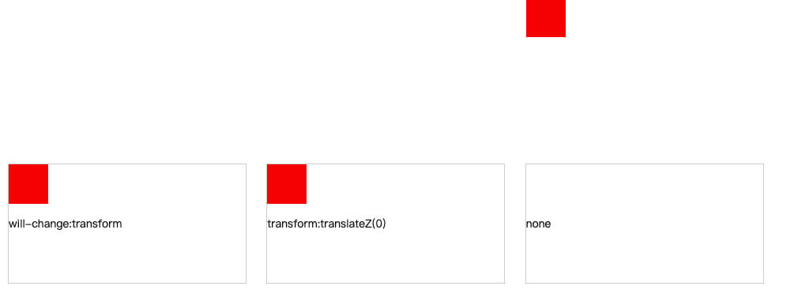

##

**DOM 操作会导致一系列的重绘（repaint）、重新排版（reflow）操作。为了确保执行结果的准确性，所有的修改操作是按顺序同步执行的。大部分浏览器都不会在 JavaScript 的执行过程中更新 DOM。相应的，这些浏览器将对对 DOM 的操作放进一个队列，并在 JavaScript 脚本执行完毕以后按顺序一次执行完毕。也就是说，在 JavaScript 执行的过程，直到发生重新排版，用户一直被阻塞。**<br />**
一般的浏览器中（不含 IE），repaint 的速度远快于 reflow，所以避免 reflow 更重要**。<br /> **导致 repaint、reflow 的操作**：<br />_ \* DOM 元素的添加、修改（内容）、删除( Reflow + Repaint)_<br />_\* 仅修改 DOM 元素的字体颜色（只有 Repaint，因为不需要调整布局）_<br />_\* 应用新的样式或者修改任何影响元素外观的属性_<br />_\*
Resize 浏览器窗口、滚动页面_<br />_\* 读取元素的某些属性（offsetLeft、offsetTop、offsetHeight、offsetWidth、scrollTop/Left/Width/Height、clientTop/Left/Width/Height、getComputedStyle()、currentStyle(in IE))_

##

## 合成层的利弊

---

开启硬件加速的 css 属性

```css
transform
opacity
will-change
filter
```

渲染层的提示带来的好处：

- 开启硬件加速，合成层的位图会交由 GPU 合成，相比 CPU 处理要快。
- 合成层发生 repaint 的时候，不会影响其他图层。
- 对于 transform 和 opacity 效果，不会触发 layout 和 paint。

当然合成层也存在一些问题：

- 如果我们把所有渲染工作都交给 GPU，在现有的优化下，它会导致渲染内存占用比大幅度提升，反而出现负面的效果。
- 另外隐式合成容易产生大量我们意料之外的合成层，过大的内存占用，会让页面变的卡顿，性能优化适得其反。

### 使用 transform 和 opacity 来实现动画

在我们日常开发中经常会实现一些动画，有时候我们可能会选择改变 top/left 去实现，那么这个节点的渲染会发生在普通文档流中。而使用 transform 和 opacity 实现动画能够让节点被放置到一个独立合成层中进行渲染绘制，动画不会影响其他图层，并且 GPU 渲染相比 CPU 能够更快，这会让你的动画变的更加流畅，我们来看看他们的区别。

通过 left 来实现动画：

<br />通过 transform 来实现动画：<br />

可以看到通过 transform 来实现动画，页面的 fps 能够稳定在 60 左右，而通过 left 来实现存在波动，fps 大概稳定在 30 左右，这会影响你的用户体验指标。

### 谨慎使用 will-change

我认为除非你的元素的真的存在某个属性马上会发生变化，例如 transform，你可以使用 will-change: transform 告知浏览器，根据您打算更改的元素，浏览器可能可以预先安排，元素的改变和渲染速度都会变得更快。可是这些属性可能会给你带来一些副作用，我们来看一个[demo](https://link.juejin.cn?target=https%3A%2F%2Fpk2tw.csb.app%2F)。



任何带有 position: fixed 或者 position: absolute 的子元素将会相对于设置了 will-change: transform 的元素进行相对定位。所以在你使用的时候需要确保这种意料之外 containing block 不会对你造成影响。除此之外浏览器用来为 will-change 属性做的更进一步的优化常常会耗费更多的资源，如果你将它施加在过多属性上显然是一个浪费，更甚者非常过度的使用可能会造成页面相应速度的变慢或者直接崩溃。
