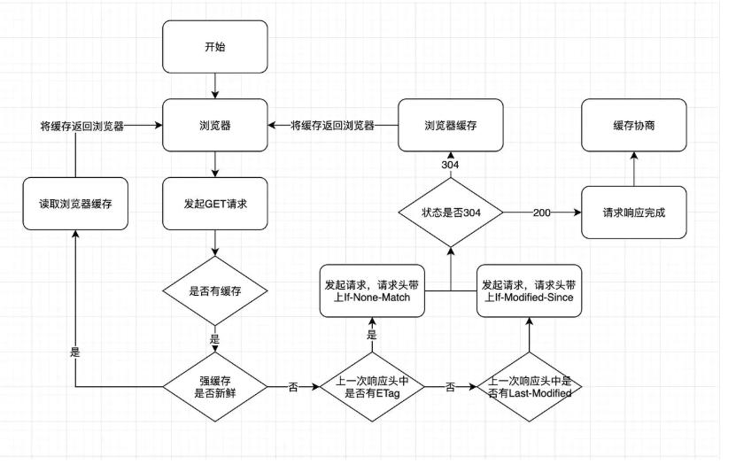
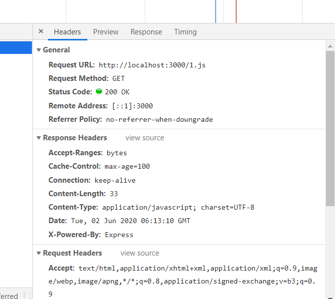
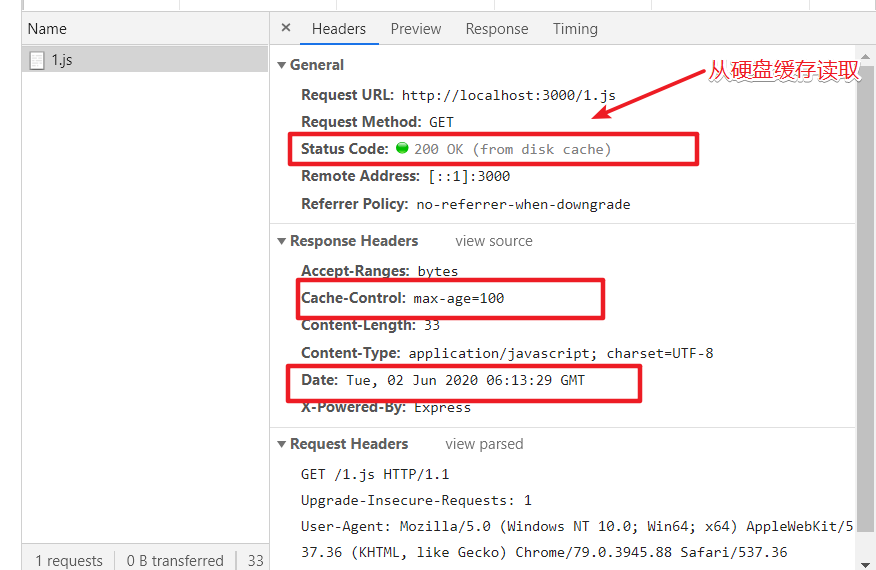

### 前言

作为一个合格的前端工程师,且以大厂为目标的程序猿,浏览器的相关工作原理使我们进行性能优化的基石。必须牢牢掌握这才能对瞬息万变的实际场景,针对性地给出实际方案,而不是各种背诵(掘金上混脸熟)的开发'军规'和性能优化常见条例。这样很难真正发现问题所在。自己也得不到实质性的提升。

HTTP 缓存分为两种`强缓存`和`协商缓存`。两者的作用都是加快资源获取,提升用户体验,减少网络连接,缓解服务器的压力。还有这里的缓存是指`文件文件`!!!并不是指平时后端从服务器拿出来的数据。



又到了看图说话的时候了,我们都知道我们请求文件是发送`get`请求,在发起的时候`浏览器`就回去找请求头是否开启了`强缓存`。没开启就直接进去`弱缓存`阶段了。如果开启了就回去比对`强缓存的标志`是否过期之类的,没有过期则直接读取`缓存`这时候状态码是`200`(实际上并没有发请求)！紧接着过期了,那就必须发送一个请求去服务器了。这就到了`弱缓存`阶段。这时候就会询问服务器`我所请求的文件是否更新了`如果没更新则会返回`304`告诉浏览器`文件没有更新`。更新了则返回`200`让浏览器缓存新的文件。

#### 强缓存

不需要发送网络连接给服务器,直接读取本地的缓存。缓存可以从`硬盘`或者`内存`中。这是由浏览器决定的。但是强缓存是由`Expires`、`Cache-control`、`Prage`3 个属性来控制的。

#### Expires

`Expires`也就是过期时间,这里通常会设置一个时间戳`Tue, 02 Jun 2020 04:12:42 GMT`但是这个属性有严重的缺陷就是如果服务器时间跟本地时间不同的话(时区)这个字段就没有任何意义了。所以这个字段在`http1.1`是采用`Cache-control`来控制。`Expires`优先级最低

#### Cache-control

`Cache-control`这个属性是`http1.1`新增,在响应头和请求头中都可以设置。常见的属性有

- max-age: 单位是秒,缓存时间计算方式是距离上一次发起时间的秒数,超过间隔的秒数缓存失效
- no-cache: 禁止使用强缓存
- no-store: 禁止使用缓存(包括协商缓存)
- private: 专用于个人的缓存,中间代理,CDN 等不能缓存响应
- public: 响应可以被中间代理、CDN 等缓存
- must-revalidate: 在缓存过期前可以使用,过期后必须向服务器验证

#### Pragma

`Pragma`只有一个属性值就是`no-cache`,这个属性跟`Cache-control`中的`no-cache`一样就是不使用`强缓存`

#### 验证环节

本文采用`express`作为服务端(主要`KOA`没有找到关闭`弱缓存`的方法....)还是太菜了

```javascript
const express = require("express");
const app = express();
var options = {
  etag: false, // 禁用协商缓存
  lastModified: false, // 禁用协商缓存
  setHeaders: (res, path, stat) => {
    res.set("Cache-Control", "max-age=100"); // 强缓存超时时间为10秒
  },
};
app.use(express.static(__dirname + "/public", options));
app.listen(3000);
```



第一次加载服务端的响应头中加入了`Cache-Control:max-age=100`这个字段,也就是强缓存的时间为 100 秒



第二次加载(并不是刷新)可以明显看到`http`状态码中有`(from disk cache)`的字样。

加入`Pragma`后并把值设为`no-cache`后发现,尽管有`max-age`但是也会重新请求服务端加载文件。

### 协商缓存

当强缓存没有命中后,并且请求头中设置了`If-Modified-Since`或者`If-None-Match`的时候,就会去尝试命中协商缓存,命中后则会返回`304`状态,加载浏览器缓存,并且响应头会设置`Last-Modified`或者`ETag`属性

#### Last-Modified/If-Modified-Since

`Last-Modified/If-Modified-Since`两者都是代表文件的最后修改时间,在第一次请求的时候服务端会返回这个文件的最后修改时间到`Last-Modified`字段中。在客户端重新请求这个文件的时候会带上一次请求返回的`Last-Modified`字段的值添加到本次请求头中的`If-Modified-Since`中,服务端会比较`If-Modified-Since`和`Last-Modified`是否相同,相同则返回`304`读取浏览器缓存。

#### ETag/If-None-Match

`ETag/If-None-Match`的值是一串`hash`码，代表的是一个资源的标识符，当服务端的文件变化的时候，它的`hash`码会随之改变，通过请求头中的 `If-None-Match` 和当前文件的 hash 值进行比较，如果相等则表示命中协商缓存。`ETag` 又有强弱校验之分，如果 `hash` 码是以 `"W/"` 开头的一串字符串，说明此时协商缓存的校验是弱校验的，只有服务器上的文件差异（根据 `ETag` 计算方式来决定）达到能够触发 `hash` 值后缀变化的时候，才会真正地请求资源，否则返回 `304` 并加载浏览器缓存。
